**1、 MTDS 网址是多少？ MTDS 的安装密码是多少？**

**解决方案：**  网址： mtds.oppein.com；

安装密码“oppein”（仅限于苹果 IPAD ，其他设备不需要安装密码）

**2、 MTDS 适配浏览器是什么？**

**解决方案：**  MTDS 适配谷歌浏览器普通版，可以在登录首页下载安装。

**3、手机、  IPAD 端安装二维码在哪里？**

**解决方案：**  1.APP 安装二维码在 MTDS 平台首页“二维码入口”，点击“二维

码入口”进入界面后，扫二维码即可

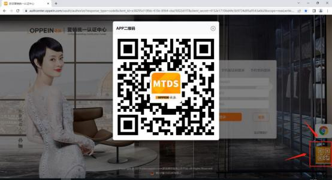

2\.手机 APP 登陆界面有二维码入口：

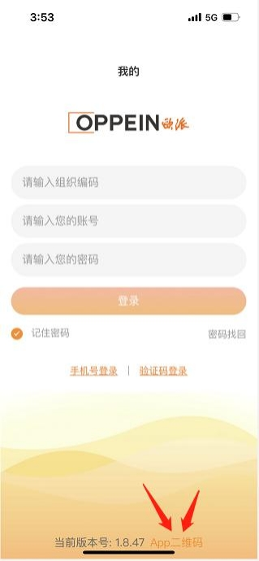

3\.手机 APP 登陆后， 右下角“我的”里面有二维码：

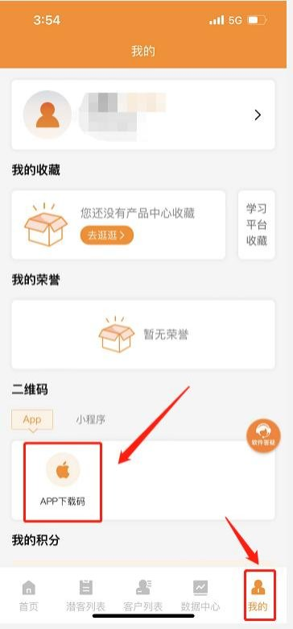

4\.微信进入“欧派营销支持”公众号 ，点击下方“学功能”－点击“APP 下

载” ，进入二维码的界面直接下载安装即可。

**4、苹果设备安装 MTDS 需要信任 ，该怎么设置？**

**解 决方案：**   打开 你 的 苹 果 设 备 ： 设置 - 通用 - 设备管理 - 信任此软件

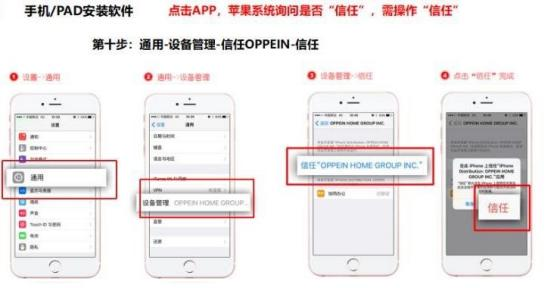

**5、有没有 MTDS 操作视频？在哪里查看教学视频？**

**解决方案：**因为 MTDS 功能强大 **，**教学视频进行了细分，分为不同模块，不同

岗位，不同功能，不同端口的视频，可以根据自己的需要有针对性的查看。

查看视频途径 1：登陆手机 APP“我的欧派”，点击“更多功能”进到“学习中

心” ，点击“信息化教程”， 查看教学视频：

**6、员工如何修改登录密码？**

**解决方案：** 员工个人在首页点击当前登录的帐号→查看个人信息→点击修改密

码→按要求输入新旧密码后点击保存即可。

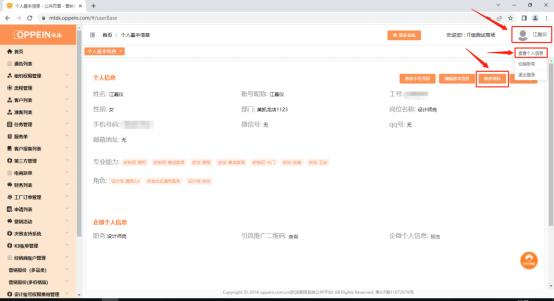

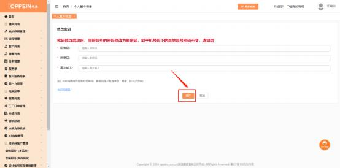

**7、员工忘记密码怎么办？**

**解决方案 1：**管理员 admin 账号登录  → 点击“组织权限管理”→  “组织人员 管理” →找到指定员工，点击该员工→点击“重置密码” →弹出提示框“您   是否要把该员工密码重设为 111111？” →点击确定。然后让员工使用 111111

的密码登录即可。

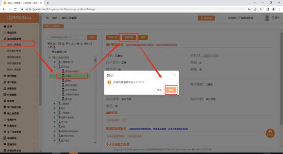

**解决方案 2：**电脑端登 MTDS 首页→点击“忘记密码”  →  “输入组织编码和  账号” →发送验证码，收到验证码后填写好→点击“下一步” →填好新密码 →点击修改密码。注：该员工电话号码必须为自己的手机号码才能接收到验证

码哦。

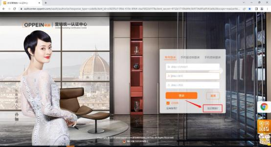

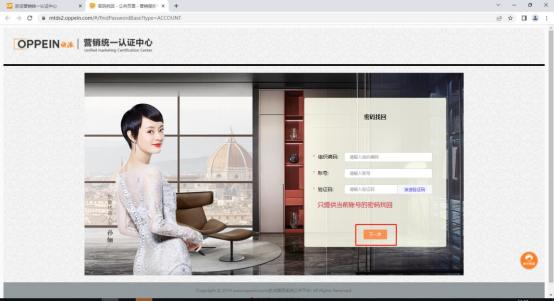

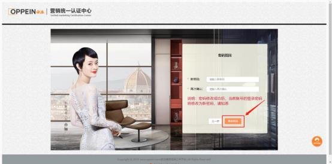

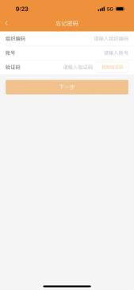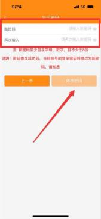

**解决方案 3：**手机端登 MTDS 首页→点击“密码找回”  →  “输入组织编码和  账号” →发送验证码，收到验证码后填写好→点击“下一步” →填好新密码

→点击修改密码。注：该员工电话号码必须为自己的手机号码才能接收到验证

码哦。

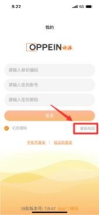

**8、系统管理员（admin）的密码忘记了怎么办？**

**解决方案：** 如果 admin 的账号手机有维护正确的话，可以通过手机进行密码找

回，操作如下：

① 电脑端： 电脑端登 MTDS 首页→点击“忘记密码”  →  “输入组织编码和账 号” →发送验证码，收到验证码后填写好→点击“下一步” →填好新密码 →点击确定。  注：该员工电话号码必须为自己的手机号码才能接收到验证码

哦。

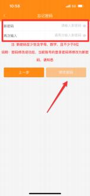

② 手机端： 手机端登 MTDS 首页→点击“密码找回”  →  “输入组织编码和账 号” →发送验证码，收到验证码后填写好→点击“下一步” →填好新密码 →点击确定。  注：该员工电话号码必须为自己的手机号码才能接收到验证码

哦。

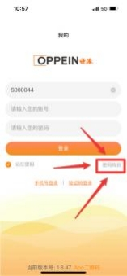

注：如果 admin 的电话没有维护在系统中，需要提供法人身份证原件照片给到

经销部门商场管理员或是 MTDS 答疑咨询群的老师申请重置密码，  MTDS 答疑

咨询群二维码：

**9、手机端无法保存照片/无法接收通知？**

**解决方案：**  检查手机是否已设置允许MTDS访问相机、照片，以及打开允许通

知。

**10、“我的欧派”手机端闪退？**

**解决方案：**  重新扫码安装最新app  （二维码必须是最新的）

注意：如重新下载后不能安装，请检查手机的版本是否最新，最好是该系统下

最新的版本。（苹果手机ios系统是10以上， 安装系统是7以上可使用）

**11、员工如何修改手机号？**

**解决方案：**admin 无法修改员工手机号，需要员工自己登录账号修改。

步骤一：员工登录账号， 在页面右上角点击查看人员信息-修改手机号码，输入

新手机号、验证码后点击保存；

步骤二： 员工用原手机号登录企微，  点击左上角三条横线，  再点击右下角，  点击

账号-手机号操作更换手机号。

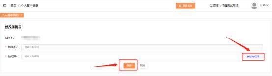

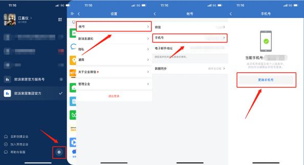

**12、提示【当前账号未关注“欧派营销支持”微信公众号， 请绑定后**

**登录】怎么处理？**

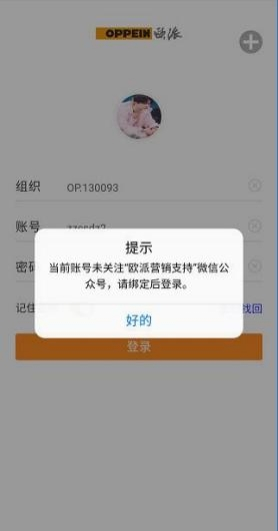

**解决方案：**  按照以下指引操作绑定即可。

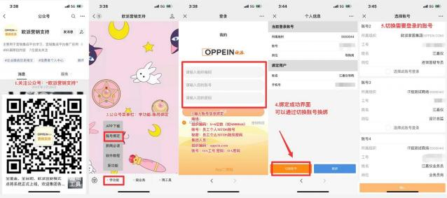

**13、点击账号绑定进去页面空白或者在绑定公众号的时候，无法正常**

**登录绑定账号， 一直重复显示登录页面怎么办？**

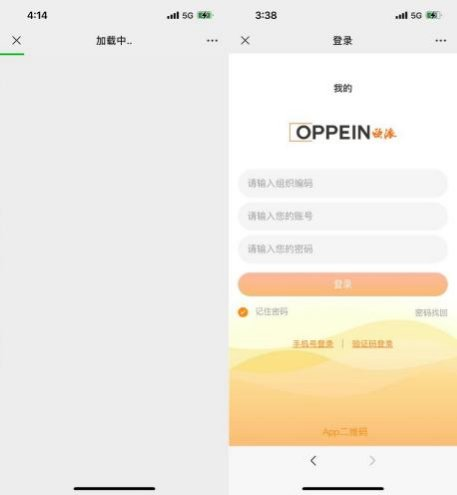

**解决方案：**  1、检查一下微信是否是最新的版本（要更新到最新版本才可以）然

后取消关注公众号重新关注一下进行绑定即可。

**解决方案：**  2、

第 1 步：在微信里打开 <https://ai.oppein.com/binding/#/pages/binding/clearData>，

第 2 步：之后关闭窗口，

第 3 步：重新在公众号进入账号绑定试试

复制以上的链接到微信的文件传输助手，在里面打开链接

**14、CAXA 账号如何购买？**

**解决方案：**  ①在左侧系统菜单栏中找到【设计账号权限费用管理】， 选择【设计

账号开通管理】后点击【新增订单】（如图 1）；

②可在搜索栏直接搜索员工账号姓名或账号进行添加，  或点击+选择对应人员添 加， 勾选需要的账号后点击【添加】， 完成添加后点击【添加服务项目】， 页面

跳转到计费项目页面 （如图 2）；

③ 选择账户计费类型并选择好需要开通的模块后点击【确认】（如图 3）

分类有账户管理类和业务能力类：

账户管理类（必选） ：设计师使用账号基本权限， 新设计账号申请必须勾选。

业务能力类（可多选）：申请开通的代理品牌渠道。

④回到账号开通提交页面选择好需要提交的事业线后， 选择生成预算可查看计费

明细；点击【提交】即可完成设计软件账号开通申请（如图 4）；

④ 提交成功后会跳转到账号开通页面，可点击【查看】，  当订单状态从“待审 核”更改为“已审核”后即可用 MTDS 账号登录 CAXA 设计软件查看账号

是否申购成功 （如图 5）。

注：具体详情参考答疑咨询企微群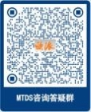群文件中《CAXA 账号购买绑

定指引》。

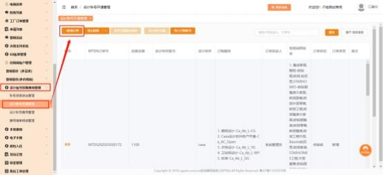

图 1

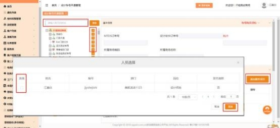

图 2

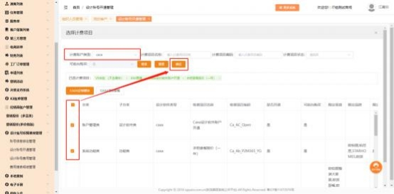

图 3

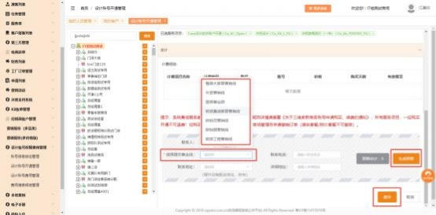

图 4

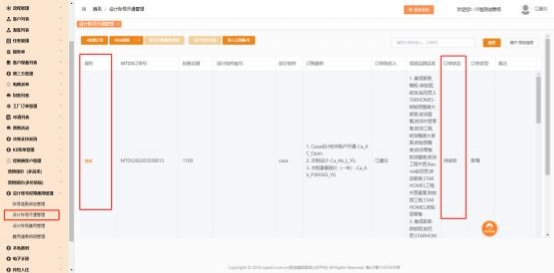

图 5

**15、三维家账号为啥在 MTDS 可以登陆， 直接登三维家登不进去？**

**解决方案：**  自从 2021 年 1 月 28 日起，所有账号都需从 MTDS 系统进三维家，

所以只能从 MTDS 系统进来登录。

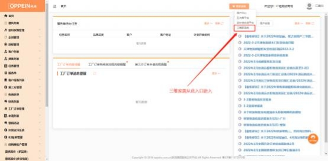

**16、点击账号绑定进去页面登录时提示该账号已绑定其他微信账号，**

**无法进行绑定。如需绑定， 请输入手机号的验证码？**

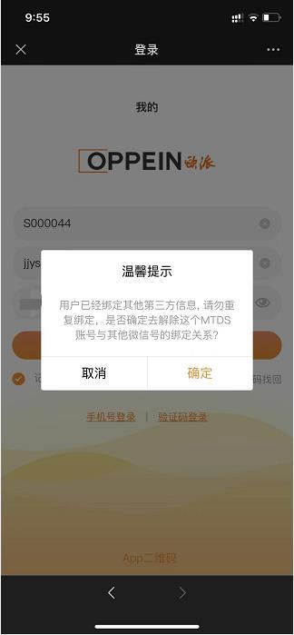

**解决方案：**  需在原来绑定的微信上面解绑，然后重新绑定当前的微信即可。

**17、安装 APP 时提示“我的欧派”需要更新怎么办？**

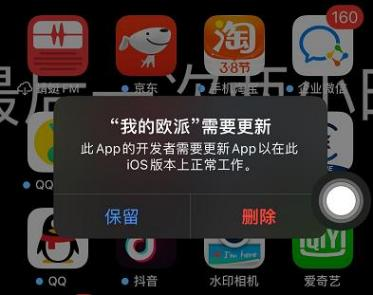

**解决方案：** 检查系统版本是否为： ios15 。此测试版本，需待官方给出解决方案，

故目前只能通过浏览器进入该网站进行操作：

<https://ai.oppein.com/wxwork/#/>

**18、 MTDS 登录界面更新后，需要怎么登录？**

**解决方案：**

MTDS 登录可用三种方式登录：

**方式一、 MTDS 账号+密码登录（默认登录方式，首次推荐）**

①新账号初始密码： 111111 ； ②若登录账号为未激活状态， 需先激活，确认

手机号码或修改手机号码验证通过后才能登录。

**方式二、手机+密码登录**

①新账号首次使用手机号码+密码的方式登录， 默认密码 111111，系统强制要求

修改密码，修改密码后按修改后的密码登录；

②手机号码登录密码独立，如：手机号已关联账号 1，对应密码 1；账号 2，对 应密码 2，手机号登录密码修改为密码 3，账号 1 和账号 2 的密码仍为密码 1 和

密码 2

**方式三、手机+验证码登录**

①在完成方式一登录后，可使用方式三登录。    ②同手机号码下存在集团 OA 账 号： 按 OA 维护的手机号码登录。②同手机号码下存在多个激活账号（已经过手

机号码验证），可直接手机号码+验证码登录

**19、登录账号时提示： 是否与该手机号码的账号合并，是什么意思？**

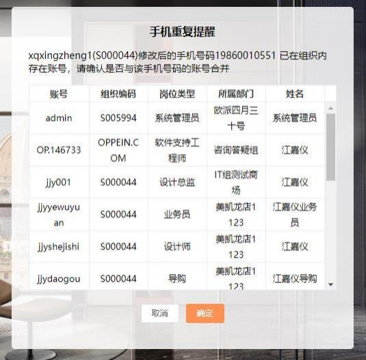

**解决方案：**

此提示说明：当前登录的账号手机号码下，存在同一个组织编码多个 MTDS 账

号/同手机号码下存在集团 OA 账号。

①系统显示当前手机号码下所有账号的基础信息：  姓名、账号、归属门店、岗位

类型

②勾选账号，  点击确定后，  可将当前勾选账号全部合并到同手机号码下，  后续可

切换账号进行使用。

**注意：** 合并账号操作后，  同一个手机号码下，  账号姓名、手机号码若变更，  会全 部同步并更。例：张三手机号码下，创建了 A、 B、C 3 个账号，操作了合并账

号后，如更改其中 A 的姓名/手机号码,那 B、C 账号也会全部同步更改。

**20、登录账号时提示： 是否与该手机号码的账号合并、强制新增是什**

**么意思？**

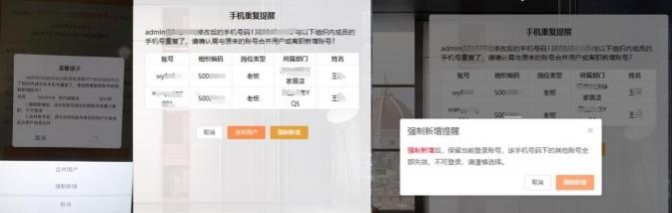

**解决方案：**此提示说明： 当前登录的账号手机号码下，  存在不同的组织编码下

有多个 MTDS 账号。

①系统显示当前手机号码下所有账号的基础信息：  姓名、账号、归属门店、岗位

类型

②**合并用户：** 勾选账号，  点击合并用户后，  可将当前勾选账号全部合并到同手机

号码下，后续可切换账号进行使用。

⑤ **强制新增：**若点击强制新增后，  当前登录账号将关联到该手机号码，  同时将 该手机号码的其他 MTDS 账号全部置为失效，且清空手机号码，如需恢复账

号，联系 admin 系统管理员在组织架构上进行人员复职操作。  **请谨慎操作！**

**21、商场人员有多个账号，进行了合并账号操作后，会有什么影响？**

**解决方案：**  在 MTDS 系统中，用同一个手机号码创建了多个账号，  可以进行账 号合并的操作。合并账号操作后，  修改任意一个账号姓名、手机号码，  其它账号

也将会全部同步修改。

例：张三手机号码下，创建了 A、 B、C 3 个账号，操作了合并账号后，如更改 其中 A 的姓名/手机号码,那 B、C 账号也会全部同步更改。其各账号中的权限不

受账号合并影响，  后续可切换账号进行使用。

**22、如何解绑同一个手机号用户下绑定的账号？**

**解决方案：**

**PC 端：** 登录 mtds 账号点击右上角用户头像图标或名称-选择查看个人信息-点 击【解绑账号】 -勾选需要解绑的账号然后点击提交， 输入验证码后确认解绑即

可；

**APP 端：** 登录 mtds 账号点击【我的】  -用户信息栏-解绑账号-勾选需要解绑的

账号后点击确认，输入验证码后点击提交即可解绑。

注：①同一个手机号下的账号不可全部解绑；

②解绑操作仅限于用户本人账号登录后操作；

③解绑的账号需要用账号密码登录，输入手机号激活后方可继续使用。

PC 端：

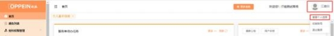

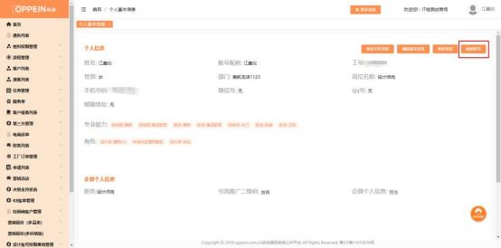

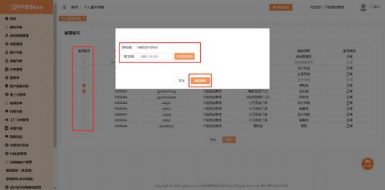

APP 端：

**23、admin 账号如何修改手机号？**

**解决方案：** 有两种情况：

① 原手机号对应的 admin 离职，需要更换新手机号。登录 admin 账号，点击 右上角【查看人员信息】  - 【修改手机号码】， 输入新手机号、验证码， 点击 保存后在弹窗中点击【要更换企业微信商场管理员】即可。这种情况会导致

原手机号对应的 admin 账号在企微中被离职， 新手机号将产生对应新的企微

身份， admin 账号的企微中不会留存旧手机号对应的好友关系和群聊。

② 原手机号对应的 admin 未离职，只是更换手机号。登录 admin 账号，点击  右上角【查看人员信息】  - 【修改手机号码】， 输入新手机号、验证码， 点击  保存后在弹窗中点击【否，日常手机变更】。这种情况下，新手机号不会同  步到企微，需要用旧手机号登录 admin 账号的企微，点击左上角三条横线，

再点击右下角，点击账号-手机号操作更换手机号。

（注： 一年最多操作日常变更手机号三次，请谨慎操作。）

**24、如何修改账号昵称？**

**解决方案：**登录 admin 账号或拥有组织权限管理的账号，在组织人员管理中

找到该员工，点击修改人员，修改账号昵称。

注：在系统操作过程中，人员均以账号昵称显示，不显示用户姓名。

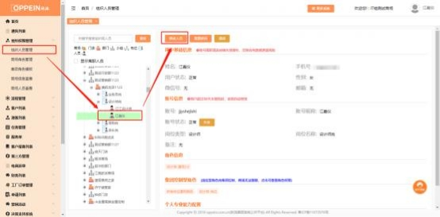

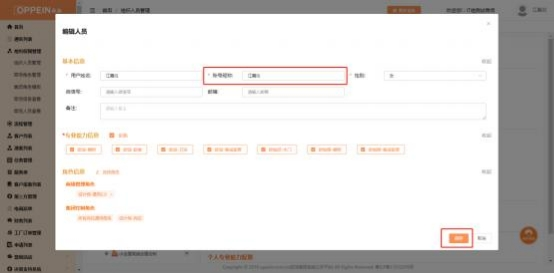

**25、登录 MTDS 显示“账号不存在”？**

**解决方案：**

① 员工账号：该账号状态异常，需要联系 admin 在组织人员管理中找到该人

员，点击操作复职。复职之后，该人员登录该账号进行激活后即可。

② admin 账号：可能是同手机号下新增账号激活时选择了【强制新增】导致

包括 admin 在内的其他账号被失效，  需要找经销部管理员联系集团人员操

作复职账号，复职之后，登录 admin 账号进行激活即可。

**26、如何跨组织编码绑定 CAXA 账号？**

**解决方案**：

业务场景描述：

A 商场购买了 CAXA 账号，将其与本商场设计师 MTDS 账号 A1 绑定，后 A 商 场淘汰，  B 商场需要沿用 A 商场 CAXA 账号给 B 商场的设计师 MTDS 账号 B1

使用。

这种情况下，需要操作 CAXA 解绑原 MTDS 账号后,再重新绑定新 MTDS 账号，

具体步骤如下：

**步骤一：**登录 A 商场的 admin 账号， 点击设计账号权限费用管理-账号信息绑 定管理，可通过筛选账号类型、输入 CAXA 账号/MTDS 账号（A1 账号） 搜索

找到账号信息，点击解绑，在确认是否解绑的提示框中点击确定，即可解绑账号；

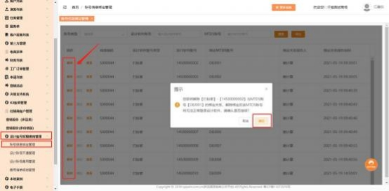

**步骤二：** 登录 A 商场的 admin 账号，可通过筛选账号类型、输入 CAXA 账号搜 索找到账号， 点击绑定， 在所属组织编码栏中输入 B 商场的组织编码， 在 MTDS 账号栏输入 B 商场的 MTDS 账号（B1），点击确定，  在确认是否绑定的提示框 中点击确定， 即可完成绑定。注： 重新绑定后的明细， 需 B 商场 admin 登录后，

在账号信息绑定管理中查看。

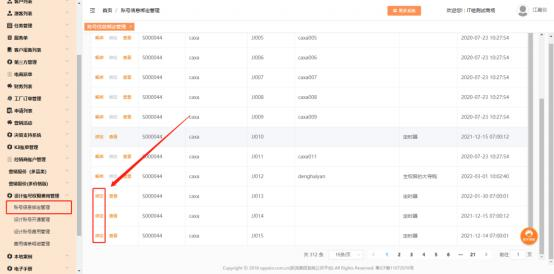

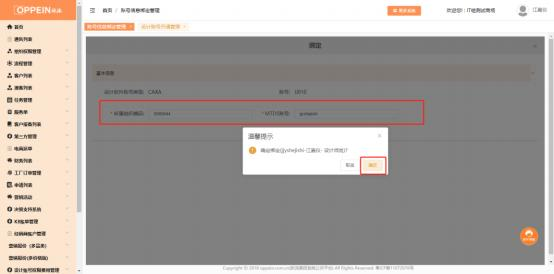

**27、如何进入谷歌浏览器无痕模式？**

**解决方案：**

进入谷歌浏览器无痕模式方法：

方式一：点开谷歌浏览器右上角三个点，点击【打开新的无痕式窗口】。

方式二：快捷键 Ctrl+Shift+N ,直接打开新的无痕式窗口。

进入无痕模式后，重新输入访问网址，此模式下浏览数据无缓存。

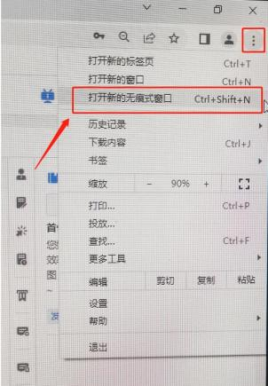

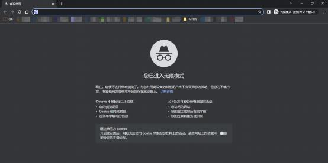

**MTDS0100027**
**28、怎么安装 MTDS APP？APP 二维码？**

解决方案： MTDS 网页登录页界面， 有一个 APP 二维码的入口， 扫码即可安装。

**29、登录账号时提示：“账号已超过 30 天未登录，请找商场 admin**

**处理“？   【MTDS0100028】**

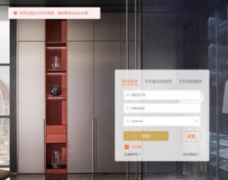

**解决方案：**此提示说明用户超过 30 天未登陆时，系统自动禁用了。找商场 admin  系统管理员，组织人员管理架构中，找到对应人员，可查看到账号状态为禁用，

点击【启用】即可。

**30、登录界面出现扫码登录是怎么回事？**

解决方案：  MTDS 系统登录界面新增扫码登录的功能，  您使用手机微信扫码， 确 认后即可自动登录，更安全更便捷。若是首次登录超级导购小程序，需要微信或

手机验证码确认，确认后将自动登录 MTDS。

同时，原登录方式仍保留，点击右上角切换登录方式即可。

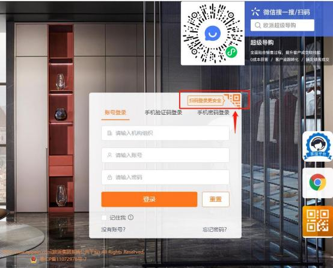

**31、MTDS 账号没有购买 CAXA 账号，系统却显示一条账号购买记录，**

**是怎么回事呢？**

**解决方案：**  当 MTDS 账号（未绑定设计账号） ，首次登录超级导购工具并使用智  能设计模块生成全景图，系统会自动创建一条 CAXA 软件账号绑定信息（如下图， 与绑定并购买设计软件显示一样） ，**不收取费用，** 但这个软件账号无法登陆并不  具备电脑端设计软件的功能。如需登录画图， 需按正常流程给这个账号购买续费

即可。

**场景说明：**

**场景一、**A 人员已购买设计软件（即有绑定信息） ，他使用超级导购不会再另外

生成一条绑定信息。他即能用设计软件，也能用超级导购的全景图渲染；

**场景二：** B 人员没有买设计软件（即无绑定信息）  ，他使用超级导购会生成一条 绑定信息。他能用超级导购的全景图渲染， 不能用设计软件（需要用的话直接在

这个账号下购买计费项目即可）  。

**32、登录时提示“未知错误”，怎么处理？**

登录时提示“未知错误 ”，请取消之前谷歌浏览器中收藏的网址，  并清除浏览器缓

存。重新登录时直接手动输入网址： mtds.oppein.com ，待登录成功后，可再收

藏该网址便于后期登录。

**清除浏览器缓存-快捷键：** ctrl+shift+del，进入“清除浏览器数据”页面， 包括清除

浏览历史记录、清空缓存。

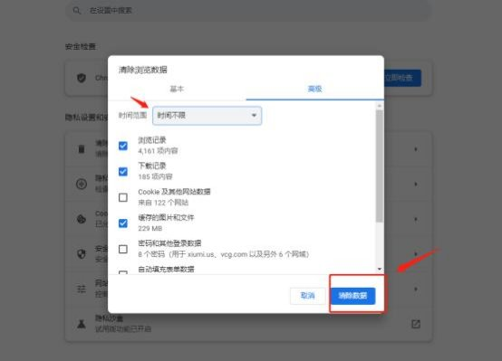

**33、酷家乐账号如何购买/续费？**

**解决方案：**酷家乐 VIP 购买/续费流程

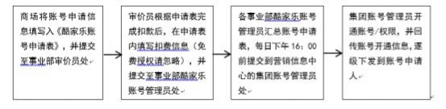

**购买类型**

欧派营销第

新增

S000001

有限公司

一事业部

注意事项：

1 、请申请人谨慎填写申请表，酷家乐账号一经开通不予撤销。

2 、账号开通后请申请人及时确认开通情况，如有疑问需在 24 小时内反馈。

3、 自有账号授权后，必须自行【接收】分享后，方可成功开通权限。

<table><tr><th colspan="21" valign="top">                    <b>酷家乐账号申请表</b></th></tr>
<tr><td colspan="4" valign="top"><b>事业线信息       商场信息</b></td><td colspan="3" valign="top"><b>申请人信息</b></td><td colspan="3" valign="top"><b>申请服务</b></td><td colspan="7" valign="top"><b>申请品类</b></td><td colspan="2" valign="top"><b>费用信息（审价填写）</b></td><td colspan="1" rowspan="1" valign="top"><b>开通日期</b></td><td colspan="1" rowspan="1" valign="top"><b>备注</b></td></tr>
<tr><td colspan="3" valign="top"><b>序号    申请日期    所属事业线 经销部/部门 商场编码 商场名称</b></td><td colspan="1" valign="top">
<b>公</b>    家装

(
</td><td colspan="1" valign="top"></td><td colspan="1" valign="top"></td><td colspan="1" valign="top"><b>联系电话</b></td><td colspan="1" valign="top"><b>账号类型</b></td><td colspan="1" valign="top"><b>购买项目</b></td><td colspan="1" valign="top">
<b>原/新账号</b>

<b>(默认密码op123456)</b>
</td><td colspan="1" valign="top"></td><td colspan="1" valign="top"></td><td colspan="1" valign="top"></td><td colspan="1" valign="top"><b>橱柜零售</b></td><td colspan="1" valign="top"><b>衣柜家装整装</b></td><td colspan="1" valign="top"><b>衣柜零售</b></td><td colspan="1" valign="top">
<b>合作渠</b>    创新发展

(
</td><td colspan="1" valign="top"><b>费用金额</b></td><td colspan="1" valign="top"><b>审价员</b></td></tr>
<tr><td colspan="1" valign="top">例 1/1</td><td colspan="1" valign="top">一事业部经销一部</td><td colspan="1" valign="top"></td><td colspan="1" valign="top">广州市众可装饰设计</td><td colspan="1" valign="top"></td><td colspan="1" valign="top"></td><td colspan="1" valign="top">13100000000</td><td colspan="1" valign="top">商场账号</td><td colspan="1" valign="top">自有账号授权（400元/年）</td><td colspan="1" valign="top">注册手机号/邮箱号</td><td colspan="1" valign="top"></td><td colspan="1" valign="top"></td><td colspan="1" valign="top"></td><td colspan="1" valign="top"></td><td colspan="1" valign="top"></td><td colspan="1" valign="top"></td><td colspan="1" valign="top"></td><td colspan="1" valign="top">1500</td><td colspan="1" valign="top">李四</td><td colspan="1" valign="top"></td><td colspan="1" valign="top"></td></tr>
<tr><td colspan="1" valign="top">1</td><td colspan="1" valign="top"></td><td colspan="1" valign="top"></td><td colspan="1" valign="top"></td><td colspan="1" valign="top"></td><td colspan="1" valign="top"></td><td colspan="1" valign="top"></td><td colspan="1" valign="top"></td><td colspan="1" valign="top"></td><td colspan="1" valign="top"></td><td colspan="1" valign="top"></td><td colspan="1" valign="top"></td><td colspan="1" valign="top"></td><td colspan="1" valign="top"></td><td colspan="1" valign="top"></td><td colspan="1" valign="top"></td><td colspan="1" valign="top"></td><td colspan="1" valign="top"></td><td colspan="1" valign="top"></td><td colspan="1" valign="top"></td><td colspan="1" valign="top"></td></tr>
<tr><td colspan="1" valign="top">2</td><td colspan="1" valign="top"></td><td colspan="1" valign="top"></td><td colspan="1" valign="top"></td><td colspan="1" valign="top"></td><td colspan="1" valign="top"></td><td colspan="1" valign="top"></td><td colspan="1" valign="top"></td><td colspan="1" valign="top"></td><td colspan="1" valign="top"></td><td colspan="1" valign="top"></td><td colspan="1" valign="top"></td><td colspan="1" valign="top"></td><td colspan="1" valign="top"></td><td colspan="1" valign="top"></td><td colspan="1" valign="top"></td><td colspan="1" valign="top"></td><td colspan="1" valign="top"></td><td colspan="1" valign="top"></td><td colspan="1" valign="top"></td><td colspan="1" valign="top"></td></tr>
<tr><td colspan="1" valign="top">3</td><td colspan="1" valign="top"></td><td colspan="1" valign="top"></td><td colspan="1" valign="top"></td><td colspan="1" valign="top"></td><td colspan="1" valign="top"></td><td colspan="1" valign="top"></td><td colspan="1" valign="top"></td><td colspan="1" valign="top"></td><td colspan="1" valign="top"></td><td colspan="1" valign="top"></td><td colspan="1" valign="top"></td><td colspan="1" valign="top"></td><td colspan="1" valign="top"></td><td colspan="1" valign="top"></td><td colspan="1" valign="top"></td><td colspan="1" valign="top"></td><td colspan="1" valign="top"></td><td colspan="1" valign="top"></td><td colspan="1" valign="top"></td><td colspan="1" valign="top"></td></tr>
<tr><td colspan="1" valign="top">4</td><td colspan="1" valign="top"></td><td colspan="1" valign="top"></td><td colspan="1" valign="top"></td><td colspan="1" valign="top"></td><td colspan="1" valign="top"></td><td colspan="1" valign="top"></td><td colspan="1" valign="top"></td><td colspan="1" valign="top"></td><td colspan="1" valign="top"></td><td colspan="1" valign="top"></td><td colspan="1" valign="top"></td><td colspan="1" valign="top"></td><td colspan="1" valign="top"></td><td colspan="1" valign="top"></td><td colspan="1" valign="top"></td><td colspan="1" valign="top"></td><td colspan="1" valign="top"></td><td colspan="1" valign="top"></td><td colspan="1" valign="top"></td><td colspan="1" valign="top"></td></tr>
<tr><td colspan="1" valign="top">5</td><td colspan="1" valign="top"></td><td colspan="1" valign="top"></td><td colspan="1" valign="top"></td><td colspan="1" valign="top"></td><td colspan="1" valign="top"></td><td colspan="1" valign="top"></td><td colspan="1" valign="top"></td><td colspan="1" valign="top"></td><td colspan="1" valign="top"></td><td colspan="1" valign="top"></td><td colspan="1" valign="top"></td><td colspan="1" valign="top"></td><td colspan="1" valign="top"></td><td colspan="1" valign="top"></td><td colspan="1" valign="top"></td><td colspan="1" valign="top"></td><td colspan="1" valign="top"></td><td colspan="1" valign="top"></td><td colspan="1" valign="top"></td><td colspan="1" valign="top"></td></tr>
<tr><td colspan="1" valign="top">6</td><td colspan="1" valign="top"></td><td colspan="1" valign="top"></td><td colspan="1" valign="top"></td><td colspan="1" valign="top"></td><td colspan="1" valign="top"></td><td colspan="1" valign="top"></td><td colspan="1" valign="top"></td><td colspan="1" valign="top"></td><td colspan="1" valign="top"></td><td colspan="1" valign="top"></td><td colspan="1" valign="top"></td><td colspan="1" valign="top"></td><td colspan="1" valign="top"></td><td colspan="1" valign="top"></td><td colspan="1" valign="top"></td><td colspan="1" valign="top"></td><td colspan="1" valign="top"></td><td colspan="1" valign="top"></td><td colspan="1" valign="top"></td><td colspan="1" valign="top"></td></tr>
<tr><td colspan="1" valign="top">7</td><td colspan="1" valign="top"></td><td colspan="1" valign="top"></td><td colspan="1" valign="top"></td><td colspan="1" valign="top"></td><td colspan="1" valign="top"></td><td colspan="1" valign="top"></td><td colspan="1" valign="top"></td><td colspan="1" valign="top"></td><td colspan="1" valign="top"></td><td colspan="1" valign="top"></td><td colspan="1" valign="top"></td><td colspan="1" valign="top"></td><td colspan="1" valign="top"></td><td colspan="1" valign="top"></td><td colspan="1" valign="top"></td><td colspan="1" valign="top"></td><td colspan="1" valign="top"></td><td colspan="1" valign="top"></td><td colspan="1" valign="top"></td><td colspan="1" valign="top"></td></tr>
<tr><td colspan="1" valign="top">8</td><td colspan="1" valign="top"></td><td colspan="1" valign="top"></td><td colspan="1" valign="top"></td><td colspan="1" valign="top"></td><td colspan="1" valign="top"></td><td colspan="1" valign="top"></td><td colspan="1" valign="top"></td><td colspan="1" valign="top"></td><td colspan="1" valign="top"></td><td colspan="1" valign="top"></td><td colspan="1" valign="top"></td><td colspan="1" valign="top"></td><td colspan="1" valign="top"></td><td colspan="1" valign="top"></td><td colspan="1" valign="top"></td><td colspan="1" valign="top"></td><td colspan="1" valign="top"></td><td colspan="1" valign="top"></td><td colspan="1" valign="top"></td><td colspan="1" valign="top"></td></tr>
<tr><td colspan="1" valign="top">9</td><td colspan="1" valign="top"></td><td colspan="1" valign="top"></td><td colspan="1" valign="top"></td><td colspan="1" valign="top"></td><td colspan="1" valign="top"></td><td colspan="1" valign="top"></td><td colspan="1" valign="top"></td><td colspan="1" valign="top"></td><td colspan="1" valign="top"></td><td colspan="1" valign="top"></td><td colspan="1" valign="top"></td><td colspan="1" valign="top"></td><td colspan="1" valign="top"></td><td colspan="1" valign="top"></td><td colspan="1" valign="top"></td><td colspan="1" valign="top"></td><td colspan="1" valign="top"></td><td colspan="1" valign="top"></td><td colspan="1" valign="top"></td><td colspan="1" valign="top"></td></tr>
<tr><td colspan="1" valign="top">10</td><td colspan="1" valign="top"></td><td colspan="1" valign="top"></td><td colspan="1" valign="top"></td><td colspan="1" valign="top"></td><td colspan="1" valign="top"></td><td colspan="1" valign="top"></td><td colspan="1" valign="top"></td><td colspan="1" valign="top"></td><td colspan="1" valign="top"></td><td colspan="1" valign="top"></td><td colspan="1" valign="top"></td><td colspan="1" valign="top"></td><td colspan="1" valign="top"></td><td colspan="1" valign="top"></td><td colspan="1" valign="top"></td><td colspan="1" valign="top"></td><td colspan="1" valign="top"></td><td colspan="1" valign="top"></td><td colspan="1" valign="top"></td><td colspan="1" valign="top"></td></tr>
</table>
**备注说明：**

**1、购买项目：可点击下拉选择【VIP账号购买（1500元/年）】或【自有账号授权（400元/年）】或【钻石VIP账号购买（2500元/年）】；**

**2、账号信息：账号需填写注册或绑定的手机号/邮箱号；新增vip账号无需填写，默认密码为op123456；**

**3、每行仅可填写一个账号，如申请多个账号、多个购买项目请分行填写；**

**4、请谨慎填写申请表，账号一经开通不予撤销；请勿随意修改表头。**

