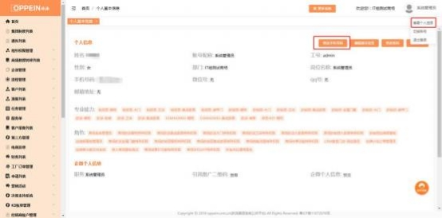
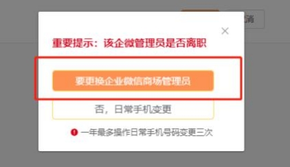
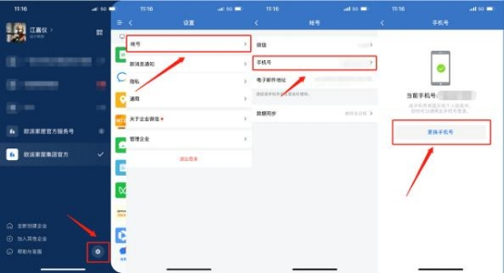

**23、admin 账号如何修改手机号？**

**解决方案：** 有两种情况：

① 原手机号对应的 admin 离职，需要更换新手机号。登录 admin 账号，点击 右上角【查看人员信息】  - 【修改手机号码】， 输入新手机号、验证码， 点击 保存后在弹窗中点击【要更换企业微信商场管理员】即可。这种情况会导致

原手机号对应的 admin 账号在企微中被离职， 新手机号将产生对应新的企微

身份， admin 账号的企微中不会留存旧手机号对应的好友关系和群聊。

② 原手机号对应的 admin 未离职，只是更换手机号。登录 admin 账号，点击  右上角【查看人员信息】  - 【修改手机号码】， 输入新手机号、验证码， 点击  保存后在弹窗中点击【否，日常手机变更】。这种情况下，新手机号不会同  步到企微，需要用旧手机号登录 admin 账号的企微，点击左上角三条横线，

再点击右下角，点击账号-手机号操作更换手机号。

（注： 一年最多操作日常变更手机号三次，请谨慎操作。）

