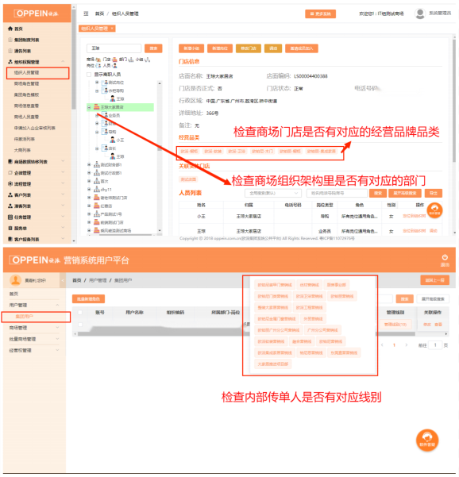
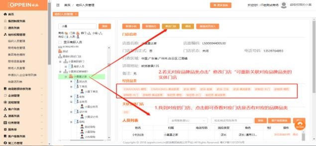
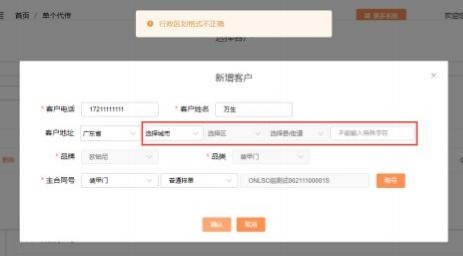
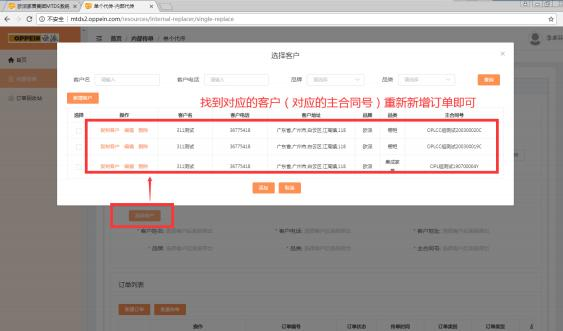
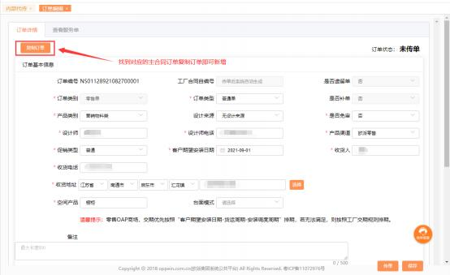
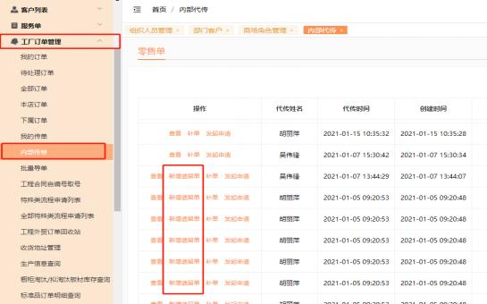
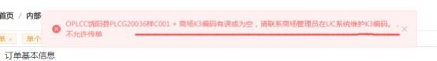
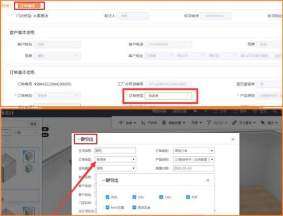
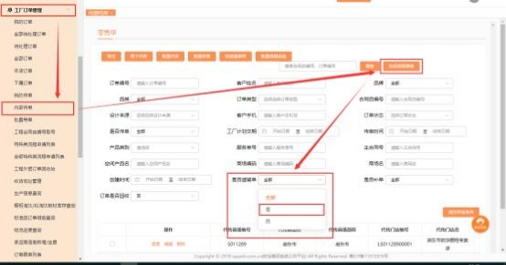


**十、 内部传单相关问题**

**（一）内部代传**

**1、集团内部代传的网址是多少？**

**解决方案：  <http://mtds.oppein.com>**

**2、内部代传的单个代传和批量代传有什么区别？**

**解决方案：**单个代传是针对一个商场单个订单类型，   批量代传针对多个商场单 个订单类型传单（应用较多是厨电和家配） 。其中注意的是批量代传：  订单的客 户等信息是商场的法人信息（姓名， 电话， 地址） ；单个代传：  收货人、收货地 址、收货人电话信息取的是选择对应商场的门店（取商场在 mtds 配置的默认信

息，若无可以手动输入）。

**3、内部代传时为什么会找不到对应的商场？**

**解决方案：** 1）检查该内部传单人员在 UC 上是否管理到对应线别； 2）检查对应

商场在 MTDS 的组织架构里是否有门店；3）确认门店是否有对应的品牌品类。

**4、内部传单提示“虚拟门店品牌品类不能为空”？**

**解决方案：**  1）检查一下商场 MTDS 组织架构的对应门店是否有对应的品牌品 类；2）确认门店有对应品牌品类后清缓存重新进来试一试； 3）仍然出现提示请

提供商场组织编码、账号密码和 admin 密码报给事业线答疑群。

企业微信答疑群：

【答疑群】橱柜事业部 -UC+MTDS+MTDS 传单

【答疑群】欧铂丽事业部 MTDS-UC-ASSP 答疑（集团&欧铂丽）

【答疑群】整装大家居 MTDS+UC+ASSP+招商

【答疑群】集成家居事业部(MTDS+UC+招商）

**5、单个代传时提示“行政区划格式不正确”，怎么处理？**

**解决方案：**检查一下客户地址是否填写正确，特别注意行政区和县/街道是否有

勾选好了。

**6、保存时提示“系统错误， 虚拟门店信息丢失，请联系 admin 处理”，**

**怎么处理？**

**解决方案：**请找商场 admin 检查一下该订单的门店是否有变动，若门店无实体 门店请重新关联该虚拟门店的实体门店，若该门店已经删除只能重新新增订单关

联新门店重新传单。

**7、保存订单时提示“请输入产品空间名” ，怎么解决？**

**解决方案：**在空间产品处输入订单的空间产品名 。

**8、新增客户时提示“生成主合同失败， 原因： 主合同号重复！ ！！ℽ ,**

**这个怎么处理？**

**解决方案 1：**   系统会校验主合同号唯一，如果仍需使用该主合同编码， 需找到

对应的客户选择该主合同号继续下单即可。

**解决方案 2：**系统会校验主合同号唯一，如果仍需使用该主合同编码， 或者找到

对应主合同号订单复制订单新增即可。

**9、集团内部人员传完单后， 商场具体在那可以查看订单？**

**解决方案：**商场 admin 给对应的人员开通内部传单权限即可查看。

**10、内部代传的单商场能在哪里下遗留单呢？**

**解决方案：** 1)确认 admin 给对应角色勾选对应的权限 2）工厂订单管理→ 内部

传单→找到对应单→新增遗留单即可新增遗留单。

**11、内部代传时提示“商场 K3 编码有误或为空”怎么处理？**

**解决方案：** 1)找商场对应的经销部商场管理员检查一下商场在 UC 系统里 K3 编 码是否有维护 2）若 UC 后台维护好 K3 编码后， 仍提示这个，  请确认一下商场

K3 账户上是否有款 ，无款需充值后才能下单。

**12、 内部员工查询订单时搜不到订单是怎么回事？**

**解决方案：**内部代传的单查询需要选择订单创建时间段及搜索范围是三个月的订

单。

**13、内部代传单怎么发起批量取消审批？**

**解决方案：**登录系统后在工厂订单管理→ 内部传单→选择对应需要取消的订单→

点击“批量流程申请”（仅支持批量取消审批流程）  →填好内容提交即可。

**14、内部代传的单在哪可以导出？**

**解决方案：**部分导出：登录内部代传系统后→ 内部代传→搜索对应需要导出的订 单→导出即可； 全部导出：登录内部代传系统后→ 内部代传→直接点击导出，即

可导出全部。

**15、提示“指针为空“是什么原因？**

**解决方案：**这是不明语提示， 需报咨询群 ，咨询老师提供给技术处理。

企业微信答疑群：

【答疑群】橱柜事业部 -UC+MTDS+MTDS 传单

【答疑群】欧铂丽事业部 MTDS-UC-ASSP 答疑（集团&欧铂丽）

【答疑群】整装大家居 MTDS+UC+ASSP+招商

【答疑群】集成家居事业部(MTDS+UC+招商）

**16、内部代传时，提示”设计文件订单类型选项不符，请重新修改后上**

**传“**

**解决方案：**需检查设计文件的订单类型和 MTDS 传单界面的订单类型是否一致。

如下图：

**17、 内部代传里新增了遗留单，保存后怎么查找该订单？**

**解决方案：**点击工厂订单管理→ 内部传单→点击高级搜索→选择是否遗留单为

是→点击搜索即可，请看下面图片

