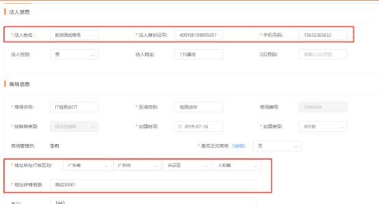
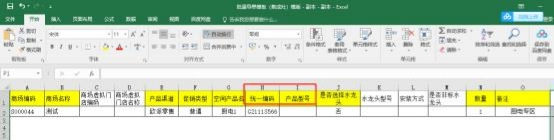
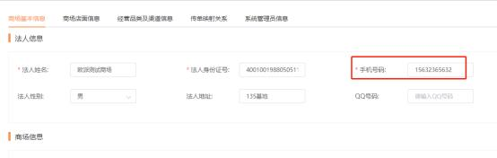
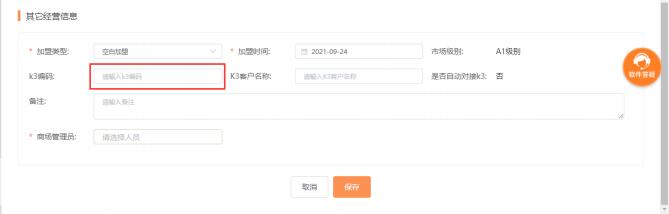
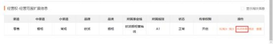


**（二）批量导单**

**2、批量导单失败， 失败原因“下属门店均未配置收货地址/无省市区**

**行政区划”？**

解决方案：此问题是因为需下单的品牌品类在商场组织架构匹配到多个虚拟门店， 并且全部虚拟门店都没有配置默认地址，需要商场 admin 的账号为虚拟门店配   置默认地址即可，操作步骤：登陆 Admin 的账号-进到“工厂订单管理-收货地   址管理”菜单-新增默认地址后 -点击“配置默认地址” -选择所属门店、选择默

认收货地址-点击“新增默认地址”，即配置成功，如下图：

**3、批量导单失败， 失败原因“请补充标准品的必填字段”**

**解决方案：**  检查导入的表格数据，将必填字段填完整后再重新导单。

**4、批量导单失败，失败原因“读取 excel 第 XX 行时失败， 请修正后**

**重试“**

**解决方法：**  检查导入表格对应的行的数据，修改正确后再重新导入。

**5、批量导单失败，失败原因“系统找不到符合条件的下单门店， 请 检查 UC 基础信息配置（如账号无权限、无下单门店、无实体门店与**

**虚拟门店映射等）**

**解决方案：**    此提示需检查以下方面：

1）商场没有创建虚拟门店或是商场所有的虚拟门店没有配置此次导单的品牌品

类，则需由商场 Admin 账号创建虚拟门店并关联对应实体门店或是在现有的虚

拟门店上关联对应导单品牌品类的实体门店。

2）此次导单人没有管理到此次导单商场所在的线别，同事业部的可联系对应事  业线超管配置管理线别，跨事业部的可发邮件给集团营销信息中心余海英处理。 3）商场虚拟门店所关联的实体门店的品牌品类被淘汰，需要联系商场对应的经

销部门商场管理员进行处理。

4）导单时所选择的大中小渠道和商场经营的大中小渠道不一致，需联系商场对

应的经销部门商场管理员进行处理。

5）检查导单模板中的商场组织编码是否正确。

**6、批量导单失败，失败原因“匹配不到指定的门店”**

**解决方案：**检查商场的虚拟门店的品牌品类及渠道是否和导单时所选择的品牌品 类、大中小渠道一致， 如果商场有多个虚拟门店，  每个虚拟门店都需要检查，只要有一个虚拟门店的品牌品类及渠道与导单时选择的一致即可。

**7、批量导单失败，失败原因“请先补充商场信息，如法人姓名、电**

**话、商场区划地址”**？

**解决方案：**  原因为此次导单的商场在 UC 后台信息不全，  需要联系对应经销部门

商场管理员前往 UC 进行处理。

**8、批量导单失败，失败原因“填写的产品渠道有误，与该品牌品类**

**下的产品渠道名称不一致”**

**解决方案：**导单时填写的渠道信息和商场的渠道不致，修改渠道即可。

**9、批量导单失败， 失败原因“当前条件下找不到该标准品”**

**解决方案：** 根据导单文件中的统一编码和产品型号查询标准品库， 查询不到标准

品，检查导单文件中的统一编码和产品型号是否正确， 修改正确重新导单即可。

**10、批量导单失败，失败原因“搜索到多个标准品， 请填写准确的统**

**一编码后重试”**

**解决方案：**根据导单文件中的统一编码和产品型号查询标准品库，查询到多个值，

检查导单文件中的统一编码和产品型号是否正确，修改正确重新导单即可。

**11、批量导单失败，失败原因“客户电话格式有误”**

**解决方案：**  UC 商场法人电话格式必须是 11 位的手机号，联系经销部门商场管 理员检查一下 UC 商场的法人电话号码是否格式不对或者电话末尾或首位多了

空格/回车符，将法人电话号码改为正确的即可。

**12、批量导单失败，失败原因“商场 K3 为空不允许传单”**

**解决方案：** UC 系统中商场的 K3 编码没有设置， 联系经销部门商场管理员补充商

场 K3 编码即可。

**13、批量导单失败，失败原因“商场传单权限已经关闭，不允许传单**

**“**

**解决方案：**  UC 系统中商场对应的品牌品类渠道的传单权限被关闭，  联系经销部

门商场管理员处理。

**14、批量导单失败，失败原因“订单不存在“**

**解决方案：** 由于系统数据库读写异常导致，  可等两分钟后再重试，  如重试后还是

不行，可联系营销信息中心答疑人员处理。咨询途径：

企业微信答疑群：

【答疑群】橱柜事业部 -UC+MTDS+MTDS 传单

【答疑群】欧铂丽事业部 MTDS-UC-ASSP 答疑（集团&欧铂丽）

【答疑群】整装大家居 MTDS+UC+ASSP+招商

【答疑群】集成家居事业部(MTDS+UC+招商）

**15、批量导单失败，失败原因“调用 XX 接口失败，原因是 XXX “**

**解决方案：**  系统接口报错，  等两分钟后重试，  如重试后仍不行，  可联系营销信息

中心答疑人员处理，咨询途径：

企业微信答疑群：

【答疑群】橱柜事业部 -UC+MTDS+MTDS 传单

【答疑群】欧铂丽事业部 MTDS-UC-ASSP 答疑（集团&欧铂丽）

【答疑群】整装大家居 MTDS+UC+ASSP+招商

【答疑群】集成家居事业部(MTDS+UC+招商）

**16、批量导单失败，失败原因“客户详细地址不允许输入特殊字符，**

**请重新输入后再操作！“**

**解决方案：**  ①若是第一次为此商场导单，客户地址取的是  UC  中对应事业线下， 商场基本信息中的地址详情信息，请经销部管理员在 UC 中删除特殊字符或空格，

再重新操作批量导单。

②若不是第一次为此商场导单， 客户地址取的是最近一次该产品类别的内部代传 订单的服务号的客户地址信息。登录商场 admin 账号， 在工厂订单管理-内部传 单里找到最近该产品类别的一个订单， 点击查看进入订单详情，  下拉点击【服务 单信息】tab 栏， 复制服务号，  在全部客户中找到此客户，  点击编辑进入，  删除

特殊字符或空格。

