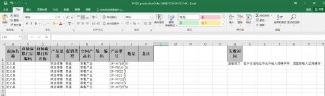
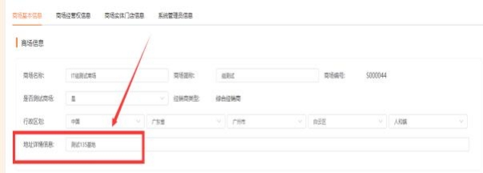
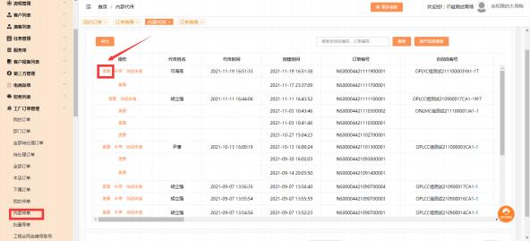
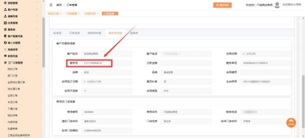
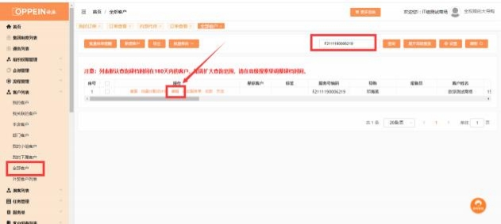
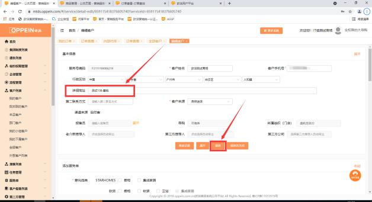

**16、批量导单失败，失败原因“客户详细地址不允许输入特殊字符，**

**请重新输入后再操作！“**

**解决方案：**  ①若是第一次为此商场导单，客户地址取的是  UC  中对应事业线下， 商场基本信息中的地址详情信息，请经销部管理员在 UC 中删除特殊字符或空格，

再重新操作批量导单。

②若不是第一次为此商场导单， 客户地址取的是最近一次该产品类别的内部代传 订单的服务号的客户地址信息。登录商场 admin 账号， 在工厂订单管理-内部传 单里找到最近该产品类别的一个订单， 点击查看进入订单详情，  下拉点击【服务 单信息】tab 栏， 复制服务号，  在全部客户中找到此客户，  点击编辑进入，  删除

特殊字符或空格。

