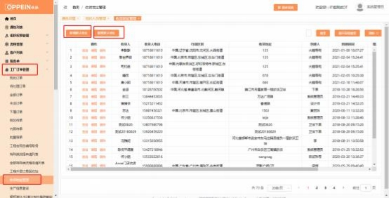
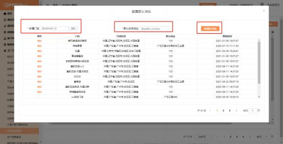

**2、批量导单失败， 失败原因“下属门店均未配置收货地址/无省市区**

**行政区划”？**

解决方案：此问题是因为需下单的品牌品类在商场组织架构匹配到多个虚拟门店， 并且全部虚拟门店都没有配置默认地址，需要商场 admin 的账号为虚拟门店配   置默认地址即可，操作步骤：登陆 Admin 的账号-进到“工厂订单管理-收货地   址管理”菜单-新增默认地址后 -点击“配置默认地址” -选择所属门店、选择默

认收货地址-点击“新增默认地址”，即配置成功，如下图：

