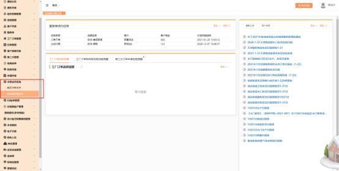
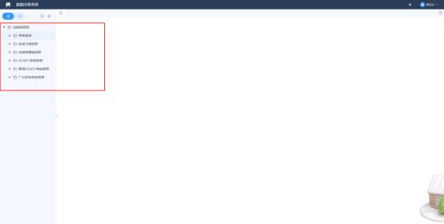
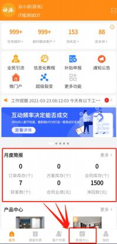
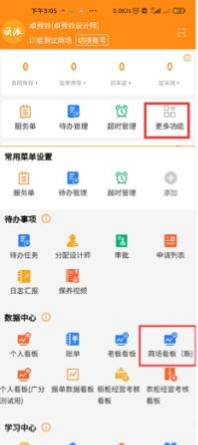


**十一、三盯/数据看板/其他相关问题**

**1、电脑端怎么查看报表数据？？**

**解决方案：**  电脑端登录 MTDS 账号—决策支持系统—经销商决策支持

**2、手机端数据看板在哪里查看？**

**解决方案：**  登录MTDS手机端➡数据中心查看数据看板

**3. 我的 MTDS APP 首页界面的三盯展示为什么没有待办任务展示**

**了？？**

解决方案：  现店长、老板、部门经理、系统管理员等管理岗位的三盯展示显示的 为：   “任务超时”“超时跟进客户”“测未定”“定未测”，待办任务可在【更 多】菜单里把【待办任务】加再在常用菜单里即可在首页直接点开待办任务办理

任务

**4、系统管理员账号登录数据看板， 显示当前账号无门店列表数据？**

**解决方案:** 系统管理员账号不在门店下，看不了门店数据，可以看商场看板。

**5、昨天已经录入了客流，今天数据看板还不显示数据呢？**

**解决方案:** 数据看板--客流部分的数据，是智慧门店的数据，目前现在只有智慧

门店试点商场才有数据。

