
**十二、售服相关问题**

**1、厨电百货新增遗留单怎么传（原单为厨电礼包百货时）？**

**解决方案：**  登录 MTDS 系统-进入工厂订单菜单栏-我的订单/全部订单，  找到品 类为橱柜，  产品类别为礼包百货类的订单，  点击新增遗留单（如图一），即可自

动跳转至居家匠人页面。

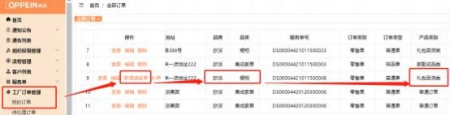

图一

**2、厨电百货快速遗留单怎么传（原单为厨电礼包百货时）？**

**解决方案：**  登录 MTDS 系统-工厂订单-我的订单-快速遗留单按钮，  输入关联的 原单号（如图一），若关联的原单品类为橱柜、产品类别为礼包百货类，  点击确

认后，即可正常跳转至居家匠人界面。

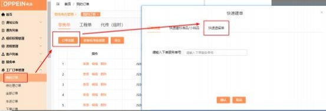

图一

**3、厨电百货遗留单怎么传（原单非厨电礼包百货时） ？**

**解决方案：**  当原单为其他产品类别（比如普通订单） 的橱柜单时（如图一），通  过新增遗留单或快速遗留单，进入订单创建页面时；切换产品类别为礼包百货，

会弹出提示框，点击确认后（如图二），即可自动跳转至居家匠人系统。

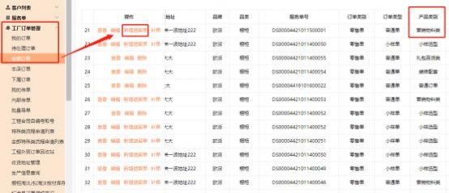

图一

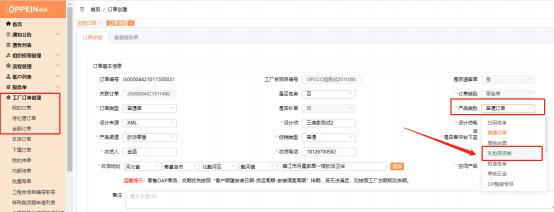

图二

**4、居家匠人完成遗留单后怎么在 MTDS 上查询？**

**解决方案：** 在居家匠人系统操作完成遗留单后， 订单会回传 MTDS；可在 MTDS

系统-工厂订单-我的订单查看对应遗留单（如下图）。

图一

图二

图三

**5、橱柜怎么发起返货流程？**

**解决方案：**  ①登录 MTDS 系统-在工厂订单中找到对应订单-新增 MTDS 申请单 -返货/对色收货确认流程流程的发起（如图一）； 注： 因为橱柜遗留单为责任判 定， 没有遗留判定 BPM 流程， 故在传单前后均可发起返货流程，  是否返货由商

场线下和橱柜售服人员沟通。

②商场与集团橱柜售服人员沟通后发起返货申请， 先填写表单中返货基地， 系统

会自动带出收货人信息（含姓名、电话和地址），接着必填写【商场返货人】、

【返货人联系电话】、【返货件数】、【返货内容】、【返货原因】、【物流快

递单据号】、【物流公司】后，点击提交即可（如图二）；

③当返货流程状态为【物流收货】。如果集团物流基地线下收到货后，  点击确认 提交流程，  状态会流转为【商场确认】。此时首页的工厂订单特殊类流程消息提

醒会进行展示如（图三）。

④  收到【商场确认】消息提醒时， 商场点击进入流程操作提交确认，  商场确认

后代表流程结束（如图四）。

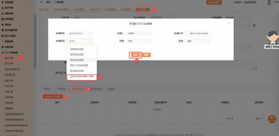

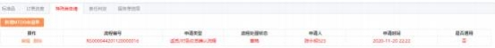

图一

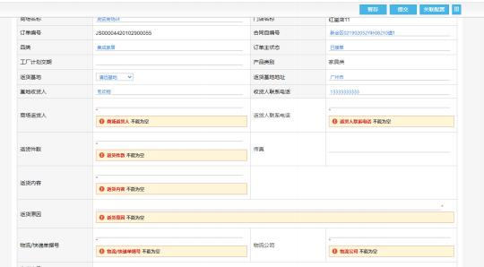

图二

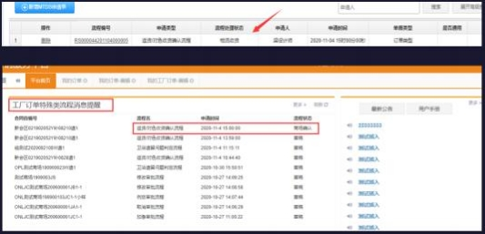

图三

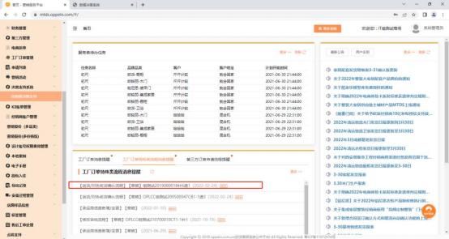

图四

**6、衣柜/木门/家配怎么发起返货流程？**

**解决方案：**  ①登录 MTDS 系统-在工厂订单中找到对应订单-新增 MTDS 申请单

-返货/对色收货确认流程流程的发起， 在遗留判定申请中新增【是否返货】字段，

如果该字段勾选【是】，则在点击传单按钮时 MTDS 系统校验该遗留单必须发 起返货流程；若该字段勾选【否】，则 MTDS 系统传单时不校验是否发起返货

流程 （如图一）；

②登录 MTDS 系统-在工厂订单中找到对应订单-新增 MTDS 申请单-返货/对色 收货确认流程流程的发起如图二（注： 如果在遗留判定申请中【是否返货】字段

勾选【是】，传单前需发起返货申请。）

③商场与集团橱柜售服人员沟通后发起返货申请， 先填写表单中返货基地， 系统

会自动带出收货人信息（含姓名、电话和地址），接着必填写【商场返货人】、

【返货人联系电话】、【返货件数】、【返货内容】、【返货原因】、【物流快

递单据号】、【物流公司】后，点击提交即可（如图三）；

④当返货流程状态为【物流收货】。如果集团物流基地线下收到货后，  点击确认 提交流程，  状态会流转为【商场确认】。此时首页的工厂订单特殊类流程消息提

醒会进行展示（如图四）。

⑤收到【商场确认】消息提醒时，  商场点击进入流程操作提交确认，  商场确认后

代表流程结束（如图五）。

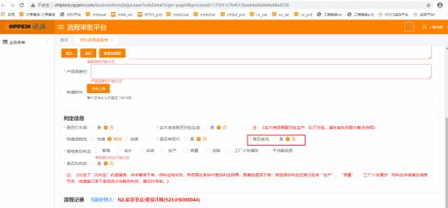

图一

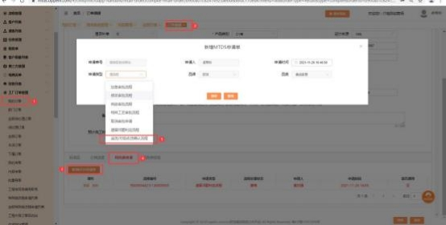

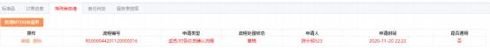

图二

图三

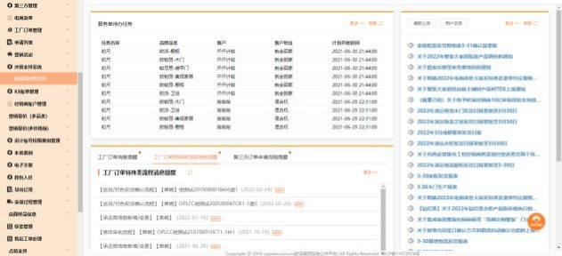

图四

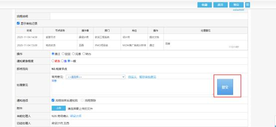

图五

**7、卫浴怎么发起返货流程？**

**解决方案：**  ①登录 MTDS 系统-在工厂订单中找到对应订单-新增 MTDS 申请单  -卫浴遗留问题判定流程（如图一） ；卫浴的返货流程因其业务特殊性，将返货  相关信息嵌进卫浴遗留判定流程中，卫浴先发起遗留判定后，经过售服组判定后， 触发自动传单，  并将遗留判定流程流转到【商场返货信息填写】（如图二） ，商  场填写信息提交后，  返货流程状态为【物流收货】， 商场点击确认后，  给售服人

员复判。

注： 如订单自动传单后，  商场没按售服人员沟通完善返货信息，  继续遗留判定流

程，卫浴制造线会人工卡单。

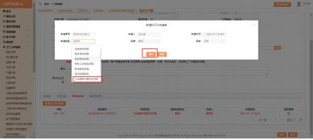

图一

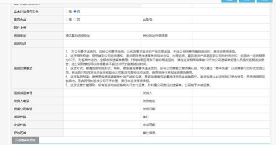

图二

**8、橱柜备用物料怎么下单？**

**解决方案：**  遗留单产品类别选择【单独五金】； 如果要下备用物料的遗留单，  则

添加标准品时选择二级目录为【备用物料】的产品，保存传单即可（如图一）。

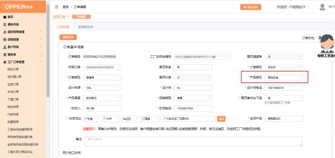

图一

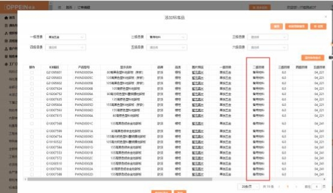

图二

**9、橱柜柜身免审怎么下单?**

产品类别选择【柜身免审】  ,下单流程与普通订单一样，设计来源选择 xml 设计

来源，上传设计文件，传单即可。

**10、家配成品类遗留单怎么下单？**

**解决方案：**  集成家居遗留单的产品类别选择【家配成品类】， 新增【遗留问题判 定流程】（图一），填写好审批单并提交（图二） ，审核通过后，  在标准品栏目

删除原产品，添加遗留单所需补件，添加好产品后点传单完成下单（图三）。

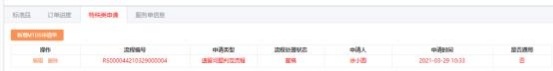

图一

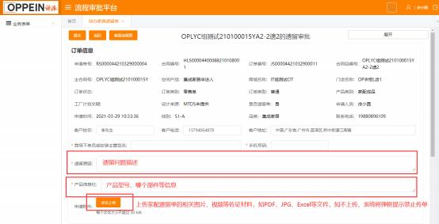

图二

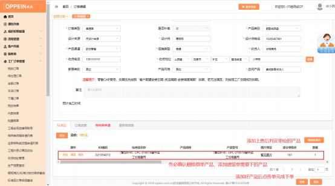

图三

**11、卫浴交期时间说明**

**解决方案:** 若期望交期小于等于今天， 保存订单会提示用户重新选择客户期望安 装日期； 客户期望交期选择范围要求只能选择当前时间 3 天之后（包含 3 天） ~

60 天之内（包含 60 天）（如图一）

图一

**12、木门遗留判定规则。**

**解决方案：**木门在发起遗留问题判定流程时， 如果【是否先判定】选择“是”， 即先判定，  在判定流程结束前， 系统禁止商场传单； 如果选择“否”，则系统允

许商场传单（如图）。

图三

**13、遗留五金下单怎么操作？**

**解决方案：** ①创建单独五金订单：按照正常建单流程创建遗留单，  选择产品类别

为单独五金即可（如图一）

②选择单独五金标准品: 订单创建页面下侧【标准品】Tab 栏， 点击添加标准品 （如图二） ，勾选需要的单独五金标准品，  在保存界面输入需要的数量，  确认保

存即可（注：单独五金标准品和原单五金不可同时被选择）

③选择原单五金数据：订单创建页面下侧【标准品】Tab 栏， 点击选择原单五金 （如图三） ；勾选需要的原单五金数据，  在保存界面输入需要的五金数量，  确认 保存即可（如图四） （注： 输入的原单五金数量，  不能超过原有订单下该五金本

身的数据（即若原有订单仅包含 5 个型号 A 的五金，下遗留单时最多只能选择

5 个型号 A 的五金，独五金标准品和原单五金不可同时被选择）

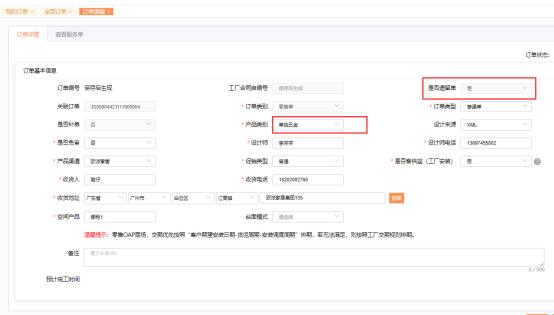

图一

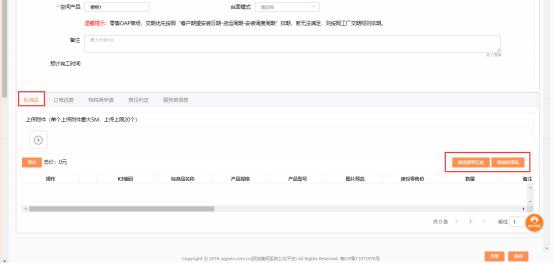

图二

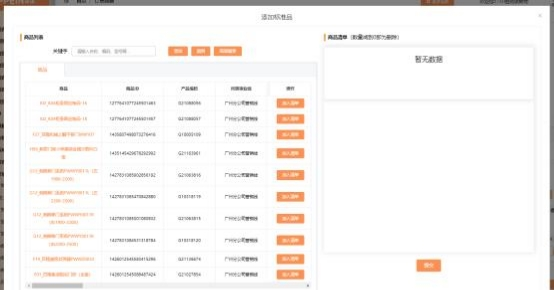

图三

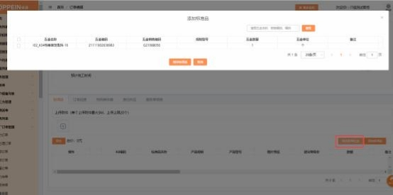

图四

**14、旧平台的订单下百货的遗留单，在 MTDS 关联订单下单报错，提**

**示“关联订单不存在”？**

**解决方案：**  如果需要在 MTDS 下单， 需要找一个在 MTDS 传单的橱柜订单或礼

包百货的订单去下单。产品类别选【礼包百货】 ，页面跳转至居家匠人系统去下

单， 具体的操作请参考厨电发出的通知。

**15、提示下单门店未关联欧派-橱柜的实体门店？**

**解决方案：**要用系统管理员账号检查此门店是否关联了“欧派-橱柜”的实体门 店， 若未关联此实体门店， 则无法下橱柜品类的遗留单，  关联好“欧派-橱柜”的

实体门店就行。

**16、单独百货的订单新增遗留单出现跳转不了【居家匠人平台】？**

**解决方案：**  该问题需要贵商场自行拨打售服工程师联系电话（020-29199397）

进行【居家匠人平台】信息维护。

**17、售服小能工单进不去怎么处理？**

**解决方案：**  小能工单自 2020 年 10 月 1 日起暂停使用，经销商处理集团派发的 客诉工单， 将由各经销部管理员在 OA 接收到工单后， 导出工单， 通过 QQ 传递

给商场售后负责人， 商场收到经销部管理员 QQ 下发的工单应按“客诉制度处理

时限要求”及时回复、处理， 并将处理方案与结果及时通过 QQ 回复经销部管理

员，经销部管理员收到商场回复后需及时通过 OA 回复到旧客服平台

**18、下遗留百货时，报错“保存失败， 厨电百货遗留单请在居家匠人**

**平台下单”怎么处理？**

**解决方案:** 用户在 MTDS 下遗留单， 产品类别为礼包百货， 点击确认后，  即可跳 转到居家匠人平台 **，**在居家匠人提交成功了后订单会回传到  MTDS ，可登录 MTDS 在工厂订单里-我的订单查看对应遗留单， 无需在 MTDS 系统重复操作下

单。

**19、扫码遗留单， 条码位置要怎么填写？**

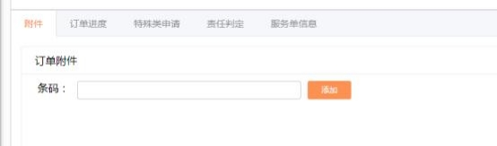

**解决方案：**

商场若用遗留板件的二维码下遗留单，注：橱柜类型订单产品类别需选择【扫  码免审】，集成家居类型订单产品类别该字段需选择【扫码遗留单】可用微信  等能扫码的手机应用扫描二维码，可扫描出序列号，在 MTDS 基本订单信息页

面-下方 TAB 栏中填写序列号。需填入第三个条码序列号即可。

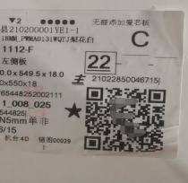

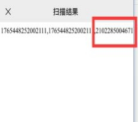

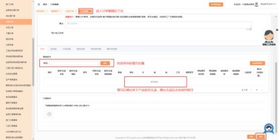

