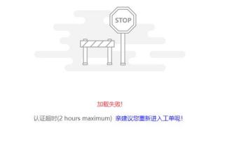

**17、售服小能工单进不去怎么处理？**

**解决方案：**  小能工单自 2020 年 10 月 1 日起暂停使用，经销商处理集团派发的 客诉工单， 将由各经销部管理员在 OA 接收到工单后， 导出工单， 通过 QQ 传递

给商场售后负责人， 商场收到经销部管理员 QQ 下发的工单应按“客诉制度处理

428

时限要求”及时回复、处理， 并将处理方案与结果及时通过 QQ 回复经销部管理

员，经销部管理员收到商场回复后需及时通过 OA 回复到旧客服平台

