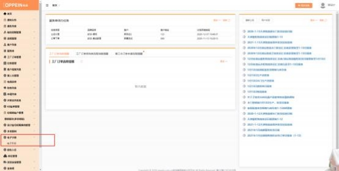
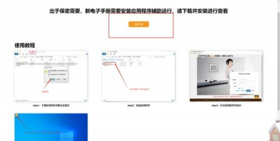
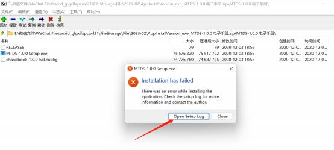
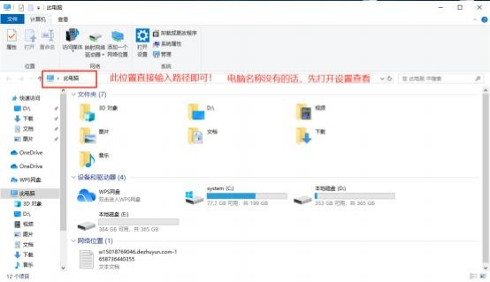
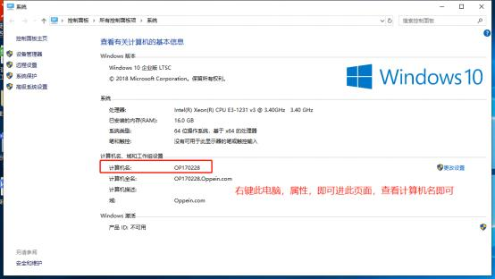
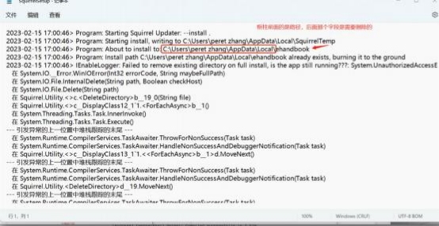

**十三、 电子手册相关问题**

**1、新电子手册在哪里，怎么查看？**

**解决方案：** 登录 MTDS 电脑端，进入电子手册列表，跳转至电子手册快捷方式

下载界面，点击安装至桌面，安装完成双击点开登录 MTDS 账号即可。   （安装

一次即可，无需重复安装）

**2、 电子手册安装报错应该如何处理？**

**解决方案：**

电子手册安装失败可能是以下 2 种情况，根据具体情况查看解决方案即可！

首先需确认是集团人员 （情况一）或商场人员 （情况二） ；

**情况一：**集团的**有部分电脑安装了信息部的保密系统， 这个会影响电子手册应用**

**的安装；**

**解决方案：** 集团人员如果遇到无法安装的情况， 直接联系集团信息部工程师反馈

处理即可。

**情况二：** 商场人员如果出现无法安装电子手册，  需确认是否是盗版系统，  或者修

改过的系统，都会导致电子手册的安装失败！

**解决方案：**  商场人员需先打开桌面上，  找到此电脑，   （如图一）在左侧路径位置

输入

C:\Users\#电脑名称#（需确认自己电脑名称，右键此电脑属性即可如图二；）

\AppData\Local\；

（图一）

（图二）

找到此文件后点击键盘中 CTRL+F 键搜索 ehandbook 的文件夹（或者快捷方

式如图三），直接删除之后即可重新安装！

（图三）

