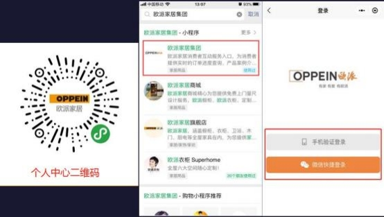

**十四、消费者个人中心小程序相关问题**

**1、 消费者个人中心是什么来的？**

**解决方案：**  消费者个人中心是相当于客户有了个人的“欧派淘宝 ”，客户全流程可 视化服务，   包括： 服务单全过程可视化监督、物流信息信息查询，  服务评价、积

分中心、案例收藏、电子收据、保修、投诉、工单查询、客服咨询等等。

**2、短信已经发送给客户了，但是客户通过短信链接进入小程序没有**

**弹窗消息确认， 待办也没有收到确认消息？**

**解决方案** 1：检查录入 mtds 系统的电话是否与登录号码一致，不一致的话，

直接退出重新输入正确的手机号码登录即可。

方案 2：如果客户电话一致的情况，让客户删除微信小程序，重新进入扫码。

**3、客户登录小程序的微信号绑定的手机号与合同签订手机号不一致，**

**现在客户无法确认合同信息**？

**解决方案：**  点击右上角的设置按钮，进入账号信息界面，点击换账号登录按

钮，在登录界面输入需要登录的手机号，获取验证码后点击立即登录即可。

**4、消费者怎么在小程序上修改手机号码/姓名呢？**

**解决方案：** 进入【欧派家居集团】小程序后，  点击「我的服务」-右上角的设置按 钮， 进入账号信息界面，  可修改相关信息。若修改手机号， 点击手机号码后输入

新手机号码，  获取验证码后点击立即修改即可。

**5、消费者个人中心的物流进度怎么显示的呢？**

**解决方案：**  个人中心显示当前品类的订单在工厂生产的详细信息如下图

**6、怎么客户小程序上查不到衣柜的订单进度？**

**解决方案：** 登录个人中心首页面，  点击生产进度查询，  在我的定制订单页面点击

需要查找的订单， 进入定制订单详情页面点击上方的品牌品类按钮即可切换 .

**7、消费者怎么进入个人中心呢？**

**解决方案：**

方案 1：扫描个人中心二维码（可向商场人员获取）；

方案 2：微信搜索“欧派家居集团”小程序；

方案 3：建档， 派尺， 合同签订，  首次传单，  四个节点会发送短信给消费者，  消

费者点击短信链接即可跳转至小程序。

**8、个人中心合同签订的金额不正确，怎么办呢？**

**解决方案：** 商场在办理合同签订任务时，  需要录入正常的合同金额，  可通过合同

增补的方式修改合同金额。

**9、消费者如何自己催单？**

**解决方案：**

方案一:1.在我的服务里点击催单按钮， 进入到我的服务订单界面， 选择要催单的  订单， 点击一键催单。催单后， 显示催单结果， 对催单结果满意可选择“有帮助” （如图一）。如对催单结果不满意点击“无帮助”可直接联系客服（如图二）。 方案二： 2.若对催单内容不满意，  可以点击“人工催单”按钮进行人工催单（如   图三） 。将需求写入需求框内，  点击提交，  即人工催单成功；  每个订单只能催一

次，如果二次催单则会出现提示。催单后，可以在催单记录里查看详情内容。

图一

图二

图三

**10、消费者如何查看自己的订单进度？**

**解决方案：**  点击生产进度查询，  进入订单列表，  点击某个订单，  可查看订单的量

尺预约，量尺图，合同签订，生产物流等信息。

**11、消费者如何查看自己的线上订单？**

**解决方案：**点击线上订单查询（目前仅支持 MTDS 促销系统线上拍付订单查询） ，

进入线上订单列表，可查看全部订单，普通，秒杀，下定，套餐及优惠券。

**12、消费者如何确定合同交期？**

**解决方案：**

方案 1：扫码进入个人中心小程序确认；

方案 2：通过短信链接进入个人中心确认；

方案 3：在微信小程序搜索“欧派家居集团”进入个人中心确认；

进入首页，  在弹窗提示点击【立即前往】或点击合同交期，  进入合同列表找到对

应的合同点选之后点击同意即可

**13、为什么我的订单没有积分呢？**

**解决方案：**  订单是没有下发积分的 ， 目前欧铂丽晒家（iHome）小程序对接了 个人中心， 消费者可在小程序进行晒家后，  由集团总部人员审核通过以后会下发

积分。

**14、客户收不到短信合同交期，怎么办？**

**解决方案：**

方案 1：商场人员首先检查一下录入系统的客户手机号是不是正确的；

方案 2：如果手机号正确录入的情况下，  需让客户检查一下短信垃圾箱是否有短

信。

**15、商场录入的收据，客户能通过消费者个人中心查看吗？如何查看**

**呢？**

**解决方案：**  可以查看的，  操作路径：  在我的数据，  点击我的收据进入查看电子收

据。

**16、办理合同签订任务上传的合同照片客户可以看到吗？在哪里查**

**看呢？**

**解决方案：** 可以查看， 操作路径： 点击生产进度查询， 在订单列表找到对应订单，

点击合同签订节点查看合同照片即可。

**17、给客户发短信后， 发现客户手机号是错的，客户收不到验证码，**

**可以再发一次吗？客户需要怎么确认合同呢？**

**解决方案：** 不能进行短信发送，  可以将个人中心二维码发给客户，  或客户微信小

程序搜索“欧派家居集团”，让客户扫码进入个人中心进行合同确认

**18、客户如何办理【欧派家居集团】小程序的合同确认？**

**19、消费者个人中心里面，售后报修电话如何设置？ 售服对接人电话**

**需要怎么设置？**

**解决方案：**  消费者个人中心小程序中，  服务-售后报修-电话报修，  显示的售服对

接人的电话，需要在 MTDS 系统组织架构管理中设置。

具体设置操作如下：

①组织架构管理中，新建售服对接人岗位及人员；

**②**编辑人员信息中， **备用联系方式可填写座机或手机号码，将展示在消费者个人**

**中心上。** 若备用联系方式处未填写，将直接展示手机处号码。

**③**该人员角色信息，**需设置成【集团控制型角色-售服对接人】。**若仅设置商场 管理角色属于无效。商场若设置了多人是集团控制型角色-售服对接人，消费者

个人中心将同步展示多个人员信息。

