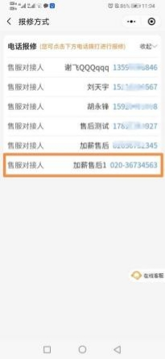
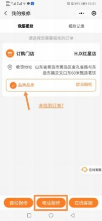
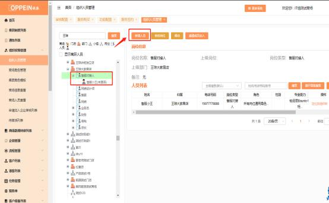
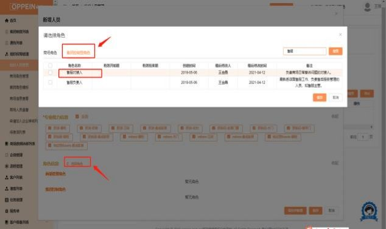

**19、消费者个人中心里面，售后报修电话如何设置？ 售服对接人电话**

**需要怎么设置？**

**解决方案：**  消费者个人中心小程序中，  服务-售后报修-电话报修，  显示的售服对

接人的电话，需要在 MTDS 系统组织架构管理中设置。

具体设置操作如下：

①组织架构管理中，新建售服对接人岗位及人员；

**②**编辑人员信息中， **备用联系方式可填写座机或手机号码，将展示在消费者个人**

**中心上。** 若备用联系方式处未填写，将直接展示手机处号码。

**③**该人员角色信息，**需设置成【集团控制型角色-售服对接人】。**若仅设置商场 管理角色属于无效。商场若设置了多人是集团控制型角色-售服对接人，消费者

个人中心将同步展示多个人员信息。

