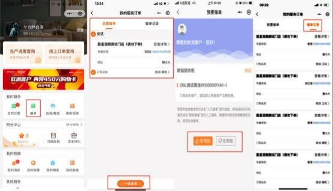
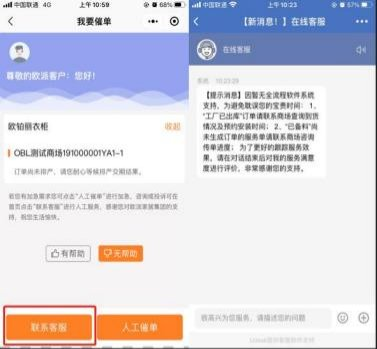
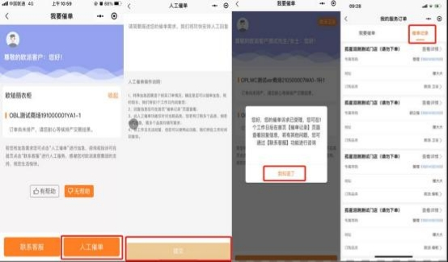

**9、消费者如何自己催单？**

**解决方案：**

方案一:1.在我的服务里点击催单按钮， 进入到我的服务订单界面， 选择要催单的  订单， 点击一键催单。催单后， 显示催单结果， 对催单结果满意可选择“有帮助” （如图一）。如对催单结果不满意点击“无帮助”可直接联系客服（如图二）。 方案二： 2.若对催单内容不满意，  可以点击“人工催单”按钮进行人工催单（如   图三） 。将需求写入需求框内，  点击提交，  即人工催单成功；  每个订单只能催一

次，如果二次催单则会出现提示。催单后，可以在催单记录里查看详情内容。

图一

图二

图三

