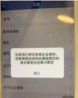
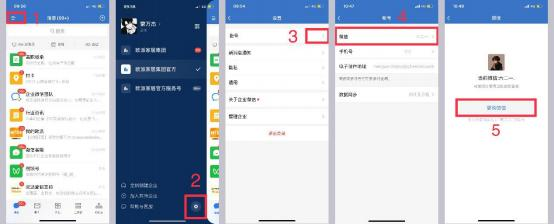
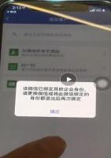
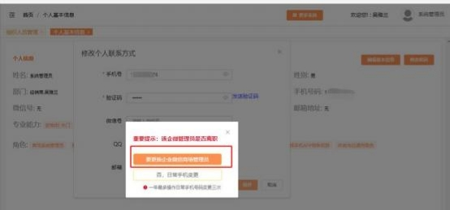

**（一）企微登录相关**

**1、企微登录使用手机号码登录时，员工加入不了欧派家居集团官方，**

**显示无法申请加入企业怎么办？**

**解决方案：**

①需要确认在 MTDS 系统维护的手机号与现在企微登录的手机号是否一致；

②需要确认该账号能否正常登录 MTDS 系统，是否完成手机号激活验证；

③确认是否有修改过 MTDS 账号关联的手机号，如有修改过，需使用原手机号

登录 ，进入企微后，在企微设置里面修改手机号码即可。

**2、原来在 MTDS 上维护的手机号码是错误的/不用了的，在 MTDS**

**上修改为正确的手机号后， 现在收不到企业微信邀请怎么办？**

**解决方案：** 由于是原手机号已经登录企微激活了才修改的手机号码， 原则上需使 用原来的手机号登录企微再修改手机号码， 若原手机号无法登录，需进行以下操 作：①在 MTDS 系统右上角-查看个人信息里修改为正确的手机号（如下图 1）； ②由 admin 在组织人员管理将此员工账号点击失效，系统提示弹框中选择“该 人员正式离职”后，然后再恢复在职（如下图 2）；③员工重新登录账号完成手 机号注册激活（如图 3），以新 ID 进入企微，原先添加的企微好友可通过离职

继承修改给新的企微。

**3、A 员工使用 B 员工的 MTDS 账号， 在 MTDS 将手机号修改为自**

**己的，现在收不到企微邀请怎么办？**

**解决方案：**建议使用原来的 B 员工手机号（需与 MTDS 原先维护的手机号一致）

登录企微，  登录之后再在企微的设置里，再修改成  A  员工的手机号即可。

**4、多个 MTDS 账号关联同一个手机号，在商场 PC 端 MTDS 系统 的组织架构有显示这个账号，但是企微的组织架构找不到这个账号是**

**什么原因？**

**解决方案：**  由于该手机号在 MTDS 架构上有两个或两个以上的账号同步到了企 微， 企微是根据最新同步的账号名字显示。现如果需要显示为正确的名字，  需登

录企业微信在工作台进入 MTDS 应用切换账号即可。

**5、员工登录企微显示【用户投诉，此账号因涉嫌违法或违规已被限**

**制登录】怎么办？**

**解决方案：**  需确认该手机号之前是否有被客户投诉， 如果有被客户投诉， 建议找

腾讯客服申诉，实在找不到具体原因，需提供员工手机号等相关信息给答疑老师，

联系企微协助排查。

**6、老板的 mtds 账号，可以用员工的微信帮忙激活吗？还是必须要**

**老板的微信激活？**

**解决方案：**  建议使用老板本人手机号激活。

**7、新员工新开通的账号，是不是要再发一次邀请？**

**解决方案：**  新账号的手机号，  如果是没有关联过其他  MTDS  账号的， 应该是会  自动收到邀请的，不需要管理员发送邀请；如果员工微信绑定的手机号是同一个，

在微信的服务通知就会收到邀请。

**8、企微无法和微信绑定，提示该微信已绑定其他企业身份，请更换**

**微信或将此微信绑定的身份都退出后再次绑定，该如何处理？**

**解决方案：** 出现提示原因是要绑定的微信已经绑定了其他企业身份， 需将该微信 原绑定的其他企业企微退出后，  再重新登录【欧派家居集团官方】企微，重新绑

定该微信即可。

**9、使用微信能登录企微，但是使用手机号码登录不了，  现在加好友**

**也提示报错怎么办？**

**解决方案：**  新账号的手机号该问题是由于企微有条件限制，  如： 原来【欧派家居

集团官方】企业， 绑定了手机号  138XXX，微信号  A1，然后又有另一个【欧派】 企业身份绑定了微信号  B1，在【欧派】上也绑定了  138XXX  的手机号， 那么，

【欧派家居集团官方】企业中的手机号就会变为未设置。

**方案一：**现需在微信号  B1 原有的企业微信上换绑手机号， 然后重新使用微信号 A1 登录【欧派家居集团官方】企业， 再把手机号码维护为手机号码  138XXX  即

可

**方案二：** 若原有的企业微信不用了，  需将微信号  B1  原有的企微退出企业后， 然 后使用微信号 A1 登录【欧派家居集团官方】企业， 再把手机号码维护为手机号 码  138XXX 即可。若该登录【欧派家居集团官方】的微信号 A1 不是自己想绑

定的微信，也可换绑。

**10、员工的企微邀请通知过期了， 能单独的在发一个吗？**

**解决方案：**直接用手机号登录即可

**11、员工是用的另一员工账号， 修改手机号为自己的，现在收不到企**

**微邀请？**

**解决方案：**  不支持将 A 员工账号修改信息给 B 员工使用，新员工入职建议新增

员工账号。

**12、账号一直有用，在后台更换了手机号码，从企业微信进入 mtds**

**显示“该企业微信尚未绑定任何 UC 用户信息”？**

**解决方案:**检查一下员工是否已经用原来都号码激活过企业微信了，  这 MTDS 修 改了号码同步不了到企微（企业微信的问题，已激活的只能在企微修改手机号） ，

需要员工在企业微信-设置里将手机号也修改成一致的即可。

**13、商场的系统管理员账号换了一个人来操作管理， 现在他要登录企**

**业微信需要怎么激活账号？ 关联手机号怎么修改？**

**解决方案:** 修改 admin 账号关联的电话号码，登录系统管理员 admin 账号， 系 统右上角点击账户名称-查看个人信息-编辑基本信息 ，可以修改 admin 账号的

手机号，点击更换企业微信商场管理员，即可同步。

**14、如何查看企微的学习资料？**

**解决方案：**  ①入口一： 进入企微，  点击工作台-企微教程，  点击对应的课程即可

查看、学习。见图 1。

②入口二： 进入企微， 点击工作台-我的欧派， 在首页点击更多功能-学习中心-信 息化软件教程-首页-热门课程-企业微信， 点击对应的课程即可查看、学习。见图

2。

图 1

图 2

**15、登录【欧派家居集团官方】的企微显示“你的账号已被禁用，请**

**联系该公司的管理员”怎么办？**

**解决方案：**

出现此情况是因为  MTDS 账号超一个月未登录， 后期每月需至少登录一次

MTDS 账号确保不被禁用。

**步骤一：**商场系统管理员（admin），在组织人员管理中找到该人员，点击

【启用】；

**步骤二：** 启用后， 需当天登录该 MTDS 账号进行激活。  不可通过切换账号方式

激活，否则第二天仍将被禁用。

**步骤三：** 待以上两步操作完后，即可重新登录企微。

**16、登录企微提示“让身边 1 位同事扫码确认你的身份，即可加入企**

**业” ？ 账号修改了手机号码导致企微登陆不上？**

**修改了手机号码，导致企微登录不上，提示“让身边  1 位同事扫码确认你的身**

**份，即可加入企业”，可能有以下几种情况：**

**情况一：**员工离职仅修改 MTDS 上手机号码后， 把离职人员账号给到新员工用，

导致与企微后台信息数据不一致，企微无法登录。

**解决方案：**

如若员工离职， 不建议离职人员账号直接给到新员工用。因为企微已经经过实名

认证，绑定了原微信及手机号码。为避免企微无法使用，新员工入职需新增 MTDS

账号，登录激活 MTDS 账号后，新员工信息将自动同步至企微，新员工用自己

手机号码即可登录企微。

**情况二：**人员在职需要更改手机号码，现仅修改了 MTDS 上手机号码，企微上

未修改，号码不一致导致无法登陆企微。

**解决方案：**

在职人员如需修改手机号码，在修改完 MTDS 手机号码的基础上，再用原手机 号码登录企微，  在企微个人信息中上修改手机号码，  保证号码一致后， 再用新手

机号码登录，即可正常登录企微。

**情况三：**当企业微信手机号码跟微信绑定的手机号码绑定不一致， 或强制绑定其

他账号，会导致企业微信手机号码滞空登录不上。

**解决方案：**

使用**企业微信绑定的微信**进行登陆，重新绑定企业微信手机号码，保持微信、

MTDS、企业微信手机号码全部一致，方可正常登录。

