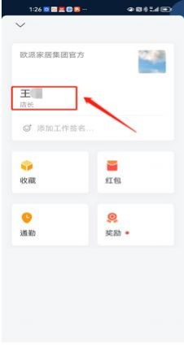

**16、登录企微提示“让身边 1 位同事扫码确认你的身份，即可加入企**

**业” ？ 账号修改了手机号码导致企微登陆不上？**

**修改了手机号码，导致企微登录不上，提示“让身边  1 位同事扫码确认你的身**

**份，即可加入企业”，可能有以下几种情况：**

**情况一：**员工离职仅修改 MTDS 上手机号码后， 把离职人员账号给到新员工用，

导致与企微后台信息数据不一致，企微无法登录。

**解决方案：**

如若员工离职， 不建议离职人员账号直接给到新员工用。因为企微已经经过实名

认证，绑定了原微信及手机号码。为避免企微无法使用，新员工入职需新增 MTDS

账号，登录激活 MTDS 账号后，新员工信息将自动同步至企微，新员工用自己

手机号码即可登录企微。

**情况二：**人员在职需要更改手机号码，现仅修改了 MTDS 上手机号码，企微上

未修改，号码不一致导致无法登陆企微。

**解决方案：**

在职人员如需修改手机号码，在修改完 MTDS 手机号码的基础上，再用原手机 号码登录企微，  在企微个人信息中上修改手机号码，  保证号码一致后， 再用新手

机号码登录，即可正常登录企微。

**情况三：**当企业微信手机号码跟微信绑定的手机号码绑定不一致， 或强制绑定其

他账号，会导致企业微信手机号码滞空登录不上。

**解决方案：**

使用**企业微信绑定的微信**进行登陆，重新绑定企业微信手机号码，保持微信、

MTDS、企业微信手机号码全部一致，方可正常登录。

