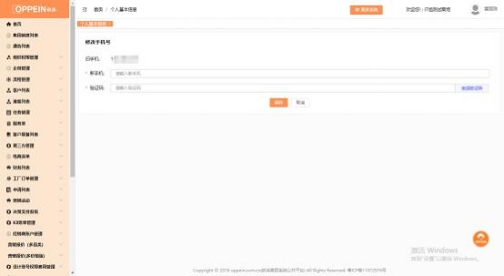
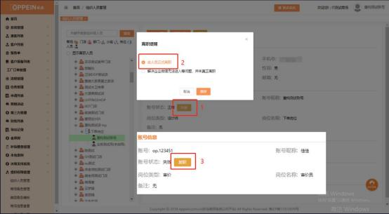
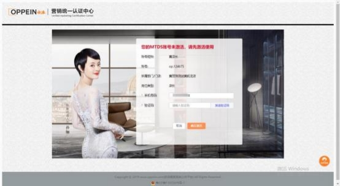

**2、原来在 MTDS 上维护的手机号码是错误的/不用了的，在 MTDS**

**上修改为正确的手机号后， 现在收不到企业微信邀请怎么办？**

**解决方案：** 由于是原手机号已经登录企微激活了才修改的手机号码， 原则上需使 用原来的手机号登录企微再修改手机号码， 若原手机号无法登录，需进行以下操 作：①在 MTDS 系统右上角-查看个人信息里修改为正确的手机号（如下图 1）； ②由 admin 在组织人员管理将此员工账号点击失效，系统提示弹框中选择“该 人员正式离职”后，然后再恢复在职（如下图 2）；③员工重新登录账号完成手 机号注册激活（如图 3），以新 ID 进入企微，原先添加的企微好友可通过离职

继承修改给新的企微。

