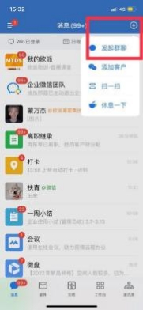

**（三）客户联系相关**

**1、企业微信建的群能解散吗？**

**解决方案:** 群主可以解散群，在群管理进入，点击解散群聊即可。

**2、为什么有些外部群没有快捷回复功能？**

**解决方案：** 只有在企微建的群聊才有有快捷回复的功能；若外部群是在微信创建

的（群主是微信端的，  建群时拉了企微好友进群），  则没有快捷回复的功能。

**3、之前建的群有部门和外部群之分，现在建的群即使拉的都是企业微信内部员**

**工，显示还是外部群？**

**解决方案：**  在工作台创建的客户群是自带【外部】标识，  这个标识不会变

**4、企业微信内部群，能否建了个部门，  一并自动建群生成部门群?**

**解决方案:** 我的企业-设置-自动创建部门群（须有部门群权限），人员架构调动

的时候不能自动退群

**5、怎么去识别内部群？跟外部群呢？他们建群的依据是什么？**

**解决方案:** 群聊名称带标识，  【外部】指群内有微信用户，   【部门】指纯企微本

组织部门群

**6、分管没有自动建群的功能?**

**解决方案:** 超管给权限就可以自动生成，不是把这权限给分管

**7、如何建内部群和外部群？**

**解决方案:** 1.首次建群的时候如果没有选客户，只选了内部员工， 那么创建后就  是内部群，后面再添加人员就添加不了客户了。如果首次建群的时候就选了客户，

那么建的就是外部群，后面再添加人员就可以添加客户也可以添加内部人员。

2、在工作台，客户群建的群，不管首次建群时选的是客户还是仅内部员工，建

的都是外部群。

**8、怎样才能把客户拉到建好的群里？**

**解决方案:** 去工作台-客户群， 创建一个客户群，先添加一个客户进来，然后再分

享二维码即可

**9、群聊名称显示自带的吗？内部群开发出来可以按架构里添加加“ 内部”字眼？**

**解决方案:** 外部是可以加微信的，  如果要加微信客户可以在企微首页右上角发起

群聊

**10、我们微信的客户群，能拉我们企业微信中的客户进微信群吗？**

**解决方案:** 微信群无法添加企业微信里的客户

**11、终端商场每个月都会建微信群搞微信爆破活动。如果微信群， 拉不了企业微**

**信的客户，那客户怎么参加活动呢？**

**解决方案：**去企业微信建群，然后把自己的微信号也加进去。等于有两个身份了，

那么企业微信和微信客户都可以加到群里去。

**12、群欢迎语，设置时间，有些有，有些没有，是为什么呢？**

**解决方案:** 1）邀请人不是客户联系范围内的成员不会下发欢迎语；  （2）被邀请

人不是客户身份不会下发欢迎语， 可以查看下被邀请人是不是在成员的客户列表

**13、聊天界面的应用界面想删除删不了？**

**解决方案:** 点击左侧红色标签，可以删除

**14、店长或导购在收到系统管理员的群发消息后， 只能群发一个客户， 不能给全**

**部客户进行群发？**

**解决方案：** 可以给全部客户进行群发，  但是按照群发规则，  每个客户每天只能接 受一条群发信息，  每月不超过四条；  若其他客户在当天有收到过信息，  则无法再

次发送

**15、有两个导购客户群发功能没有权限，是找管理员开通吗？**

**解决方案:**导购本身无权限使用客户群发，建议使用【客户群】

**16、客户群发能否针对性选择客户？筛选的标签是否来自于 MTDS 里面的标签，**

**需要导购先对客户打了标签才能分类群发？**

**解决方案:** 客户群发不能通过标签筛选客户，工作台-群发助手里可以通过企微

通讯录-我的客户里的标签或者按条件筛选客户

**17、我们企业微信发送客户朋友圈能否按标签组别发送?**

**解决方案:**可以的，发送朋友圈时选择可见的客户-部分可见-根据标签筛选

**18、转发视频号里的“用群发助手发送给客户 ”和“转发到我的客户群 ”是受**

**到每月 4 次的限制？**

**解决方案:** 这个是员工个人群发助手，不受每月 4 次的限制。

**19、用企业微信扫商场人员的对外名片， 为什么会无权查看个人信息， 也无法聊**

**天?**

**解决方案:**  目前企业微信同企业的但是不同组织编码的不能加好友

**20、企业微信朋友圈有办法转发欧派视频号的视频吗?**

**解决方案:**已有操作视频教程，指引视频号如何在企业微信转发

**21、发送企微名片去微信，发送失败？**

**解决方案:** 这个是企微的原生功能，  目前不支持双开场景，  微信不要双开，  卸载

掉一个微信，然后登录账号绑定的微信号，再通过微信授权登录操作。

**22、苹果手机找不到标签按钮，是系统本身的问题吗？**

**解决方案:** 标签在企微通讯录， 我的客户那里去给客户打标签，  然后给对应客户

添加标签即可

**23、跟商场聊要去到官方身份， 看部门通知消息要到欧派，有什么办法不用一直**

**在那里切换来切换去不？**

**解决方案:** 欧派家居集团与欧派家居集团官方已实现通讯录互联功能，  完成范围 配置之后可以直接互联。（各事业部自行配置，  其他集团部门经总裁室审批后由

集团营销信息中心王琼配置）

**24、企微添加客户后能否一键建立客户档案，无需客户列表二次建档?**

**解决方案:** 不能。企业微信不能直接获取微信手机号，  没有拿到手机号的情况下

是不会建客户档案的。

**25、企业微信进入 MTDS 应用， 客户列表的发消息按钮都是灰色是为什么？**

**解决方案:** 确认该客户是否有添加为企微好友，是好友才能发消息

**26、员工离职了， 如何进行客户离职继承？**

**解决方案:** 登录【欧派家居集团官方】企微-工作台-我的欧派（图 1），或 MTDS APP 进入客户列表/潜客列表（图 2），点击右上角方形小图标-离职继承（图 2），

选择相应的客户/潜客（图 3），选择接替的员工与继承类型， 提交即可（图 4）。

