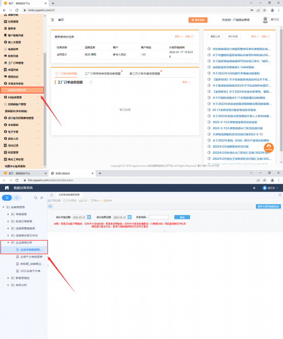
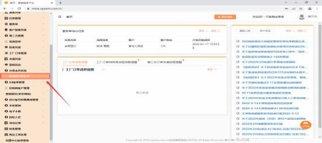
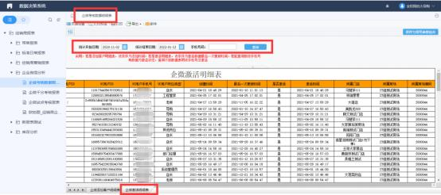
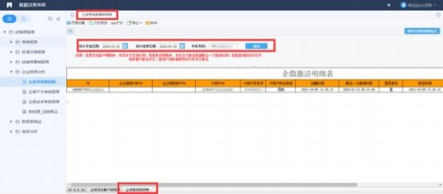
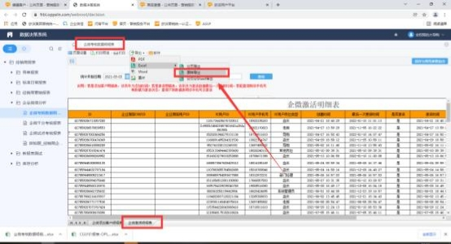

**（六） 经销商企微注册激活报表**

**1、报表对应查询路径是否能截个图？**

**解决方案:** MTDS 系统-决策支持系统-经销商决策支持-经销商报表-企业微信分

析                                                                                                               ；

**2、我们企业的激活率，可以选择性激活吗？比如公司的后端，使用不上，我只**

**激活前端可以吗？这个激活率的分母从哪里取值呢？**

**解决方案:** 与千分考核要求一致，考核的是前端岗位，包括经理、店长、导购、

设计师、设计总监、业务员。按手机号取数，  一个手机号多个账号的，算 1 个

**3、企业微信分析数据是实时更新，还是第二天再更新的？**

**解决方案:** 今天激活的数据，要明天才能出来 ，T＋1。

**4、是否注册激活怎么判定？**

**解决方案:** 登录上企业微信并在工作台进入【我的欧派】就算激活了，一个手机

号对应多个账号的，只要有一个账号激活都算激活。

**5、已经注册成功的员工，但是报表为什么还是未注册？**

**解决方案:**是否存在一个手机号码，有两个账号；筛选一下，看看这几个否的人

员，是不是在报表中有两个（两个岗位）数据，  一个显示是，  一个显示否

**6、在组织架构里面把重复人都离职了，为什么个人明细表里名字还有重复的？**

**解决方案：**专业能力铂尼思和欧派是分开的，考核按照手机号算

**7、为什么他们加客户数很少，但 PV 数很高？**

**解决方案:** PV 是他们点进去看 MTDS 的功能， 这个是点进去一次就算一次， PV

和加客户没有关系哦

**8、商场怎么查看员工企微激活明细数据？**

**解决方案:** 登录 admin 系统管理员账号，进入决策支持系统-经销商决策支持。

① **数据明细**：

进入报表系统后， 点击企业微信分析-企微考核数据明细表，选择企微登录的时 间段， 点击查询，  即可查询本商场在筛选时间段的企微激活所有人员明细，  如图

一；

输入员工手机号，即可查询该员工在筛选时间段的企微激活记录，如图二。

图一

图二

② **报表导出：**  点击导出-Excel-原样导出，  可在导出的 Excel 表格中进行数据汇

总等分析。

**注： 多个账号使用同一个手机号注册激活企微，  明细记录显示多条，  但考核数据**

**只算一条。**

