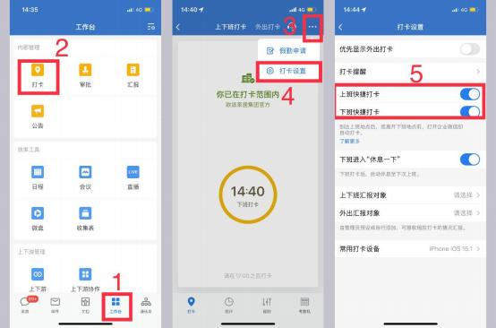

**（七）其他企微原生功能**

**1、企业微信后台要怎么登录呀？**

**解决方案: <https://work.weixin.qq.com>** ，右上角【企业登录】  ；后台不能在手

机查看，只能用电脑

**2、手机登录的 MTDS 账号显示系统管理员， 可是我电脑登录企微后台登不上？**

**解决方案:**  因为分管理员企业微信没有开放接口， 都是手动设置系统管理员

admin 为分管理员的，有异常请报给答疑老师确认

**3、最小部门为哪个部门？我们后台组织架构里面哪个为最小？**

**解决方案:**组织架构中最小一级的组织，可根据蓝色图标识别

**4、为什么 A 商场员工账号，在企微-微盘看到 B 商场员工上传的图片， 还能进**

**行删减？**

**解决方案:** 微盘里可新建文件夹， 该文件夹的权限管理-分享设置， 确认分享范围，

【企业内】即欧派家居集团官方下的账号都有权限查看。若只想让本商场的人查

看，需设置分享范围仅对应商场的组织编码下。

**5、企微点击客户头像查看客户详情，为什么没有设置标签的选项?**

**解决方案:** 需先在企微通讯录-我的客户添加标签，才能在客户信息设置标签

**6、工作台的汇报、公告等入口能否关闭?**

**解决方案:** 企微原生功能不关闭，通过工作台右上角按钮设置常用菜单

**7、如何在企微建了一个自己公司的请假、汇报等应用？**

**解决方案:** 企微分管登录后台-应用管理-添加模板-自定义模板， 设置好之后， 选

择本商场人员可见即可

**8、可以发一个审批流程的搭建步骤吗？**

**解决方案:** 通过下方链接查看指引：

[https://work.weixin.qq.com/help?person_id=1&doc_id=13958&helpType=undefi](https://work.weixin.qq.com/help?person_id=1&doc_id=13958&helpType=undefined)

[ned](https://work.weixin.qq.com/help?person_id=1&doc_id=13958&helpType=undefined)

**9、审批功能的权限与流程配置操作：审批了后需要报备上级，需要在后台设置**

**所有人员对应上上级的部门的领导?**

**解决方案:** 企微分管登录后台-应用管理， 进行规制设置， 选择设置范围的时候只

勾选自己商场即可

**10、审批功能模板功能不能更改吗？**

**解决方案:** 商场要去设置自己的模板和修改自己的模板， 路径： 企业微信后台-应

用管理-审批-添加模板

**11、麻烦老师们， 提供企业微信审批后台操作人的电话，商场需要设置审批流程，**

**一个个试，比较浪费时间？**

**解决方案:** 企微原生功能的客服没有电话，可以在企业微信找一下【我的客服】

**12、设置了财务部外出审批，可是企业微信没有显示?**

**解决方案:** 在企微后台确认一下该用户是否在审批的可见范围内

**13、设置请假自定义模板， 提示“模板可见范围有员工不在你的管理范围内， 只**

**能查看记录，不能更改设置”？**

**解决方案:** 是指该模板设置的可见范围内，  有员工不在该分级管理员的管理范围

中，所以导致不能更改这个模板设置呢

**14、这个汇报的已经设置了相关的接收人， 接收人能收到相关的汇报， 但是统计**

**显示是 0 的？**

**解决方案:** 就是已汇报和未汇报人数都是 0，确定一下有没设置汇报人。建议使

用 MTDS 里面的日志汇报

**15、企业微信审批的上级判定是怎么判定的，  是根据 MTDS 里面选择的上级岗 们判定吗？我这边跑了一个请假流程， 发现找不到上级审批。这个上级层级关系 是不是通过  MTDS  岗位里面的“ 上级 ”去确定的呢？ 因为整个框架都是从**

**MTDS 里面导出。还是说要在其它地方去设置这个架构关系？**

**解决方案:** 指定上级应该要去企业微信设置，  如果他很多审批人都不一样， 建议 由申请人自选；在企微上面有【上级】身份的才可以是您审批的上级，而不是

MTDS 设置的上级呢

**16、商场只要登录企业微信 ，上班之前、下班之后就自动打卡 ，是什么问题？**

**解决方案:** 在打卡里右上角可操作打卡设置，把快捷打卡去掉

**17、对外收款最多能转款 2 万吗？要收取手续费吗？对外收款我们还有二维码**

**吗？对外收款的能联通我们的支付宝吗？**

**解决方案:** 1、对外收款只支持微信，  微信和支付宝一个是腾讯，  一个是阿里，  两 个是死对头，不能打通；  2、手续费是企微千分之六的商户号的手续费 3、对外 收款暂时没有二维码， 这个是企业微信的原生功能， 后面的版本针对这个功能做 二次开发，才会有收款码生成； 4、集团正在规划支付中心，和这个有点类似， 不同的就是可以同时支持微信，  支付宝， POS 机， 银联支付等各种支付方式，  但 这个还没那么快，  也会有银行手续费，  这个还要谈统一合作银行，  所以这个会比

较慢，只是在规划阶段。

**18、商场和银行谈合作， 对外收款是没有收取手续费的， 集团是否可以和银行谈，**

**实现不收取手续费呢？ 企业微信的红包封面后期能实现如上图的自己选择吗？**

**解决方案:** 企微限制，暂时无法实现

**19、关于对外收款的金额后期能不能提高至 10 万？就是一次性能收款 10 万吗？**

**解决方案:** 这个是微信商户号限制的，  是商户号的防洗黑钱机制，只能提需求上

去，但不知道他们会不会放开。

**20、我们收款可以关联商品， 咱们这个如果客户交款后， 可不可以实时看到客户**

**交款情况，类似于淘宝这种？导购也可以实时看到？**

**解决方案:** 收款后我们可以导出的对外收款记录，  收款成功会实时提醒，  并且可

以看到客户的姓名电话地址

**21、手续费用是否能降低？千分之六确实比较高，微信提现只要千分之一**

**解决方案:** 企微原生功能限制。建议这种线上的，  为了规避资金风险，  可以用企 业微信收款，大额的，能转帐或者能刷卡的，尽量还是用回 POS 收款或直接银

行转帐

**22、是否有针对商场收款抵扣款的功能模块，比如说客户第一次交定交了 5 万 预付款， 后期客户可能定电器、定橱柜、定三大空间，  是不同时间定的，  这些钱**

**是否可以在 5 万预付款的基础上实现量化地统计出多退少补的金额？**

**解决方案:** 不能， 只能按橱柜衣柜统计，  大品类可以算出来多收还是少收，  你说 的电器是拆分细项是到了二级品类， 我们没有二级品类的金额， 不可能算出来多

退少补

**23、我把离职的员工都设置离职了 请问这个筛选表会带出离职的人出来吗？**

**解决方案:** 个人明细表不会带出离职人员

**24、企微的公费电话现在可以实现吗？还是商场只要进行充值就可以使用呢？**

**如果可以使用的，电话号码是虚拟的吗？**

**解决方案:** 公费电话可以用，  但是涉及到经销商充值的对账的事情，  我们要先跟

集团财务沟通好这个结算流程才能开放。而且会显示拨打人的手机号

**25、这个导购可以加微信，但出现未实名认证，这个可以怎么处理？**

**解决方案:** 如需实名认证可以在手机端-左上角-头像框点击-名片-姓名-实名认

证

**26、店长群发的人员跟组织架构的人员数量对不上， 群发时只能选择 2 个导购， 但是组织架构一共有 4 个导购，而且没有显示的 2 个导购账号是正常可以使用**

**的？**

**解决方案:** 若组织架构里的多个账号手机号码是一致的， 在企业微信通讯录只展

示当前手机号其中一个账号的信息

