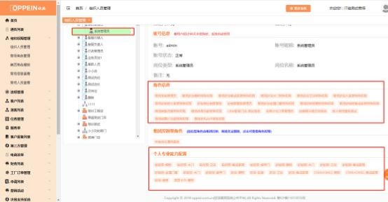
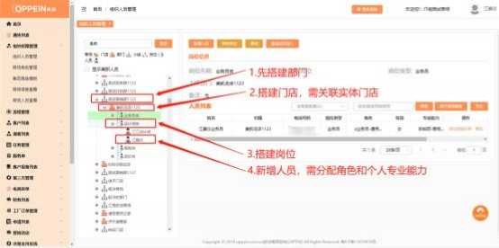
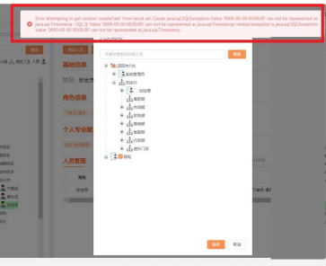
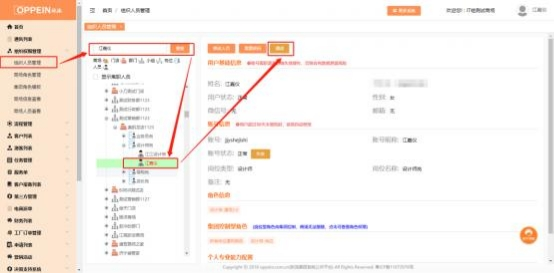
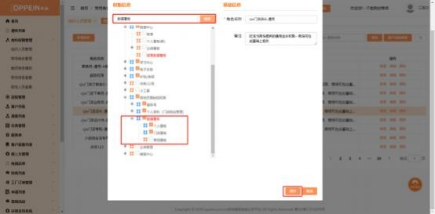
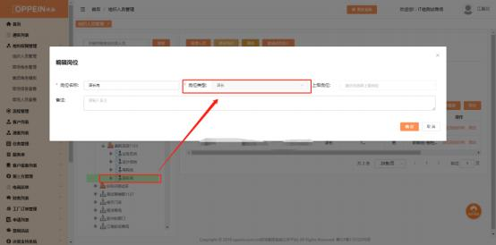
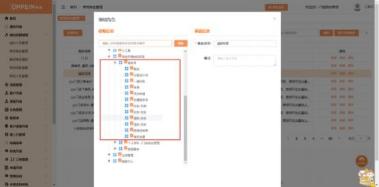


**二、组织架构管理、权限分配问题：**

**1、系统提示帐号不在门店下，不能建档是什么原因？**

**解决方案：** 请按以下方法一一排除：

①检查帐号是否为系统管理员帐号，系统管理员帐号建议只做后台搭建用，

不能建服务单。

③ 请检查系统管理 admin 是否有对应的角色和专业能力。

③用系统管理员帐号检查组织架构搭建是否正确，所用帐号的岗位必须建立

在门店下（如图所示）

搭建部门 →  门店    （需关联实体门店）→  岗位  →  人员（需分配角色和个

人专业能力）

④如以上检查都没有问题，请清理浏览器缓存或关闭浏览器重新登录。

**2、组织架构中的人员可不可以删除？**

**解决方案：**MTDS 系统组织架构里面的人员不可以删除， 您可以把人员设置为离

职状态。

**3、添加服务单的时候选不了品类怎么办？**

**解决方案：** 请按以下方法一一排除：

① 请检查系统管理 admin 是否有对应的角色和专业能力。

② 用系统管理员 admin 帐号检查组织架构， 该人员是否在门店下， 其专业能力

是否有配置 （按下图给员工配置专业能力）；

③ 若以上都没有问题，则清理浏览器缓存再关闭浏览器重新登录。

**4、人员缺少权限怎么分配？**

**解决方案：** 用系统管理员 admin 帐号，在组织权限管理→找到对应人员所分配 的角色→再到商场角色管理→搜索对应角色→在对应角色点编辑→勾选对应的

权限点击保存即可。

**5、如何关联实体门店？**

**解决方案：** 用系统管理员 admin 帐号，在组织权限管理→找到对应门店→点击

修改门店→点击关联实体门店→勾选对应的实体门店→点击保存即可。

**6、在组织架构里搜索以前账号时出现“未搜索到相关的内容，请重**

**新输入其它关键字”提示怎么办？**

**解决方案：**  ①检查一下该人员账号、姓名是否输入正确；

**①** 清理缓存，刷新页面

② 若该账号能登 MTDS，仍在组织架构里找不到该人员； 则需要登录  admin 的 账号， 进入组织管理菜单，在人员管理中搜索到对应的人员，再点击右边的 “调动”，进入到人员调动的界面， 勾选需要调动到的目标岗位， 点击“保

存”即可。

**7、当在组织架构调动人员时出现一串英文提示怎么办？**

**解决方案：**  需要把该提示截图、组织编码、系统管理员  admin  账号和密码在

MTDS 答疑咨询企微群里报给答疑老师，统一由答疑老师报给

技术处理。

**8、登陆 MTDS 时提示“账号已超过 30 天未登录，请找商场系统管**

**理员处理”怎么办？**

**解决方案：**  是因为账号长期未登录导致账号失效了。

① 如是员工的账号需要找到商场系统管理员即 Admin 的账号来将此账号进行

复职。

登陆 admin 的账号，进入组织管理菜单，在组织人员管理中搜索到对应的人员，

点击人员姓名，再点击【复职】按钮即可复职成功。

② 如果是 admin 的账号失效了，需要联系总部商场管理员或是 MTDS 答疑咨

询群的老师申请复职账号， MTDS 答疑咨询群二维码

**9、调动人员怎么操作？**

**解决方案：**  登陆 admin 的账号，进入组织管理菜单，在组织人员管理中搜索到 对应的人员， 点击人员姓名， 再点击右上角的“调动”，进入到人员调动的界面，

勾选需要调动到的目标岗位，点击“保存”即可。

**10、系统管理员无法操作调动、修改角色？**

**解决方案：**  系统管理员的角色由后台控制，商场不能对系统管理员进行修改或

调动，以免权限丢失。

**11、员工帐号登陆，电脑端可以查看的菜单， 手机端不显示？**

**解决方案：**  系统管理员帐号登录→商场角色管理→检查APP的权限是否已配

置。

**12、搭建组织架构在地图选择门店位置，无法选择到门牌号？**

**解决方案：**  因地图上无法识别部分具体门牌号，如发现无法选择门牌号时，选

择到对应路段即可。

**13、商场所有人员打开日志汇报时，显示的数据是本店/本商场的数**

**据?**

**解决方案：**  系统管理员帐号登录→商场角色管理→检查数据看板所勾选的权

限。

注意：勾选个人看板时，拥有该权限的人员在日志汇报统计为个人数据；勾选 门店看板（包含同时勾选个人看板、门店看板的情况）时，拥有该权限人员在

日志汇报统计为门店数据；勾选商场看板（包含同时勾选个人看板、门店看

板、商场看板的情况）时，日志汇报统计为商场数据。

**14、员工帐号在手机端看不到日志汇报?**

**解决方案：**  系统管理员帐号登录→商场角色管理→检查是否有勾选“日志汇

报”的权限

**15、员工已勾选 XX-通用的角色， 为什么还是没有菜单？**

**解决方案：**  是否有菜单取决于权限，如发现无菜单的情况：

1\.检查勾选的角色的编辑日期是否最新，如该角色是2019年12月以前的，权限

与现通用权限不一致，需在集团角色模版重新复制再配置。

2\.如已分配最新角色仍无菜单，系统管理员在商场角色管理手动勾选权限即

可。

**16、店长帐号登录后，在拓客经销商 H5 活动没有立即创建活动按**

**钮？**

**解决方案：**  检查该店长的岗位类型是否是店长，其他岗位类型无法创建活动。

**17、员工登录 E 学堂/商学院看不到学习地图的内容？**

**解决方案：**  检查该员工的岗位类型是否设置为系统管理员/老板/职业经理人/店

长/导购/业务员/设计师/安装工/安装监理/设计总监

**18、系统管理员登录手机端没有 E 学堂/商学院入口?**

**解决方案：**  系统管理员帐号登录→商场信息查看→所属事业线

注意：如所属事业部有误，请联系该商场所属的总部商场管理员（事业部内务

管理员）新增品类；如事业部无误，无登录入口，把系统管理员组织编码反馈

给营销信息中心任意一位老师，由营销信息中心处理。

**19、批量修改按钮点击无反应，不能修改怎么办？**

**解决方案：**

（1）客户列表批量修改的权限做了细分，需要确认是否有勾选具体的权限，路 径：登录系统管理员 admin 帐号，在组织人员管理→找到对应人员所拥有的角 色信息（选其一）→商场角色管理→搜索对应角色→点击编辑→勾选对应的权限

点击保存即可 （如下图）

（2）APP 端跟 PC 端共用权限，若无显示，则需要找 admin 管理员配置权限

**20、手机端员工帐号登录后继续服务按钮点开后无数据？**

**解决方案：**  系统管理员帐号登录→商场角色管理→检查是否已配置APP的编辑

服务号的权限。

**21、员工账号在手机端登录没有失单按钮?**

**解决方案：**  系统管理员帐号登录→商场角色管理→检查失单按钮权限是否已配

置

注意：在手机端客户列表筛选“我的客户”对应需配置我的服务单下的“失

单”权限，筛选“本店客户”对应需配置本店服务单下的“失单”权限；部门

客户、全部客户、小组客户、我的下属客户同理。

**22、人员、岗位、门店、部门无法删除？**

**解决方案：**  1.人员不允许删除，可做离职处理。系统管理员账号登录→点击人

员→点击失效

2\. 岗位、门店、部门需确认该组织下无下一层架构即可删除（即：该岗位、门

店、部门是最底层的架构，才有删除按钮。）

注意：岗位无法删除时，需点击显示离职人员，查看岗位下是否有已离职人员

并调动到其他架构下，然后再删除岗位。

**23、“我的欧派”手机登录出现校验提示“未经身份验证”？**

**解决方案：**  账号被其他人登录或使用电脑端登录了，重新退出登录即可。

**24、同时代理单品类和大家居的商场如何搭建门店？**

**解决方案：**  为了方便核算业绩，  业绩以实体门店为单位核算业绩，  因此大家居店 需要分 2 个门店去建档。导购有门店归属，  设计师没有，  因此设计师可以不切换

账号，导购的账号要分开。

**25、一个店长管理两个门店组织架构如何设置？**

**解决方案：** 系统管理员帐号登录→组织权限管理→新增部门→新增部门经理（店 长） ，岗位类型选部门经理→部门下新增两个门店→ 门店下建导购、设计师等其

他岗位人员。

注意：此情况下的店长不能新增客户、不能新增经销商活动。

**26、为什么有些公告员工的能看到，有些公告员工看不到呢？**

**解决方案：** 公告员工是否能看到， 取决于发布公告的人是否选择了此公告发送给 这个员工的岗位。例如：公告 1 的发布人发布公告时选择的接收人岗位只有系统 管理员， 则公告 1 只有商场 admin 的账号可以接收到， 公告 2 的发布人发布公 告时选择的接收人岗位有系统管理员和店长，则公告 2 商场的 admin 账号和店

长岗位的人员可以接收到。

**27、失效账号客户服务单及任务若还需要继续使用，需要怎么处理？**

**解决方案：**

若已失效账号的账号中，仍有客户服务单及任务需要处理，可以操作批量修改，

将服务号、服务单及任务全部批量修改至新账号员工下。

**28、关联实体门店的时候提示“同一虚拟门店不允许同时关联两个相**

**同品牌品类的实体门店”怎么办？**

**解决方案：**如门店性质为独立店、集成厨房店、整装店等欧派橱柜实体门店， 品牌品类均为欧派橱柜， 需要在不同虚拟门店分开关联，一个品牌品类的实体门

店在同一虚拟门店只能关联一个。

**29、菜单栏中的“OAP 套餐 C”，默认哪些人有权限查看？数据查看**

**有问题可以找谁处理**？

**解决方案：**

1、 MTDS 商场端决策支持系统中二级菜单“OAP 套餐 C”，权限配置给岗位

控制型角色：商场系统管理员 admin、老板、职业经理人、店长；

2、点击后跳转至制造 BI 系统，展示相关的数据，系统会根据输入密码来判断

是否可以查看数据；

3、若跳转后页面或数据有任务疑问，可咨询：曾增铎 13690481290 、备选

联系人：靳战旗 15521168874。

**30、离职人员如何复职？失效的人员如何复职？**

解决方案：登录 admin 系统管理员账号，  在组织人员管理中，勾选显示离职人

员，搜索到对应人员，点击复职即可。

**31、批量修改门店如何操作（PC 端） ？**

**解决方案：** 登录 admin 系统管理员或有权限的账号（admin 可配置） ，客户列表 -我的客户/我关联的客户/全部客户中，搜索到对应的客户勾选上，点击**批量修 改-修改门店，** 选择需修改到的门店。 点击保存后，该客户的门店归属即修改好

了。

**32、上传的本地案例在哪里审核和上架？**

**解决方案：**

1、商场 admin 系统管理员账号，默认拥有审核、上下架、删除等权限。如需 给员工配置权限可登陆系统管理员（admin）帐号→商场角色管理→角色编辑

→搜索本地案例勾选对应权限【图一】

【图一】

2、打开本地案例筛选所有案例【图二】（默认进去是商场案例），审核方案进

后，方可上下架。

【图二】

**33、如何分配门店及人员的专业能力？**

**解决方案：**  分配门店及人员的专业能力，分两步设置，具体如下：

**第一步：门店需先关联实体门店，选择对应的品牌品类**

组织人员管理—选中对应门店—点击修改门店—关联实体门店—勾选关联对应

的实体门店及品牌品类。

注： 同一个门店无法关联相同的品牌品类。

**第二步：给对应人员分配专业能力**

选中人员—点击修改人员—勾选专业能力信息

