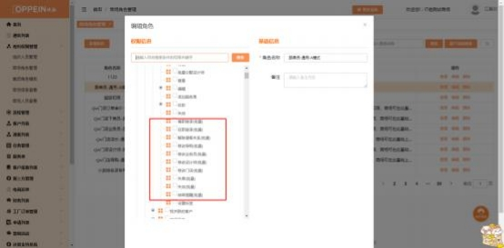

**19、批量修改按钮点击无反应，不能修改怎么办？**

**解决方案：**

（1）客户列表批量修改的权限做了细分，需要确认是否有勾选具体的权限，路 径：登录系统管理员 admin 帐号，在组织人员管理→找到对应人员所拥有的角 色信息（选其一）→商场角色管理→搜索对应角色→点击编辑→勾选对应的权限

点击保存即可 （如下图）

（2）APP 端跟 PC 端共用权限，若无显示，则需要找 admin 管理员配置权限

