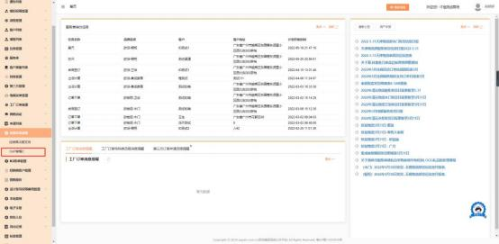
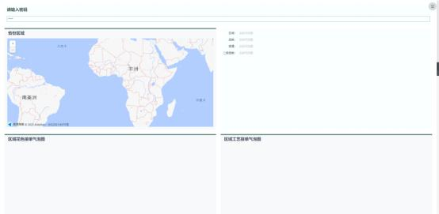

**29、菜单栏中的“OAP 套餐 C”，默认哪些人有权限查看？数据查看**

**有问题可以找谁处理**？

**解决方案：**

1、 MTDS 商场端决策支持系统中二级菜单“OAP 套餐 C”，权限配置给岗位

控制型角色：商场系统管理员 admin、老板、职业经理人、店长；

2、点击后跳转至制造 BI 系统，展示相关的数据，系统会根据输入密码来判断

是否可以查看数据；

3、若跳转后页面或数据有任务疑问，可咨询：曾增铎 13690481290 、备选

联系人：靳战旗 15521168874。

