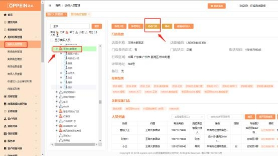
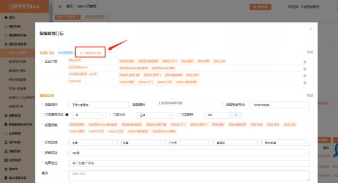
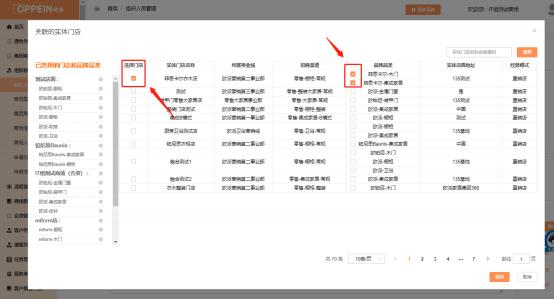
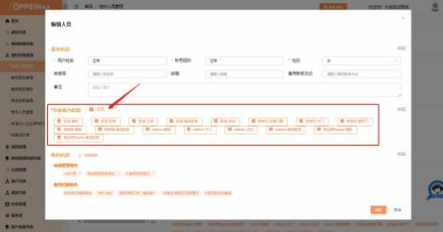

**33、如何分配门店及人员的专业能力？**

**解决方案：**  分配门店及人员的专业能力，分两步设置，具体如下：

**第一步：门店需先关联实体门店，选择对应的品牌品类**

组织人员管理—选中对应门店—点击修改门店—关联实体门店—勾选关联对应

的实体门店及品牌品类。

注： 同一个门店无法关联相同的品牌品类。

**第二步：给对应人员分配专业能力**

选中人员—点击修改人员—勾选专业能力信息

