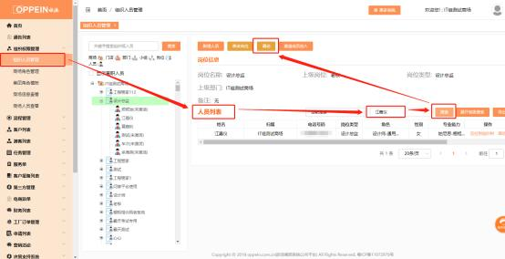
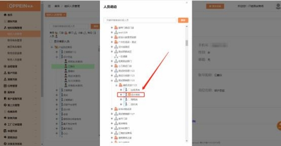

**6、在组织架构里搜索以前账号时出现“未搜索到相关的内容，请重**

**新输入其它关键字”提示怎么办？**

**解决方案：**  ①检查一下该人员账号、姓名是否输入正确；

**①** 清理缓存，刷新页面

② 若该账号能登 MTDS，仍在组织架构里找不到该人员； 则需要登录  admin 的 账号， 进入组织管理菜单，在人员管理中搜索到对应的人员，再点击右边的 “调动”，进入到人员调动的界面， 勾选需要调动到的目标岗位， 点击“保

存”即可。

