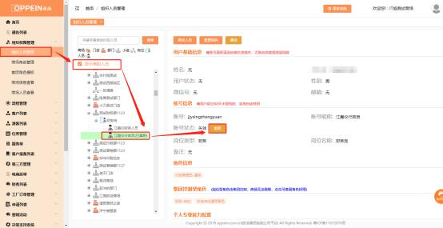
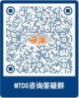

**8、登陆 MTDS 时提示“账号已超过 30 天未登录，请找商场系统管**

**理员处理”怎么办？**

**解决方案：**  是因为账号长期未登录导致账号失效了。

① 如是员工的账号需要找到商场系统管理员即 Admin 的账号来将此账号进行

复职。

登陆 admin 的账号，进入组织管理菜单，在组织人员管理中搜索到对应的人员，

点击人员姓名，再点击【复职】按钮即可复职成功。

② 如果是 admin 的账号失效了，需要联系总部商场管理员或是 MTDS 答疑咨

询群的老师申请复职账号， MTDS 答疑咨询群二维码

