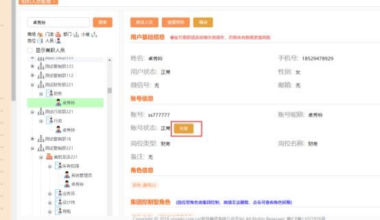
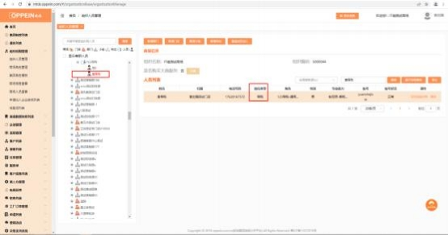
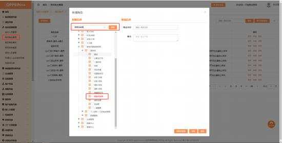
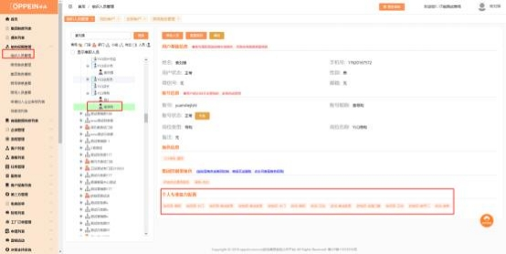
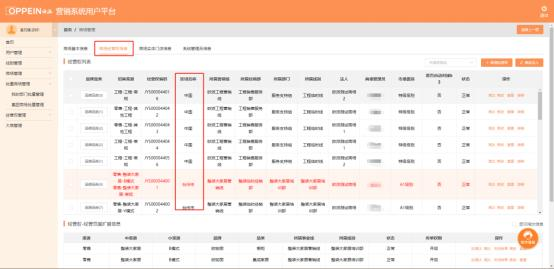

**1、商场指定导购带单时，找不到人员，怎么办？**

**解决方案：**被带单商场需登录 MTDS 系统管理员的账号（admin） ，在组织 架构， 找到该人员，  查看该人员的岗位类型，是否是导购/店长岗位，若不是， 请

修正后再进行指定导购带单即可。

**2、跨商场指定导购带单后，怎么在被带单导购的客户列表里找不到**

**对应客户呢？**

**解决方案：**被带单商场需登录 MTDS 系统管理员的账号（admin），  在组织架 构搜索这个人的姓名，检查架构中是否有两个同名同姓的，  如果是， 先把这个客 户批量修改给正确的人， 然后再将另外一个人的姓名进行修改或者将他设置为离

职即可避免这类问题发生。

**3、橱柜经销商跨商场指定导购带单后， 为什么衣柜商场导购的客户**

**列表找不到这个客户？**

**解决方案：**衣柜商场导购需要在抢单池的已抢单列表将这个客户确认有效， 而且

需要在 48 小时内确认有效才会到导购的客户列表。

**4、跨商场带单时 ，为什么没有跨商场带单的按钮？**

**解决方案：** 带单商场需使用 MTDS 系统管理员账号（admin）检查该人员是否

是店长或导购岗位，非店长导购岗位，需要系统管理员配置跨商场带单权限即可。

**5、衣柜经销商导购建档时没有衣柜的意向品类选择怎么办？**

**解决方案：** 衣柜经销商需登 MTDS 系统管理员账号（admin）去检查一下该导 购的专业能力是否有配置衣柜，没有的话，  点击修改人员，  给配置衣柜专业能力

即可。

**6、衣柜经销商跨商场带单（不指定导购）时， 点击提交时选不到该**

**区域内的橱柜商场 ，怎么办？**

**解决方案：** 带单商场和被带单商场都需要找对应商场的总部管理员在 uc 后台确  认对应的经营区域， 确认后带单商场和被带单商场需核对对方商场的经营区域是  否相同， 若不同的，需要找对应的经销部管理员在经营品类及渠道信息修改品类  的经营区域即可。记住橱衣商场都要检查哦！ 只有橱衣商场的经营区域相同时，

才允许带单。

