
**1、新增服务号时， 弹框提示“此电话号码已建档，请选择建档标签”**

**怎么办？**

**解决方案：** 新建档案时，  输入手机号码，  系统校验如存在相同的手机号，  则弹框

提示此商厂已存在相同电话号码的客户，可以选择放弃创建或继续创建。

（1）选择继续建档，新增温馨提示，选择添加品类、继续建档或取消。

（2）选择添加品类， 跳转到客户列表， 搜索相同手机号的客户， 点击继续服务，

添加品类

（3）如没有填写手机号，则进入潜客列表。

**2、潜客列表的客户是哪里来的？**

**解决方案：** 潜客就是潜在的客户， 来源包括以下四种： (1)自建档未获得手机号； (2)加企业微信好友未建档； (3)摄像头已关联但未填手机号的客户；  (4)小程序访

客互动、公众号粉丝互动有员工关联。

**3、潜客列表打标签按钮置灰了点不动怎么办？**

**解决方案：** 用商场系统管理员 admin 帐号， 在组织权限管理→组织人员管理→ 找到对应人员所分配的角色→再到商场角色管理→搜索对应角色→在对应角色 点编辑→在“MTDS2 系统主框架”下， 勾选【设置标签】权限→点击保存（见

下图）

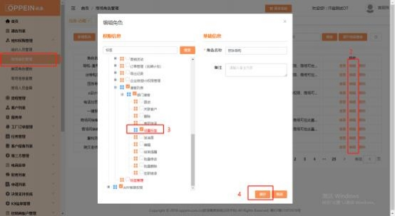

**4、潜客列表点击打标签，显示“暂时无标签，请联系商场系统管理**

**员去配置标签”怎么办？**

**解决方案：** 登录商场系统管理员 admin 帐号，点击左侧菜单栏“标签管理”自

定义添加标签，并可对标签进行增、删、改、查等操作（见下图）。

**5、潜客如何关联客户？**

**解决方案：**

（1）在“潜客列表”点击“关联客户”，跳转“选择客户”页面，  选择对应客

户关联后，该潜客显示在客户列表里。

（2）潜客列表关联客户时，也可“新增”，  跳转新增服务号列表，  此时新增客

户必须填写手机号码，才能保存成为客户；不填手机号回到潜客列表。

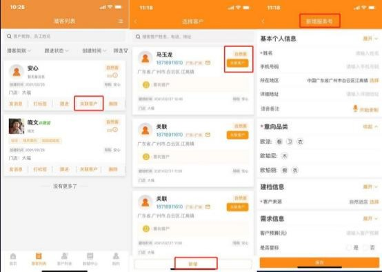

**6、潜客关联客户关联错了怎么办？**

**解决方案：** 客户列表点击右上角第一个小图标，  出现下拉弹框选项，  选择“解除

潜客关系”—选择需要解除的客户—确认。

**7、现有的客户跟进类型有哪些？**

**解决方案：**

（1）在潜客列表手动填写跟进；

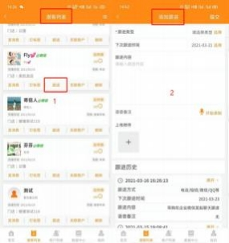

（2）在客户列表，对客户发消息，发短信，  拨打电话，手动填写跟进，系统默

认为已经跟进，并记录跟进的记录和分值

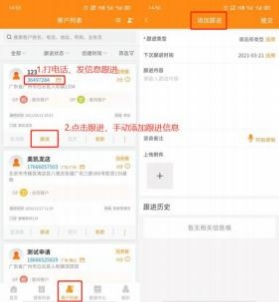

**8、现有的消息提醒类型有哪些？**

**解决方案：**

（1）默认提醒：  默认跟进 7 天后再次提醒跟进。如客户建档当天，  没有手动填

写跟进信息，默认 7 天后发送跟进提醒，如第 8 天仍未跟进，则每天提醒；

（2）强提醒：如手动填写跟进时间，是设置了强提醒，强提醒覆盖默认提醒。

只按照强提醒的时间来提醒；

（3）定时提醒：每天早 8：00 和晚上 20：00 发送待跟进和超时跟进任务

（4）整点提醒：整点时段内产生的新任务、待办任务、变更、申请、财务等情

况汇总，包括线上引流提醒、任务变更和直播提醒等；

（5）实时提醒：  实时推送财务、订单、送货、安装、验收等，  包括获客、建档、

任务改约、修改、退回、申请、审核

**9、互动轨迹的分值是如何获得的？**

**解决方案：** 互动轨迹包含三种类型：  行为轨迹、跟进轨迹和服务轨迹，  系统自动 抓取线上线下互动轨迹，  自动计算活跃度分值，  潜客详情、客户信息界面展示互

动轨迹明细。

（1）行为轨迹：添加好友，微信聊天、收藏案例、报名、购买卡劵等行为；

（2）跟进轨迹：微信沟通、发信息、打电话等行为；

（3）服务轨迹：收款、量尺、合同签订等行为

**10、 MTDS-APP 客户列表如何操作批量修改？**

**解决方案：** 客户列表点击右上角第一个小图标，出现下拉弹框选项

（1）**批量修改导购**：选择“离职继承”或“在职继承”→选择需要被修改的客

户（或者一键处理） →选择继承的员工-修改档案和好友关系-提交。

注：好友关系要 24 时生效。

（2）**批量修改业务员**：选择“修改业务员”  →选择客户→修改业务员→选择业

务员提交；

（3）**批量删除业务员**：选择“删除业务员”  →选择客户→删除业务员，点击确

认即可；

（4）**批量修改设计师**：选择“修改设计师”  →勾选对应客户，点击“修改设计

师，选择设计师提交即可

（5）**批量修改门店**：选择   “修改门店”→勾选对应客户→选择对应门店，  点击

确认即可

**11、 MTDS-APP 客户列表如何操作失单/失效？**

**解决方案：** 客户列表点击右上角第一个小图标，出现下拉弹框选项

（1）失单： 选择失单—选择对应客户，  可以选择客户对应的所有服务单，  也可

选择其中的一个服务单，点击失单→填写失单原因，确认完成失单

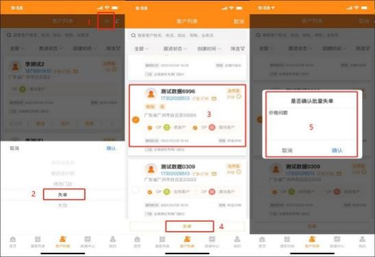

（2）失效：选择失效→选择需要失效的客户，点击失效→确认失效。

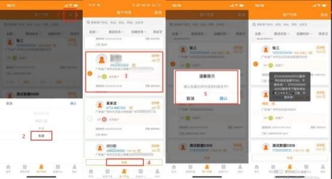

注： 已收款客户，  需要把收款退回为 0，才能操作失效；  如客户有收款的金额或

已经传单，则不允许失效。

**12、客户/服务单列表搜索不到客户/服务单怎么办？**

**解决方案：**客户/服务单列表默认显示创建时间为 180 天内的客户/服务单信息， 要点击展开高级搜索，调整创建时间扩大搜索范围，点击高级搜索查询客户/服

务单信息。

**13、设计师在客户列表中没有找到自己客户？**

**解决方案：** 客户列表中的【我的客户】仅展示由自己建档的客户明细。如果某个

客户由导购建档，分配给了设计师，设计师需要在【我关联的客户】中查看。

如果客户由设计师自己创建，  就可以在【我的客户】中查看到。

**14、订单已下单/已退单，但找不到也搜索不到了？隐藏起来了？**

**解决方案：**订单已下单/已退单的工厂订单， 找不到也搜索不到 ，隐藏起来了， 很有可能是订单点了**回收**按钮。如果需要重新找回订单，可在工厂订单管理-我 的订单/全部订单-展开高级搜索， 订单是否回收选： **全部/是，**再搜索一下合同号 就可以出来了。如需继续显示订单，  点击【**还原**】， 即可将订单从回收站中还原

至订单列表中。

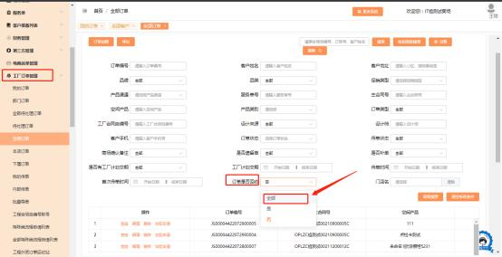

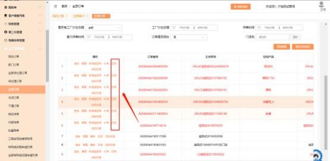

**15、如何设置服务号/服务单/订单中的客户电话加密？ 隐藏电话？**

解决方案：  商场 admin 系统管理员，  在组织权限管理-商场角色管理中，  找到相  关账号的任一对应角色进行设置，勾选上【客户电话显示加密】即可。勾选后，

该账号在查看服务上号/服务单/订单中客户电话即会加密。

**16、商场如何查看订单进度？**

**PC 端：** 工厂订单管理-我的/本店/全部订单-搜索到对应的工厂订单自编号-点击

查看-订单进度

**企微手机端：**

方式一：工作台-MTDS 应用-订单查询-搜索工厂订单自编号-查看订单详情

方式二： 工作台-MTDS 应用-【我的欧派】 -客户列表-筛选我的/本店/全部客户，

点击对应客户-查看工厂进度

**17、商场如何查看订单物流进度？**

**PC 端：** 工厂订单管理-我的/本店/全部订单-搜索到对应的工厂订单自编号-点击

查看-物流进度

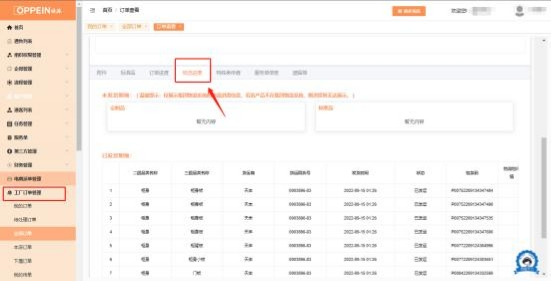

**企微手机端：**

方式一：工作台-MTDS 应用-订单查询-搜索工厂订单自编号-查看订单详情

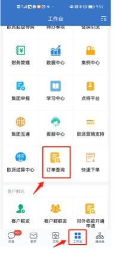

方式二： 工作台-MTDS 应用-【我的欧派】 -客户列表-筛选我的/本店/全部客户，

点击对应客户-查看物流进度

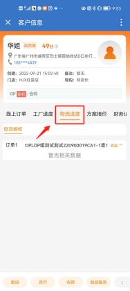

**18、商场如何查看结算价？**

**解决方案：** admin 系统管理员默认有查看结算价权限， 其他账号需要 admin 系统

管理员配置查看权限。

**路径：** 工厂订单管理-我的/本店/全部订单-查看订单-订单进度-查看结算价

**19、为什么工厂订单中搜索不到工厂订单自编号/合同号/订单呢？**

**解决方案：**

因 MTDS 系统中订单信息较多， 为保证系统的正常运行， 工厂订单管理中需要**精**

**准搜索**，不可以模糊搜索。

可搜索字段有：  客户姓名、电话、订单号、合同自编号。需精准完整输入这些字

段，才可以搜索。例： 合同自编号 OPLCC 广州市 220900001CA1 -1  、订单号

JS00004422092300001 。

**20、如何查看服务单的节点任务详情？**

**解决方案**：服务单→我的/我关联的/全部服务单→搜索对应客户点击编辑/查看

进入→右边菜单栏中点击「节点任务」→查看当前任务及务责任人。

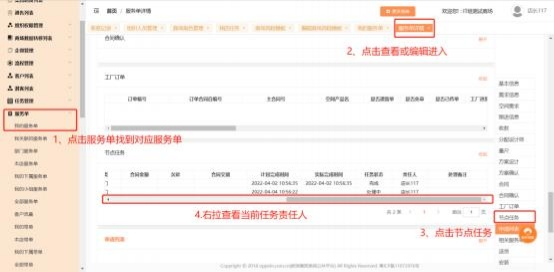

**21、如何批量修改任务责任人？**

**解决方案：**  登录 admin 系统管理员账号/或有批量修改任务权限的账号，在「任 务管理」 中 →点击我的/本店/全部任务→搜索到对应任务并勾选上→点击【批

量修改】  →选择责任人后，点击确定即可。

**22、建档时，第三方推荐人选项空白/无选项怎么办？**

**解决方案：**

建档时第三方推荐人选择项空白/无选项， 说明商场没配置第三方推荐人或第三

方推荐人生效时间已过期！

1、登录导购账号/admin 系统管理员的账号，  点击第三方管理列表-我的/全部

第三方推荐人管理-点击  [新增第三方推荐人] 按钮，点击后填写上方空缺信息

后点击下方保存按钮，提交给对应审批人。   （如图一）

注：红星为必填项，生效结束时间尽量选择较长些，或不选，  若生效时间过

期 ，建档时选择推荐人选项为空。

（图一）

2、第三方推荐人审核人登录账号，  第三方管理-待审核推荐人，  审核通过后，  导

购人员建档就可以选择相应第三方推荐人。 （如图二）

（图二）

**23、提示“必须关联服务单所属事业线的报备项目， 请重新选择”？**

**解决方案：**  出现此提示说明，此服务单品牌品类与关联的装企项目归属的事业 线不一致， 需重新选择与服务单品类一致的所属事业线装企项目。例：服务单

品牌品类是欧派衣柜，关联项目需选择衣柜事业线的装企项目。

**24、门店有零售及整装权限时 ，如何对应门店下零售/整装订单呢？**

**解决方案：**当门店有零售及整装权限时， 整装和零售产品需要分开门店下单。

主要有以下 2 种方法：

**方法一（推荐） ：**

在组织架构中分开建零售、整装门店，各门店下分开新建导购账号。相同手机号 码下的账号可进行账号合并，账号合并后可互相切换使用（如下图） 。当下什么

产品的单就切换到对应门店下的导购账号建档下单。

例：需要下整装产品的单，  就用整装门店下的导购账号建档，  建档后按照正常流

程流转即可。

**方法二：**

在组织架构中分开建零售、整装门店。可在任一门店下建档， 当客户确认是零售  或整装产品后，**必须在办理合同签订任务前， 通过批量修改门店方式， 将客户门  店归属修改到对应门店下。否则生成的自带零售/整装属性的合同号无法再修改。** 例：客户最开始在零售门店建档，确认是整装产品时，**需在客户办理合同签订前，**

通过批量修改门店的方式（admin 系统管理员默认有权限， 其他账号需 admin 设

置)，把此客户归属修改到整装门店，再走正常流程下单。

**25、如何区分客户所属门店为零售/整装门店？**

**解决方案：**

如何区分客户所属门店是零售/整装门店，需使用 admin 账号/有组织权限管理 的账号， 根据客户的所属门店（图一）去组织人员管理中查询该门店经营权信息 （图二），若招商渠道显示是常规就是零售门店，招商渠道显示是整装/A 模式

就是整装门店（图三）。

具体操作如下：

1\. 在客户列表中找到对应客户—下方进度条往右拖动-复制【所属组织（门店）】

（图一）

2\. 点击组织人员管理—在搜索栏搜索复制的门店名称—修改门店按钮

（图二）

3\. 点击关联实体门店-找到需要核对的品牌品类—查看招商渠道： 常规就是零售

店、整装/A 模式就是整装店。

（图三）
