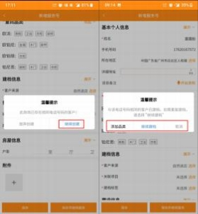
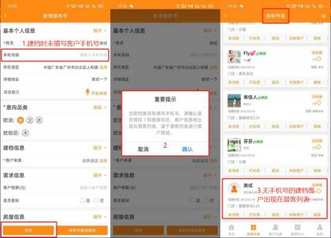


**1、新增服务号时， 弹框提示“此电话号码已建档，请选择建档标签”**

**怎么办？**

**解决方案：** 新建档案时，  输入手机号码，  系统校验如存在相同的手机号，  则弹框

提示此商厂已存在相同电话号码的客户，可以选择放弃创建或继续创建。

（1）选择继续建档，新增温馨提示，选择添加品类、继续建档或取消。

（2）选择添加品类， 跳转到客户列表， 搜索相同手机号的客户， 点击继续服务，

添加品类

（3）如没有填写手机号，则进入潜客列表。

