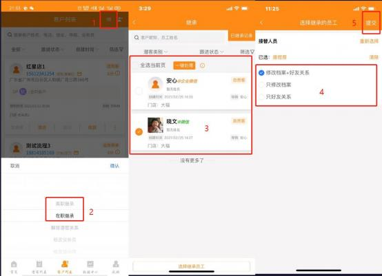
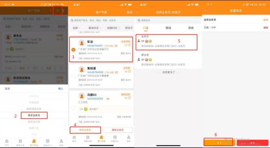
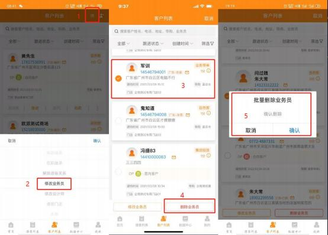
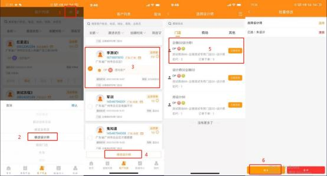

**10、 MTDS-APP 客户列表如何操作批量修改？**

**解决方案：** 客户列表点击右上角第一个小图标，出现下拉弹框选项

（1）**批量修改导购**：选择“离职继承”或“在职继承”→选择需要被修改的客

户（或者一键处理） →选择继承的员工-修改档案和好友关系-提交。

注：好友关系要 24 时生效。

（2）**批量修改业务员**：选择“修改业务员”  →选择客户→修改业务员→选择业

务员提交；

（3）**批量删除业务员**：选择“删除业务员”  →选择客户→删除业务员，点击确

认即可；

（4）**批量修改设计师**：选择“修改设计师”  →勾选对应客户，点击“修改设计

师，选择设计师提交即可

（5）**批量修改门店**：选择   “修改门店”→勾选对应客户→选择对应门店，  点击

确认即可

