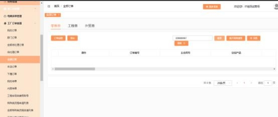

**19、为什么工厂订单中搜索不到工厂订单自编号/合同号/订单呢？**

**解决方案：**

因 MTDS 系统中订单信息较多， 为保证系统的正常运行， 工厂订单管理中需要**精**

**准搜索**，不可以模糊搜索。

可搜索字段有：  客户姓名、电话、订单号、合同自编号。需精准完整输入这些字

段，才可以搜索。例： 合同自编号 OPLCC 广州市 220900001CA1 -1  、订单号

JS00004422092300001 。

