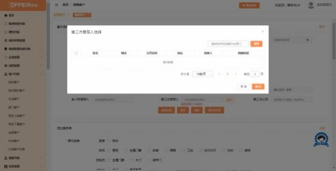
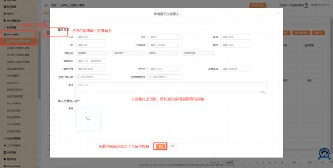
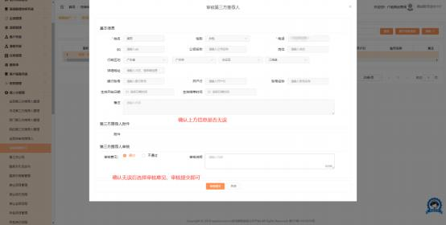

**22、建档时，第三方推荐人选项空白/无选项怎么办？**

**解决方案：**

建档时第三方推荐人选择项空白/无选项， 说明商场没配置第三方推荐人或第三

方推荐人生效时间已过期！

1、登录导购账号/admin 系统管理员的账号，  点击第三方管理列表-我的/全部

第三方推荐人管理-点击  [新增第三方推荐人] 按钮，点击后填写上方空缺信息

后点击下方保存按钮，提交给对应审批人。   （如图一）

注：红星为必填项，生效结束时间尽量选择较长些，或不选，  若生效时间过

期 ，建档时选择推荐人选项为空。

（图一）

2、第三方推荐人审核人登录账号，  第三方管理-待审核推荐人，  审核通过后，  导

购人员建档就可以选择相应第三方推荐人。 （如图二）

（图二）

