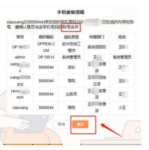
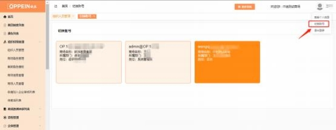
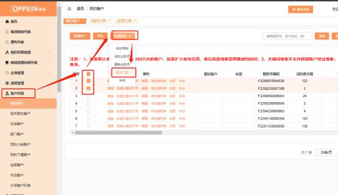
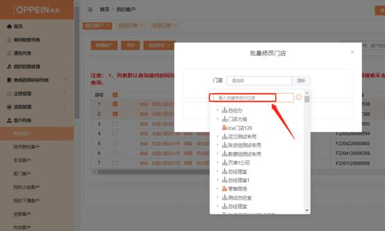

**24、门店有零售及整装权限时 ，如何对应门店下零售/整装订单呢？**

**解决方案：**当门店有零售及整装权限时， 整装和零售产品需要分开门店下单。

主要有以下 2 种方法：

**方法一（推荐） ：**

在组织架构中分开建零售、整装门店，各门店下分开新建导购账号。相同手机号 码下的账号可进行账号合并，账号合并后可互相切换使用（如下图） 。当下什么

产品的单就切换到对应门店下的导购账号建档下单。

例：需要下整装产品的单，  就用整装门店下的导购账号建档，  建档后按照正常流

程流转即可。

**方法二：**

在组织架构中分开建零售、整装门店。可在任一门店下建档， 当客户确认是零售  或整装产品后，**必须在办理合同签订任务前， 通过批量修改门店方式， 将客户门  店归属修改到对应门店下。否则生成的自带零售/整装属性的合同号无法再修改。** 例：客户最开始在零售门店建档，确认是整装产品时，**需在客户办理合同签订前，**

通过批量修改门店的方式（admin 系统管理员默认有权限， 其他账号需 admin 设

置)，把此客户归属修改到整装门店，再走正常流程下单。

