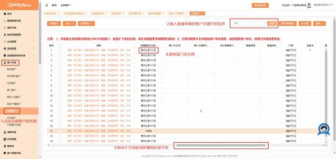
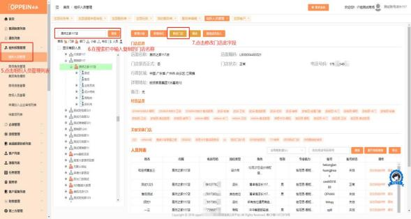
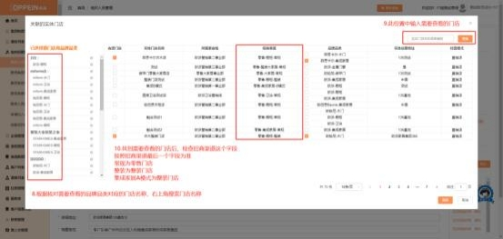

**25、如何区分客户所属门店为零售/整装门店？**

**解决方案：**

如何区分客户所属门店是零售/整装门店，需使用 admin 账号/有组织权限管理 的账号， 根据客户的所属门店（图一）去组织人员管理中查询该门店经营权信息 （图二），若招商渠道显示是常规就是零售门店，招商渠道显示是整装/A 模式

就是整装门店（图三）。

具体操作如下：

1\. 在客户列表中找到对应客户—下方进度条往右拖动-复制【所属组织（门店）】

（图一）

2\. 点击组织人员管理—在搜索栏搜索复制的门店名称—修改门店按钮

（图二）

3\. 点击关联实体门店-找到需要核对的品牌品类—查看招商渠道： 常规就是零售

店、整装/A 模式就是整装店。

（图三）
