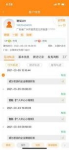

**9、互动轨迹的分值是如何获得的？**

**解决方案：** 互动轨迹包含三种类型：  行为轨迹、跟进轨迹和服务轨迹，  系统自动 抓取线上线下互动轨迹，  自动计算活跃度分值，  潜客详情、客户信息界面展示互

动轨迹明细。

（1）行为轨迹：添加好友，微信聊天、收藏案例、报名、购买卡劵等行为；

（2）跟进轨迹：微信沟通、发信息、打电话等行为；

（3）服务轨迹：收款、量尺、合同签订等行为

