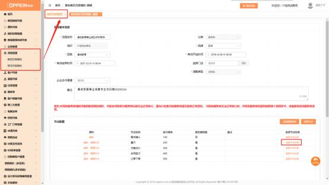

**18、保存流程时提示““流程节点需求确认、量尺、方案设计、合同**

**签订、订单下单是必须选择”？**

**解决方案：**  同一法人， 同一组织下编码既代理了整装又代理了零售品类，  启动流 程时会判定必须包含 5 步流程： 需求确认、量尺、方案设计、合同签订、订单下 单。需要系统管理员即 admin 的账号将流程设置为正确的五步流程后再进行操

作：

登陆 admin 的账号，  进入流程管理菜单，商场流程模版，找到流程后点编辑进

去，将流程设置为标准的五步流程后保存即可。

注意： 如果商场只有整装没有零售，则不会校验五步流程。

编辑流程后保存提示“保存失败，错误信息“null””怎么办？

**解决方案：**此问题由于流程适用的门店有已删除的门店导致，需要把该提示截图、 组织编码、系统管理员 admin 账号的密码在 MTDS 答疑咨询企业微信群反馈给

答疑老师，使用【欧派家居集团官方】身份扫描二维码加入。

在群里上报给答疑老师，统一由答疑老师报给技术处理。

