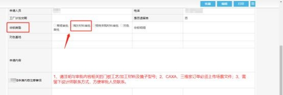
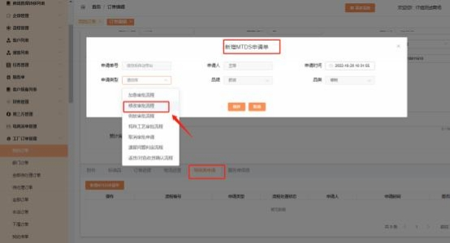

**34、橱柜衣柜淘汰材料下单流程？**

**解决方案：**

【橱柜淘汰材料下单流程】

商场直接提交特殊工艺单-淘汰材料审批表， 经工艺、物控确认材料库存等。审

批通过后，商场在 CAXA 中选特殊审批材料正常下单即可。

【衣柜淘汰材料下单流程】

商场下淘汰材料产品，  不走特殊工艺审批。商场需先联系商场管理员，  线下提交  请示经物控、研发等审核。若请示审核通过后，商场再先选其他材料正常下单，

MTDS 上提交修改单，备注清楚修改内容，附上已审批请示文件即可。

