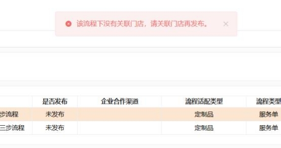
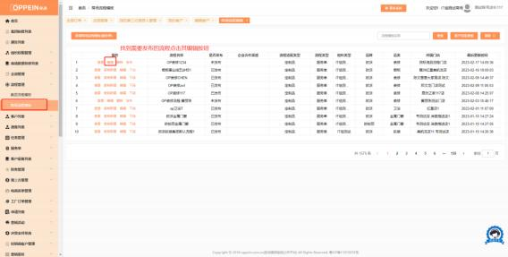
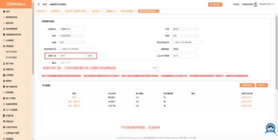

**35、点击发布流程时提示： “该流程下没有关联门店， 请关联门店再**

**发布”？**

**解决方案：** 此提示说明该流程没有设置门店，  需要先设置门店后再发布。具体操

作如下：

1、进入流程管理-商场流程模板，找到对应流程，点击编辑；   （如图一）

（图一）

2、编辑的流程基本信息中，找到选择门店按钮，选择需要配置流程的门店；

（如图二）

（图二）

3、完成以上步骤后，下拉点击保存按钮后，返回商场流程模板中发布流程即

可！

注： 所选门店下经营品牌品类信息 ，需与流程基本信息中的品牌品类一致 ，否

则会导致流程启用失败！

