**五、 全流程任务办理常见问题：**

**（一）常规流程任务常见常见问题**

**1、有没有 MTDS 操作视频？在哪里查看教学视频？**

**解决方案：**因为 MTDS 功能强大 **，**教学视频进行了细分，分为不同模块，不同

岗位，不同功能，不同端口的视频，可以根据自己的需要有针对性的查看。

查看视频途径 1：登陆手机 APP“我的欧派”，点击“更多功能”进到“我的应

用”下拉“找到学习中心”，点击“信息化教程”， 查看教学视频：

**2、设计师或下单员的帐号能建档吗？**

**解决方案：**  可以， 如果设计师或下单员帐号要建档，  需要分配导购角色，  并且岗 位要直接建立在门店下面。若不会操作可参考组织架构搭建用户手册或查看组织

架构搭建操作视频（查看视频途径见全流程问题 1）。

**3、系统流程不知道任务在谁那里?签不了合同、下不了单怎么办？**

**解决方案：**  需要在服务单详情中找到当前任务责任人。

具体操作方式：在服务单列表（找到该客户该品类）  →查看→右边菜单栏里的 “节点任务”→查看处理中的任务责任人是谁，  责任人的账号就可以在我的任

务列表里办理该服务单任务。

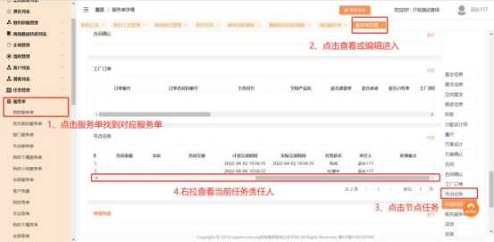

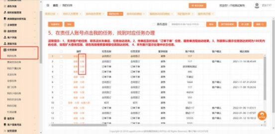

**4、为什么办理不了合同签订任务？**

**解决方案：** 在合同签订任务需要在任务管理→我的任务→点击办理， 而不是在服

务单详情查看合同签订。正确操作如图所示：

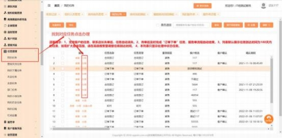

**5、合同签订时提示有待收款，已收款录不了怎么办？**

**解决方案：**  由于收款不是在合同签订任务收款  ，需在客户列表上操作收款；

操作路径：点击客户列表→我的客户→收款→线下收款→款项单中点击品类

填写收款信息→提交。

**6、任务操作了回退但是设计师收不到？**

**解决方案：**  需要在服务单列表找到对应的服务单，在服务单详情中找到当前任

务责任人。

具体操作方式：在服务单列表（找到该客户该品类）  →查看→右边菜单栏里的 “节点任务”→查看处理中的任务责任人是谁，  责任人的账号就可以在我的任

务列表里找到该服务单任务。

**7、办理初尺任务时提示要添加空间，怎么添加？**

**解决方案：**  添加空间→选择空间→点击+号上传附件→保存

（可添加多个空间）

**8、该服务单无量尺定位地址怎么办？**

**解决方案：** 该问题是因为服务单中没有操作量尺打卡的任务导致的，  目前量尺打

卡只支持手机端，  PC 端不允许操作。

操作方式：  ①设计师打开企业微信-工作台-点击我的欧派-更多功能下拉-找到代

办事项 -点击代办任务 -搜索客户手机号 -点击办理 -进行量尺打卡操作即可。

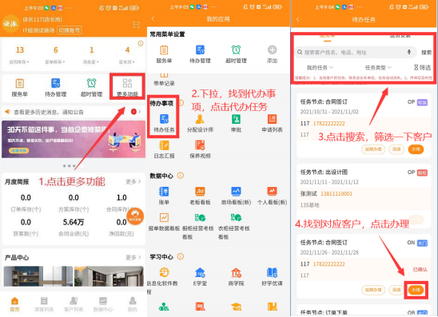

**9、任务在办理过程中,责任人看不到任务怎么办?**

**解决方案：**  此问题是由于服务单处理中的任务责任人不是需要办理任务的人导

致

具体操作方式：①系统管理员 admin 先查看当前节点任务的责任人是谁，再去 组织架构中查找该责任人是否有两个同名同姓的账号，如果名字确实一样，建

议姓名后面加上岗位或其他备注信息备注区分，可以避免此类问题。

① 系统管理员 admin 确认对应责任人后，在“任务管理”→ “全部任  务”→找到指定任务勾选上→点击批量修改，把任务修改给当前责任

人。

**10、分配过一次设计师需要修改设计师怎么办？**

**解决方案：**  ①仅当前任务的设计师需要变更：  管理员 admin 操作,任务管理” →  “全部任务”→找到指定任务勾选上→点击批量修改，把任务给当前责任

人。

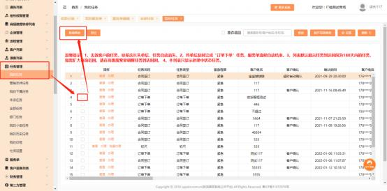

②服务单所有需设计师办理的任务的责任人都需要修改：除修改当前任务的责

任人名， 则还需在服务单列表中将设计师进行批量修改。  如图：

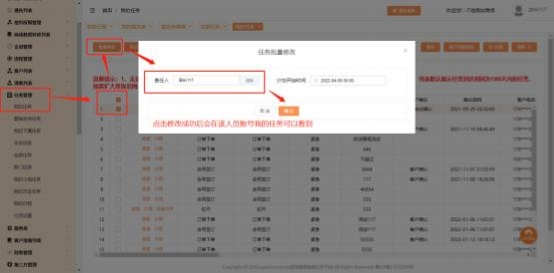

**11、建档或者下单时候校验提示出现“服务单客户名称不可含特殊字**

**符”怎么办？**

**解决方案：**  建档人在“客户列表”→  “我的客户”→点击编辑进入→把原有的

客户姓名删除，再重新录入，不能有空格、或者~@#￥% ……&\*等等字符。

**12、分配设计师或者启动标准品流程时， 提示“分配责任人失败！ 请**

**检查流程模板责任人配置！ ”怎么办？**

**解决方案：**  出现此提示，是因为流程中对应节点下的任务没有配责任人，用管 理员 admin 账号在商场流程模板中已发布的对应品类的标准品流程/订制品流

程对应节点任务配置任务的责任人即可。

**13、分配设计师时提示“流程节点需求确认、量尺、方案设计、合同**

**签订、订单下单是必须选择”怎么办？**

**解决方案：**  同一法人， 同一组织编码下既代理了整装又代理了零售品类，  启动流 程时会判定必须包含 5 步流程： 需求确认、量尺、方案设计、合同签订、订单下 单。需要系统管理员即 admin 的账号给该门店将流程设置为正确的五步流程后

再进行分配设计师的操作：

登陆 admin 的账号，  进入流程管理菜单，集团流程模版，找到流程后复制新建

流程，选择流程的适用门店保存即可。

注意：如果只是整装商场，则不会校验五步流程。

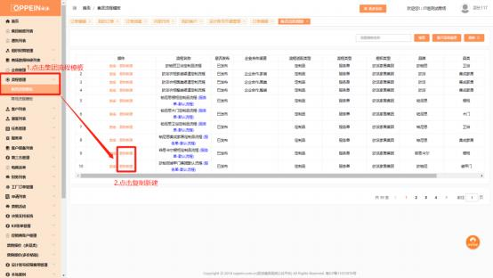

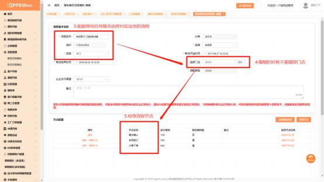

**14、批量分配设计师时提示“请选择服务单”：**

**解决方案：** 因为该服务号的服务单已经分配了设计师， 可以新增服务单后再进行

操作。

**15、启动标准品流程时提示“当前门店没有维护该品类标准品流程，**

**是否启动默认流程”怎么办？**

**解决方案：** 由于该门店该品类没有维护标准品流程，可以选择启动默认的流程， 也可以用 admin 的账号将标准品流程维护好后，再去启动标准品流程。流程维

护的操作见上一问题（第 13 个问题） 解决方案。

**16、流程没有设置合同签订任务节点可以下单吗？**

**解决方案：**  不可以，流程里面必须要设置合同签订节点任务，否则系统无法生

成主合同号，不能下单。

① 请系统管理员 admin 参考具体以下流程设置：

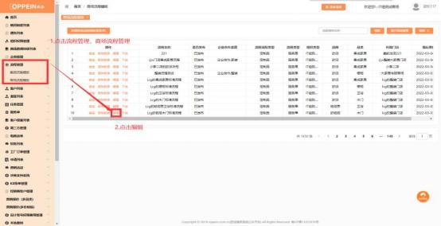

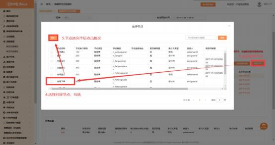

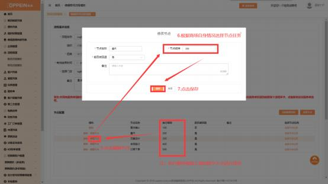

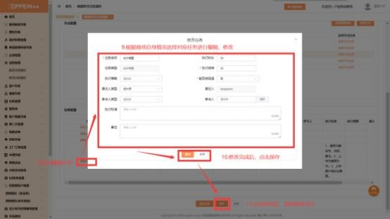

②或者请系统管理员 admin 直接参考集团流程模板复制对应事业线发布的

流程重新发布即可。

**17、流程保存时提示“存在没有任务的流程节点，请检查”怎么处理 ？**

**解决方案：**  需要检查一下流程的节点下是否有存在任务，若无任务需添加。如

图

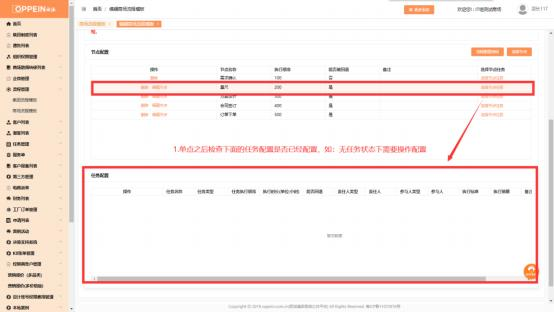

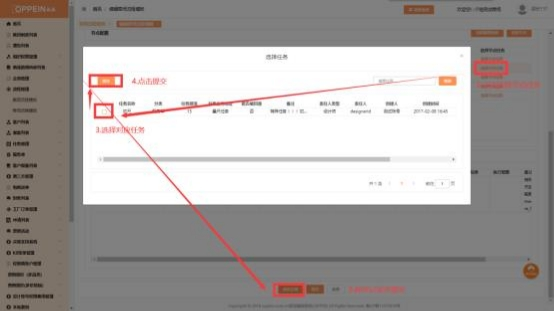

**18、保存流程时提示““流程节点需求确认、量尺、方案设计、合同**

**签订、订单下单是必须选择”？**

**解决方案：**  同一法人， 同一组织下编码既代理了整装又代理了零售品类，  启动流 程时会判定必须包含 5 步流程： 需求确认、量尺、方案设计、合同签订、订单下 单。需要系统管理员即 admin 的账号将流程设置为正确的五步流程后再进行操

作：

登陆 admin 的账号，  进入流程管理菜单，商场流程模版，找到流程后点编辑进

去，将流程设置为标准的五步流程后保存即可。

注意： 如果商场只有整装没有零售，则不会校验五步流程。

编辑流程后保存提示“保存失败，错误信息“null””怎么办？

**解决方案：**此问题由于流程适用的门店有已删除的门店导致，需要把该提示截图、 组织编码、系统管理员 admin 账号的密码在 MTDS 答疑咨询企业微信群反馈给

答疑老师，使用【欧派家居集团官方】身份扫描二维码加入。

在群里上报给答疑老师，统一由答疑老师报给技术处理。

**19、客户已传单到工厂，但是在任务列表仍显示为订单下单节点?**

**解决方案：**  工厂订单传单与任务办理是两个模块。下单员传单到工厂后仍需在

我的任务点击“完成并提交任务”才算完成任务。

**20、复制集团流程模版编辑保存后， 在商场流程模版找不到新流程?**

**解决方案：**  双击商场流程模板刷新或在商场流程模版点击刷新按钮。

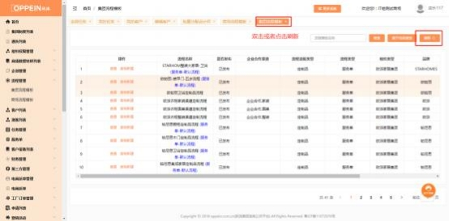

**21、历史遗留的待跟进客户怎么清理？**

**解决方案：**  1.真实并需要跟进的客户：添加跟进（该客户流程完成“合同签

订”前，未及时跟进系统会有超时提醒。）

2\.客户在合同签订前已失单/失效，无需再跟进：导购帐号可操作失单，店长帐

号可操作失效。

3\.客户已收款，但无需退款也无需跟进：客户列表→找到对应客户→ 申请→退

单申请→审批人通过后系统自动失单。

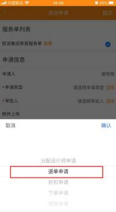

**22、历史遗留的任务超时客户怎么清理？**

**解决方案：**  1.筛选“订单下单”任务→对应责任人登陆自己的帐号→点击“办

理”→  “完成并提交”任务

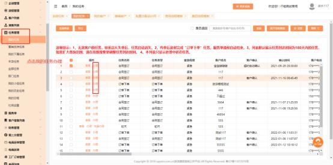

2\. 客户在合同签订前已失单/失效，无需再跟进：导购帐号可操作失单，店长

帐号可操作失效。

3\.客户已收款，但无需退款也无需跟进：客户列表→找到对应客户→ 申请→退

单申请→审批人通过后系统自动失单。

**23、新增客户后在服务单找不到该客户？**

**解决方案：**  检查是否有新增服务单：客户列表→继续服务→保存→选择意向品

类

**24、建档后客户没有收到短信？**

**解决方案：**  检查客户手机是否有信息屏蔽功能，是否被手机自动拦截了短信。

**25、批量修改设计师提示“服务单【分配设计师 -还未启动流程**

**XXXXXX，不能修改设计师】”?**

**解决方案：**  先检查该服务单当前任务是否为“需求确认”，该任务的服务单需

要进行派尺，未派尺的服务单无法进行批量修改设计师。

**26、如何查看超时任务？**

**解决方案：**  APP 端：点击 APP 首页页面上方任务超时即可跳转到服务单页面查

看超时任务的服务单。

PC 端： 点击决策支持系统菜单栏下的经销商决策支持，找到待完成任务明细输

入条件即可点击查询进行查看。

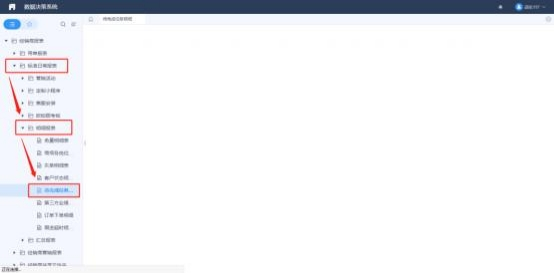

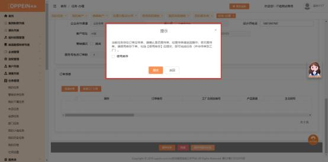

**解决方案：**

该提示为了避免商场订单还未传单就提交完成订单下单任务， ①如果订单下单任 务办理需要传单的， 传完单再提交完成订单下单任务； ②如果订单下单任务无需

传单，暂时勾选下面使用库存，进行完成订单下单任务并可继续往下流转。

**27、新建客户时，提示“该电话号码已建档，如需重复建档， 请选择**

**重复建档标签”怎么办？**

**解决方案：**

（1）客户增加品牌品类，可以点击【添加品类】给客户添加品牌品类；

（2）如果客户二次购买，可点击【继续建档】，需要选择建档标签后保存档案

**28、请问没有建手机号码的客户现在去哪里了呢？**

**解决方案：**在潜客列表查找，可输入客户昵称或员工姓名进行快速检索。

**29、销售申请分配设计师后，店长在哪里审核？**

**解决方案：**店长可以在 MTDS 手机 APP 的首页， 点击“更多”进入我的应用

界面，在待办事项的【分配设计师】进入去分配设计师

注意：销售在申请分配设计师时，审批人不要选到自己哦！

**30、设计师在我的服务单查不到派给他的单子了怎么办？**

**解决方案：**

【我的服务单】展示由本登录账号建档的服务单信息。若设计师只接收派尺并没

有建档，需要前往服务单-我关联的服务单中查询服务单；

【我关联的服务单】展示①派尺给当前登录账号服务单信息， ②当前任务责任人

及已办理过任务的服务单信息。注：设计师岗位账号默认配置该列表入口

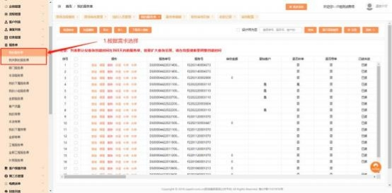

**31、分配设计师、提交任务时系统报错，如：流程[XXXXX]配置错**

**误，节点与任务:[需求确认-复尺]  ，怎么办？**

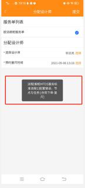

**解决方案：**

流程配置不符合规则设置，  admin 账号前往流程管理-商场流程模板，  找到该条

流程，调整好之后保存即可，具体操作见下图：

场景一：商场流程为标准五步流程：

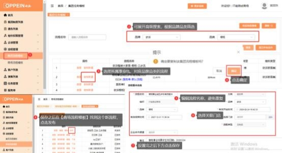

场景二：商场流程为标准五步流程＋自定义：

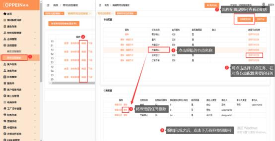

**32、办理订单下单任务时提示“当前任务存在订单没传单， 请确认是 否需传单，  如需传单请返回操作； 若无需传单，  请使用库存下单，  勾 选【使用库存】后提交， 即可完成任务（并非传单到工厂） ”，应该**

**怎么办？**

**解决方案：**

该提示是为了避免商场订单还未传单就提交完成订单下单任务：

①如果订单下单任务办理需要批量传单的， 传完单再提交完成订单下单任务； ② 如果订单下单任务无需传单， 暂时勾选下面使用库存， 提交完成订单下单任务并

可继续往下流转。

**33、客户已确定定购其他产品， 不需要再跟进或办理任务， 在系统里**

**需要怎么操作？**

**解决方案：**  服务单中，找到客户相应的服务单，操作【失单】即可

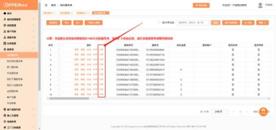

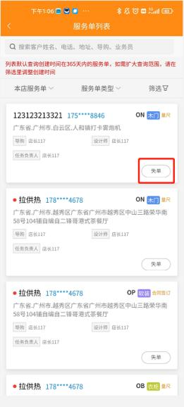

**34、橱柜衣柜淘汰材料下单流程？**

**解决方案：**

【橱柜淘汰材料下单流程】

商场直接提交特殊工艺单-淘汰材料审批表， 经工艺、物控确认材料库存等。审

批通过后，商场在 CAXA 中选特殊审批材料正常下单即可。

【衣柜淘汰材料下单流程】

商场下淘汰材料产品，  不走特殊工艺审批。商场需先联系商场管理员，  线下提交  请示经物控、研发等审核。若请示审核通过后，商场再先选其他材料正常下单，

MTDS 上提交修改单，备注清楚修改内容，附上已审批请示文件即可。

**35、点击发布流程时提示： “该流程下没有关联门店， 请关联门店再**

**发布”？**

**解决方案：** 此提示说明该流程没有设置门店，  需要先设置门店后再发布。具体操

作如下：

1、进入流程管理-商场流程模板，找到对应流程，点击编辑；   （如图一）

（图一）

2、编辑的流程基本信息中，找到选择门店按钮，选择需要配置流程的门店；

（如图二）

（图二）

3、完成以上步骤后，下拉点击保存按钮后，返回商场流程模板中发布流程即

可！

注： 所选门店下经营品牌品类信息 ，需与流程基本信息中的品牌品类一致 ，否

则会导致流程启用失败！

**36、如何查看我的已处理/历史任务流程？**

**解决方案：**

如需查看我的已处理/历史任务流程，可点击任务管理-我的任务-历史任务【图

一】可输入服务单号查看当前服务单任务流程。

注： admin 系统管理员账号默认可查看全部任务权限，  也可登陆 admin 系统管

理员账号给其他账号配置权限。

【图一】

168
