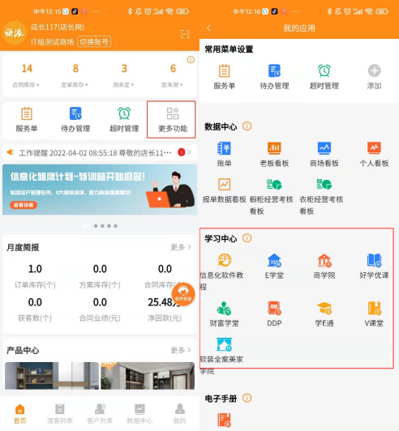

**五、 全流程任务办理常见问题：**

**（一）常规流程任务常见常见问题**

**1、有没有 MTDS 操作视频？在哪里查看教学视频？**

**解决方案：**因为 MTDS 功能强大 **，**教学视频进行了细分，分为不同模块，不同

岗位，不同功能，不同端口的视频，可以根据自己的需要有针对性的查看。

查看视频途径 1：登陆手机 APP“我的欧派”，点击“更多功能”进到“我的应

用”下拉“找到学习中心”，点击“信息化教程”， 查看教学视频：

