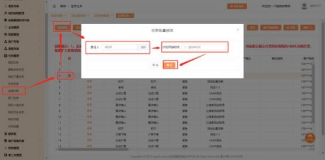

**9、任务在办理过程中,责任人看不到任务怎么办?**

**解决方案：**  此问题是由于服务单处理中的任务责任人不是需要办理任务的人导

致

具体操作方式：①系统管理员 admin 先查看当前节点任务的责任人是谁，再去 组织架构中查找该责任人是否有两个同名同姓的账号，如果名字确实一样，建

议姓名后面加上岗位或其他备注信息备注区分，可以避免此类问题。

① 系统管理员 admin 确认对应责任人后，在“任务管理”→ “全部任  务”→找到指定任务勾选上→点击批量修改，把任务修改给当前责任

人。

