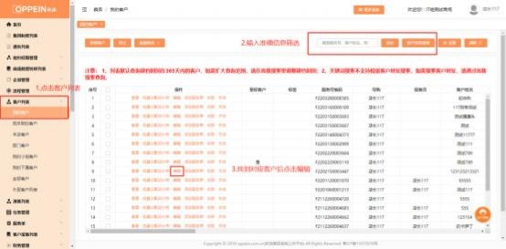

**4. 客户如何确认合同交期信息呢？**

解决方案：建议门店采用以下三种方式：

方式 1：客户在场，  建议客户来门店签合同的时候，  直接让客户面对面扫码进入 消费者个人中心，  指导客户操作合同确认即可（强烈推荐，  不影响传单，  还能提

高客户体验！）；

方式 2：客户不在场，发送确认短信后，  系统自动推送小程序服务通知如图一；

点击【欧派家居集团】小程序，合同交期中查看。

