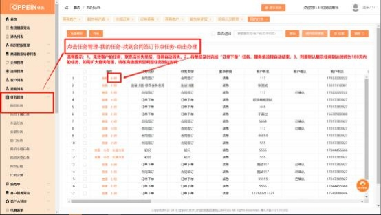

**6.短信已经发送给客户了， 但是客户反馈登录小程序没有弹窗消息确**

**认，待办也没有收到确认消息？**

解决方案：  方案 1：检查录入 mtds 系统的电话是否与登录号码一致， 不一致的

话，直接退出重新输入正确的手机号码登录即可。

方案 2：如果客户电话一致的情况，让客户删除微信小程序，重新进入扫码。

**7.客户无法登录小程序确认怎么办？**

解决方案：  可通过验证码验证，  点击发送确认短信后，  系统自动下发含确认验证

码短信给客户。

操作步骤： 短信中含有验证码和跳转微信小程序的链接如图一；复制短信验证码

发送给导购人员，由任务办理人在办理任务时输入验证码即可提交任务。如图二；

