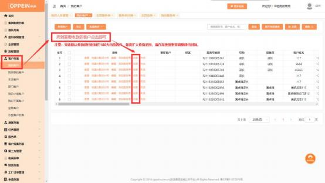
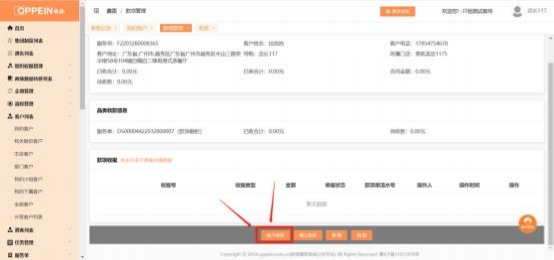

**14、如何操作收款？**

解决方案：

APP 端： 在客户列表中找到该客户，  点击【收款】（图一），点击页面下方【线 下收款】（图二） ，点击款项信息中【对应品类】（图三） ，填写收款信息后【提

交】，由财务人员审核。

若无相应按钮需要找商场系统管理员 admin 配置下对应的权限。

配置权限路径：  用商场系统管理员 admin 帐号，在组织权限管理→组织人员管 理→找到对应人员所分配的角色→再到商场角色管理→搜索对应角色→在对应

角色点编辑→根据关键词搜索权限进行勾选→点击保存

（PC 端、 APP 端权限需分开独立配置）

图一；                               图二；                                 图三；

**PC 端操作及权限配置**：在客户列表中找到该客户-点击【收款】 -【线下收款】  -

点击款项信息中的【品类】。如图操作：

