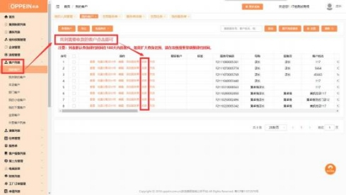
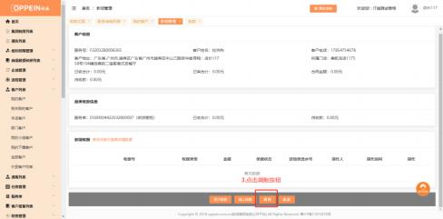
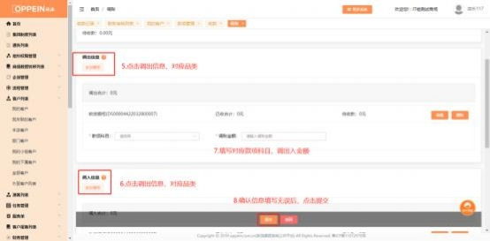

**15、怎么收款、退款或调账？**

**解决方案：**   在客户列表中找到该客户， 点击【收款】，点击页面下方的【收款】、

【调账】按钮。若无相应按钮，需要找商场系统管理员 admin 配置下对应的权

限。

调账操作步骤：  PC 端点击客户列表→我的客户→收款→调账→点击调出入对应

品类→填写调出入款项科目→确认信息无误后提交。

APP 端：登录企业微信→工作台→我的欧派→客户列表→筛选客户→点击收款

→调账→点击调出入对应品类→填写调出入款项科目→确认信息无误后提交。

**APP 端操作及权限配置**：

