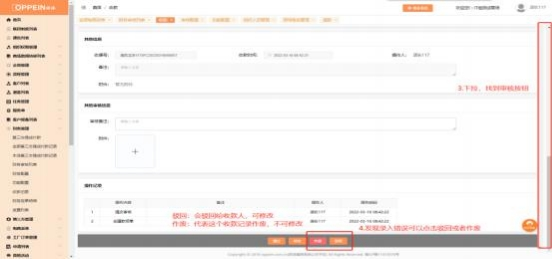
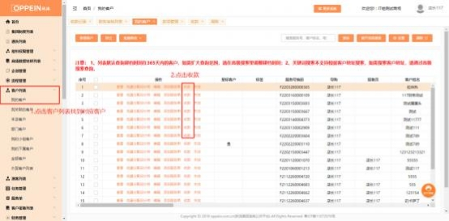
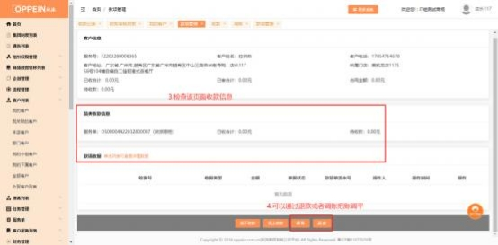
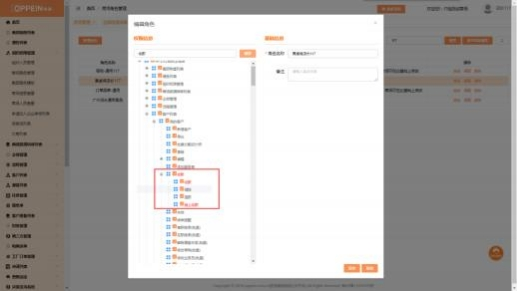
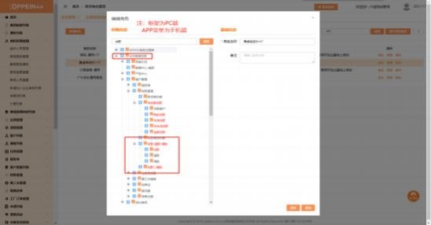

**16、收款录错了怎么办？**

**解决方案：**   若财务审核未通过， 可以联系财务审核人退回； 若财务审核已通过，

可以通过退款或者调账把账调平，无法直接修改之前录入的金额。

操作步骤：在客户列表中找到该客户， 点击【收款】，  点击页面下方的【退款】 或【调账】按钮。若无相应按钮，需要找商场系统管理员 admin 配置下对应的

权限。

用商场系统管理员 admin 帐号，在组织权限管理→组织人员管理→找到对应人

员所分配的角色→再到商场角色管理→搜索对应角色→在对应角色点编辑→根

据关键词搜索权限进行勾选→点击保存

财务审核人操作：

收款人员操作：

**APP 端操作及权限配置**：

