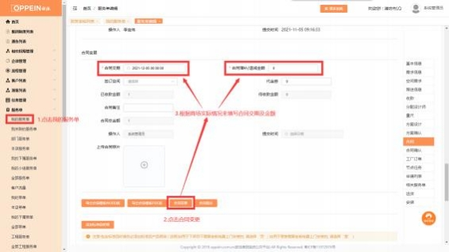

**17、合同签订任务时， 照片上传错了/合同金额填错了怎么办？**

**解决方案：**

**情况一：已完成合同签订任务的服务单**

在服务单详情中进行合同变更的操作，  上传正确的照片/进行合同金额增补，变 更后，客户在消费者个人中心小程序中将看到最新的合同照片和增补后的合同

金额，具体操作如下：

**PC 端：** 进入服务单列表－编辑服务单进入详情，找到合同的界面，点击“合同 变更”的按钮，然后上传正确的合同照片/填写增补的金额 （增加合同金额填入

正数，减少合同金额填负数） ，点击“合同提交”即可。见图 1

图 1

**②手机端：** 进入服务单列表－点击服务单进入服务单详情，找到合同的界面，

点击“合同变更” （如下图 1），上传正确的合同照片/填写增补的金额 （增加

合同金额填入正数，减少合同金额填负数） ，点击“提交”即可 （如下图

2）。

图 2

**情况二：未完成合同签订任务的服务单，任务状态在待客户确认中**

客户可在消费者个人中心小程序中操作驳回（如下图 3），驳回后， 商场可重新

编辑合同签订任务，重新上传正确的合同照片/直接填写正确的合同金额。点击

【发送确认短信】，客户重新进行合同确认。

图 3；

