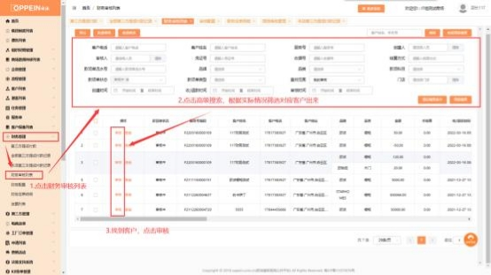

**7、财务员如何审核收款？**

**解决方案：**财务人员帐号登陆→财务管理→财务审核列表→点击高级搜索筛选或

搜索对应的收款→点击审核。

点击审核后，根据商场实际情况检查该款项单是否无误，

按钮分别为通过、修改、作废、驳回。

通过：该款项单无误，款项单审核通过。

修改： 可进行修改操作，  如修改收据号、款项科目、收款项目等，  根据商场自身

情况进行修改。

作废：该款项单金额等情况核对于事实不符，点击即代表该款项单作废。

驳回：该款项单驳回给收款人员的账号，可进行修改再提交。

注意：如没有菜单或审核按钮，请检查权限和该审核人员是否为财务审核人。

操作步骤如图；

APP 端：首页点击更多功能-下拉客户管理-财务管理-财务审核列表-找到对应款

项单点击审核。

注：财务人员默认有财务审核列表权限，如出现无权限或为空找 admin 配置一

下 APP 端财务审核人权限。

