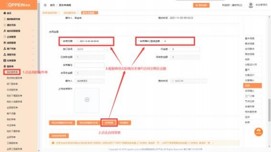

**8、合同增补怎么操作？**

**解决方案：** 如果客户签合同后需要增补合同金额， 可以在服务单详情中进行合同

变更的操作，  具体如下：

电脑端： 进入服务单列表－编辑服务单进入详情， 找到合同的界面，  点击“合同 变更”的按钮， 然后填写增补的金额（增加合同金额填入正数，  减少合同金额填

负数） ，或是更改合同交期，  点击“合同提交”即可。

手机端： 进入服务单列表－点击服务单进入服务单详情，  找到合同的界面，  点击 “合同变更” （如下图 1）， 填写增补的金额（增加合同金额填入正数， 减少合

同金额填负数） ，或是更改合同交期，  点击“提交”即可 （如下图 2）。

图一；                                     图二；

