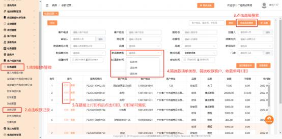
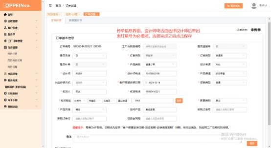



**七、零售传单**

**(一)各类型传单方式：**

**1、橱柜， 集成家居 ，卫浴 ，木门的正常单怎么下？**

**解决方案：**   MTDS 的操作流程不变，   一样需要建档，  走流程到合同签订的任务 时， 合同类型选“橱柜/衣柜/卫浴/木门”，合同类别选“普通单”，生成主合同

号，再到订单下单的界面传单，  其中带红星标记的字段为必填。

注意：

1）办理合同签订任务时，不能多次点击“生成主合同号”按钮 ，每点一次主合

同号都会变化。

2）当设计来源为 XML，上传文件保存后，  订单下单界面的产品渠道、空间产品

字段会自动解析设计文件中的产品渠道信息和空间产品信息。

3）其他设计来源的订单，订单下单界面的“产品渠道”、“促销类型”、“空

间产品”三个字段需手动填写。

