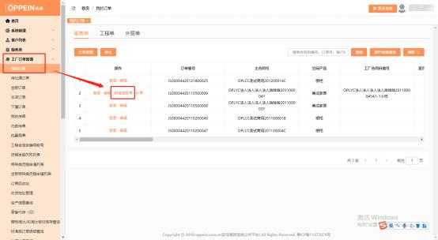

**11、原单在 MTDS 按照旧规则传单的，现在要下遗留单怎么下？**

**解决方案：**在工厂订单－订单列表－找到原合同－操作栏点击“新增遗留单”， 出现到新增遗留单的界面，  填写相关信息上传附件，  正常传单即可）  合同号按旧

的合同号规则传单。

注： 内部代传的遗留单， 原订单状态需要在生产中； 包装完成； 入库中； 已入库；

已发货、等待收货；  已归档；已签收等状态，才能在原单上发起遗留单哦！

